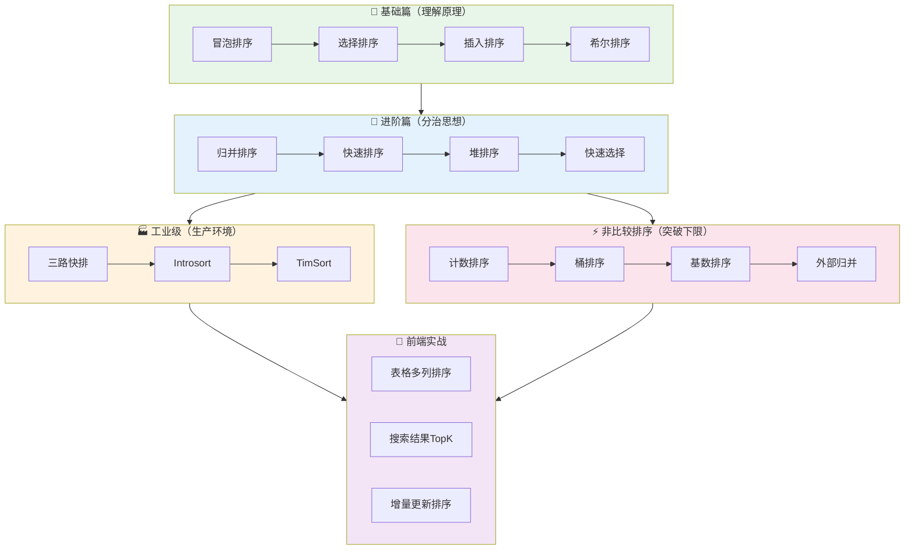

# 📚 排序算法总览

## 🗺️ 学习路线图

## 📊 算法适用场景速查表

| 场景特征 | 推荐算法 | 原因 |
|---------|---------|------|
| 小规模数据（n < 50） | 插入排序 | 常数因子小，缓存友好 |
| 几乎有序的数据 | 插入排序 / TimSort | 接近 O(n) |
| 大量重复元素 | 三路快排 | 避免 O(n²) 退化 |
| 需要稳定性 | 归并排序 / TimSort | 保持相等元素顺序 |
| 表格多列排序 | TimSort + 稳定组合 | 稳定 + 近乎有序优化 |
| TopK / 第 K 大 | 快速选择 / 堆 | O(n) 平均 |
| 整数且范围小 | 计数排序 | O(n + k) |
| 数据太大无法一次载入 | 外部归并 | 分块处理 |
| 防止最坏情况 | Introsort | 堆排兜底 |
| 通用高性能 | 快速排序 | 平均最快 |

## 📁 文件索引

### 📖 文档

| 文件 | 内容 |
|-----|------|
| [00-总览.md](./00-总览.md) | 本文件，学习路线与索引 |
| [01-选型决策树.md](./01-选型决策树.md) | 场景 → 算法的决策流程 |
| [02-复杂度对比表.md](./02-复杂度对比表.md) | 全算法复杂度横向对比 |
| [03-JS原生sort陷阱.md](./03-JS原生sort陷阱.md) | comparator 陷阱与稳定性 |
| [04-测试与基准指南.md](./04-测试与基准指南.md) | 如何测试与性能对比 |

### 📖 算法详解

#### 比较类排序

| 编号 | 文件 | 算法 | 补充批次 |
|:---:|-----|------|:-------:|
| 01 | 01-冒泡排序.md | 冒泡排序 | S1a |
| 02 | 02-选择排序.md | 选择排序 | S1a |
| 03 | 03-插入排序.md | 插入排序 | S1a |
| 04 | 04-希尔排序.md | 希尔排序 | S1a |
| 05 | 05-归并排序.md | 归并排序 | S1b |
| 06 | 06-快速排序.md | 快速排序 | S1b |
| 07 | 07-堆排序.md | 堆排序 | S1b |
| 08 | 08-快速选择.md | 快速选择 | S1b |
| 09 | 09-三路快排.md | 三路快排 | S2 |
| 10 | 10-Introsort.md | Introsort | S2 |
| 11 | 11-TimSort.md | TimSort | S2 |

#### 非比较排序

| 编号 | 文件 | 算法 | 补充批次 |
|:---:|-----|------|:-------:|
| 01 | 01-计数排序.md | 计数排序 | S3 |
| 02 | 02-桶排序.md | 桶排序 | S3 |
| 03 | 03-基数排序.md | 基数排序 | S3 |

#### 外部排序

| 编号 | 文件 | 算法 | 补充批次 |
|:---:|-----|------|:-------:|
| 01 | 01-外部归并排序.md | 外部归并 | S3 |

### 📦 算法包

| 目录 | 说明 |
|-----|------|
| [公共库/](../算法包/公共库/) | 比较器、校验器、计时器等工具 |
| 冒泡排序/ ~ TimSort/ | 各算法独立包（S1a-S2 补充）|
| 计数排序/ ~ 外部归并/ | 非比较排序包（S3 补充）|

### 🧪 基准测试

| 目录 | 说明 |
|-----|------|
| [基准测试/](../基准测试/) | 统一性能对比框架 |

### 💼 示例应用

| 目录 | 说明 | 补充批次 |
|-----|------|:-------:|
| 表格排序/ | 多列稳定排序实战 | S4 |
| 搜索结果排序/ | TopK + 增量更新 | S4 |

## 🎓 学习建议

### 初学者路线

1. **先读** [01-选型决策树.md](./01-选型决策树.md) 建立全局观
2. **依次学习** 冒泡 → 插入 → 归并 → 快排
3. **动手实现** 每个算法后跑一遍测试
4. **最后** 做 [07-自测清单.md](./07-自测清单.md)

### 面试准备路线

1. **必会**：快排、归并、堆排的原理和复杂度
2. **加分**：TimSort、Introsort 的设计思想
3. **实战**：TopK 问题、表格排序稳定性
4. **背诵**：[02-复杂度对比表.md](./02-复杂度对比表.md)

### 工程应用路线

1. **理解** JS 原生 sort 的行为和陷阱
2. **掌握** 稳定排序辅助技巧
3. **实践** 表格排序和搜索结果排序场景
4. **性能** 使用基准测试对比不同算法
