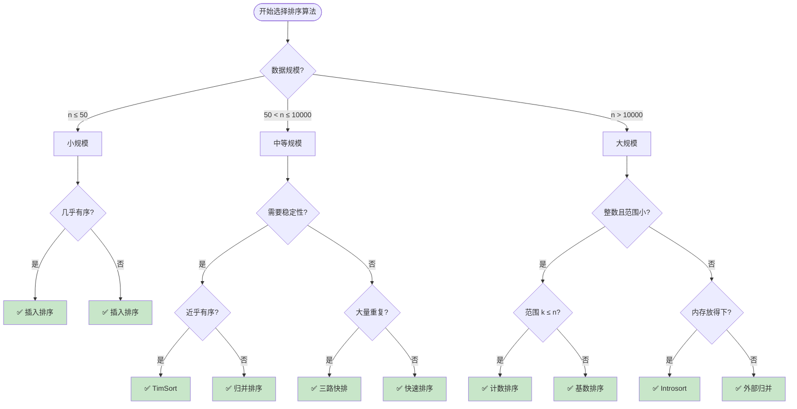
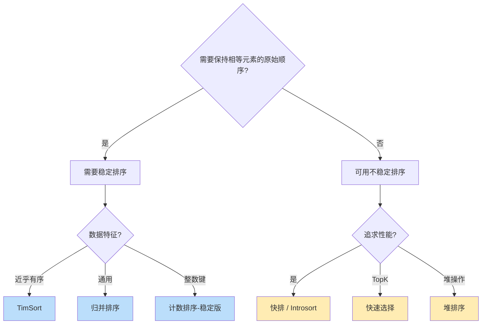
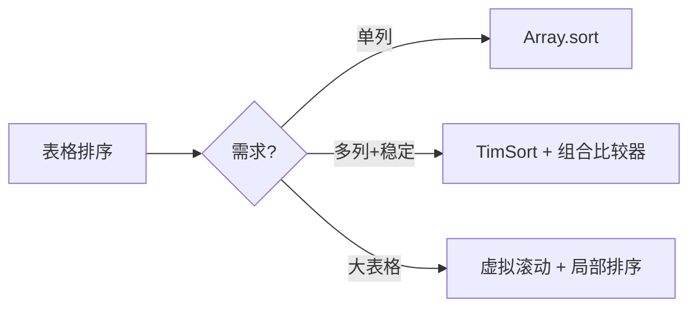
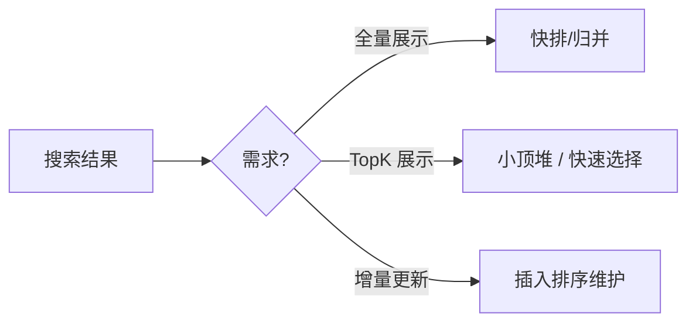

# 🌳 排序算法选型决策树

> **核心思想**：从场景出发，而非从算法出发

## 🎯 快速决策流程



## 📋 场景信号 → 算法映射

### 🔍 看到这些信号，选这个算法

| 场景信号 | 选择算法 | 理由 |
|---------|---------|------|
| "小数组"、"n < 50" | 插入排序 | 常数因子小，缓存友好 |
| "几乎有序"、"部分排序" | 插入排序 / TimSort | 接近 O(n) |
| "表格多列排序"、"稳定" | TimSort | 稳定 + 近乎有序优化 |
| "大量重复值"、"重复元素多" | 三路快排 | 避免 O(n²) 退化 |
| "最坏情况"、"对抗输入"、"DoS 防护" | Introsort | 堆排兜底 |
| "TopK"、"第 K 大/小" | 快速选择 / 小顶堆 | O(n) 平均 |
| "分数排序"、"整数键"、"范围小" | 计数排序 | O(n + k) |
| "ID 排序"、"固定位数" | 基数排序 | O(d × n) |
| "均匀分布"、"浮点数" | 桶排序 | 分桶减少比较 |
| "大文件"、"流式数据"、"内存不够" | 外部归并 | 分块处理 |
| "通用场景"、"无特殊要求" | 快速排序 | 平均最快 |

## 🔄 稳定性决策



### 稳定排序算法清单

| 算法 | 稳定性 | 备注 |
|-----|:------:|------|
| 冒泡排序 | ✅ 稳定 | 相邻交换，不跨越 |
| 插入排序 | ✅ 稳定 | 插入时保持顺序 |
| 归并排序 | ✅ 稳定 | merge 时左优先 |
| TimSort | ✅ 稳定 | 基于归并 |
| 计数排序 | ✅ 稳定 | 需要正确实现 |
| 基数排序 | ✅ 稳定 | 基于稳定子排序 |
| 选择排序 | ❌ 不稳定 | 交换可能跨越 |
| 希尔排序 | ❌ 不稳定 | 跳跃交换 |
| 快速排序 | ❌ 不稳定 | partition 交换 |
| 堆排序 | ❌ 不稳定 | 堆调整交换 |

## 💾 空间复杂度决策

```mermaid
flowchart TD
    Q1{内存限制?}
    Q1 -->|严格限制| InPlace[原地排序]
    Q1 -->|允许 O(n) 额外空间| Extra[可用额外空间]

    InPlace --> I1[堆排序 O(1)]
    InPlace --> I2[快排 O(log n) 栈]
    InPlace --> I3[插入/冒泡/选择 O(1)]

    Extra --> E1[归并排序 O(n)]
    Extra --> E2[TimSort O(n)]
    Extra --> E3[计数/桶排序 O(k)]

    style I1 fill:#c8e6c9
    style I2 fill:#c8e6c9
    style I3 fill:#c8e6c9
    style E1 fill:#bbdefb
    style E2 fill:#bbdefb
    style E3 fill:#bbdefb
```

### 原地排序 vs 非原地排序

| 类型 | 算法 | 空间复杂度 |
|-----|------|-----------|
| 原地 | 冒泡、选择、插入、希尔 | O(1) |
| 原地 | 快排、堆排 | O(log n) 栈空间 |
| 原地 | 三路快排、Introsort | O(log n) |
| 非原地 | 归并排序 | O(n) |
| 非原地 | TimSort | O(n) |
| 非原地 | 计数排序 | O(k) |
| 非原地 | 桶排序 | O(n + k) |
| 非原地 | 基数排序 | O(n + k) |

## 🎲 比较排序 vs 非比较排序

```mermaid
flowchart TD
    Q1{数据类型?}
    Q1 -->|通用对象| Compare[比较排序]
    Q1 -->|整数/可映射| NonCompare{满足条件?}

    NonCompare -->|范围小 k ≤ n| COUNT[计数排序 O(n+k)]
    NonCompare -->|均匀分布| BUCKET[桶排序 O(n)]
    NonCompare -->|固定位数| RADIX[基数排序 O(d×n)]
    NonCompare -->|不满足| Compare

    Compare --> C1[快排/归并/堆排]
    Compare --> C2[下限 O(n log n)]

    style COUNT fill:#fce4ec
    style BUCKET fill:#fce4ec
    style RADIX fill:#fce4ec
    style C1 fill:#e8f5e9
```

### 何时可以用非比较排序？

| 条件 | 可用算法 | 复杂度 |
|-----|---------|--------|
| 整数且 max - min ≤ O(n) | 计数排序 | O(n + k) |
| 均匀分布且可映射到桶 | 桶排序 | O(n) 平均 |
| 整数且位数固定 | 基数排序 | O(d × n) |

## 🎯 前端典型场景速选

### 表格排序



### 搜索结果



## 📝 决策清单

拿到排序需求时，依次回答：

1. **数据规模**：n 大约多少？
2. **数据特征**：有序程度？重复多？整数？
3. **稳定性**：需要保持相等元素顺序吗？
4. **内存限制**：允许多少额外空间？
5. **最坏情况**：需要防止恶意输入吗？
6. **特殊需求**：TopK？外部排序？实时更新？

根据回答，对照上面的决策树选择算法。
