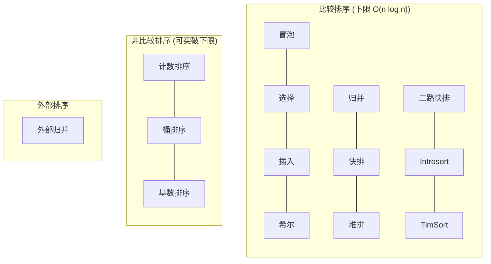

# 📊 排序算法复杂度对比表

## 🔄 比较排序 vs 非比较排序



## 📈 完整对比表

### 比较类排序

| 算法 | 最好 | 平均 | 最坏 | 空间 | 稳定 | 原地 | 补充批次 |
|:---:|:---:|:---:|:---:|:---:|:---:|:---:|:---:|
| 冒泡排序 | O(n) | O(n²) | O(n²) | O(1) | ✅ | ✅ | S1a |
| 选择排序 | O(n²) | O(n²) | O(n²) | O(1) | ❌ | ✅ | S1a |
| 插入排序 | O(n) | O(n²) | O(n²) | O(1) | ✅ | ✅ | S1a |
| 希尔排序 | O(n log n) | O(n^1.3) | O(n²) | O(1) | ❌ | ✅ | S1a |
| 归并排序 | O(n log n) | O(n log n) | O(n log n) | O(n) | ✅ | ❌ | S1b |
| 快速排序 | O(n log n) | O(n log n) | O(n²) | O(log n) | ❌ | ✅ | S1b |
| 堆排序 | O(n log n) | O(n log n) | O(n log n) | O(1) | ❌ | ✅ | S1b |
| 三路快排 | O(n) | O(n log n) | O(n²) | O(log n) | ❌ | ✅ | S2 |
| Introsort | O(n log n) | O(n log n) | O(n log n) | O(log n) | ❌ | ✅ | S2 |
| TimSort | O(n) | O(n log n) | O(n log n) | O(n) | ✅ | ❌ | S2 |

### 非比较排序

| 算法 | 最好 | 平均 | 最坏 | 空间 | 稳定 | 原地 | 适用条件 | 补充批次 |
|:---:|:---:|:---:|:---:|:---:|:---:|:---:|:---|:---:|
| 计数排序 | O(n+k) | O(n+k) | O(n+k) | O(k) | ✅ | ❌ | 整数，k ≤ O(n) | S3 |
| 桶排序 | O(n) | O(n+k) | O(n²) | O(n+k) | ✅ | ❌ | 均匀分布 | S3 |
| 基数排序 | O(d·n) | O(d·n) | O(d·n) | O(n+k) | ✅ | ❌ | 整数，d 为位数 | S3 |

### 外部排序

| 算法 | 时间 | I/O 次数 | 内存 | 稳定 | 适用场景 | 补充批次 |
|:---:|:---:|:---:|:---:|:---:|:---|:---:|
| 外部归并 | O(n log n) | O(n/B · log(n/M)) | O(M) | ✅ | 大数据/流式 | S3 |

> - k：数值范围
> - d：最大位数
> - B：磁盘块大小
> - M：可用内存

## 🎯 按场景选择

### 小规模数据 (n ≤ 50)

| 算法 | 推荐度 | 原因 |
|:---:|:---:|:---|
| 插入排序 | ⭐⭐⭐⭐⭐ | 常数因子小，缓存友好 |
| 冒泡排序 | ⭐⭐ | 教学用，实际不推荐 |
| 选择排序 | ⭐⭐ | 交换次数少，但比较多 |

### 中等规模 + 需要稳定

| 算法 | 推荐度 | 原因 |
|:---:|:---:|:---|
| TimSort | ⭐⭐⭐⭐⭐ | 近乎有序时接近 O(n) |
| 归并排序 | ⭐⭐⭐⭐ | 稳定 + O(n log n) 保证 |

### 大规模 + 通用场景

| 算法 | 推荐度 | 原因 |
|:---:|:---:|:---|
| Introsort | ⭐⭐⭐⭐⭐ | 快排 + 堆排兜底，无最坏 |
| 快速排序 | ⭐⭐⭐⭐ | 平均最快，但有最坏情况 |
| 三路快排 | ⭐⭐⭐⭐ | 重复多时推荐 |

### 整数键 + 范围可控

| 算法 | 推荐度 | 原因 |
|:---:|:---:|:---|
| 计数排序 | ⭐⭐⭐⭐⭐ | O(n + k)，k 小时最快 |
| 基数排序 | ⭐⭐⭐⭐ | 位数固定时高效 |

## 📉 复杂度增长可视化

```
操作次数
    ↑
    │                                         O(n²)
    │                                    ╱
    │                               ╱
    │                          ╱
    │                     ╱              O(n log n)
    │                ╱          ─────────────
    │           ╱        ─────
    │      ╱       ─────
    │ ╱      ─────                      O(n)
    │───────────────────────────────────────────→ n
        10   100  1000  10000  100000
```

### 实际数据规模参考

| n | O(n) | O(n log n) | O(n²) |
|--:|-----:|-----------:|------:|
| 10 | 10 | ~33 | 100 |
| 100 | 100 | ~664 | 10,000 |
| 1,000 | 1,000 | ~9,966 | 1,000,000 |
| 10,000 | 10,000 | ~132,877 | 100,000,000 |
| 100,000 | 100,000 | ~1,660,964 | 10,000,000,000 |

> 💡 当 n = 10,000 时，O(n²) 需要 1 亿次操作，而 O(n log n) 只需要 13 万次

## ⚡ 常数因子说明

复杂度只描述增长趋势，实际性能还受常数因子影响：

| 因素 | 影响 |
|-----|------|
| 比较操作成本 | 对象比较 >> 数字比较 |
| 交换/移动成本 | 大对象移动慢 |
| 缓存友好性 | 顺序访问 > 随机访问 |
| 函数调用开销 | 递归 > 迭代 |
| 分支预测 | 可预测分支更快 |

### 为什么插入排序在小规模更快？

1. **无递归开销**：没有函数调用栈
2. **缓存友好**：顺序访问内存
3. **分支可预测**：内层循环模式固定
4. **常数因子小**：操作简单

这就是为什么 TimSort/Introsort 在小数组时切换到插入排序。

## 🏆 面试速记

### 必须记住的

- **O(n log n) 是比较排序的下限**
- **快排平均最快，但最坏 O(n²)**
- **归并稳定，空间 O(n)**
- **堆排原地，空间 O(1)，但常数大**

### 加分项

- TimSort：Python/Java 默认，利用已有顺序
- Introsort：C++ STL 使用，避免快排最坏
- 三路快排：重复多时优于普通快排

