# JavaScript 原生 sort 陷阱

> ⚠️ 本章讲解 JS `Array.prototype.sort()` 的常见坑点，帮你避免生产事故。

---

## 📚 目录

1. [comparator 必须满足的数学性质](#1-comparator-必须满足的数学性质)
2. [数字排序的经典坑](#2-数字排序的经典坑)
3. [字符串排序的性能与正确性](#3-字符串排序的性能与正确性)
4. [稳定性：现代实现 vs 历史遗留](#4-稳定性现代实现-vs-历史遗留)
5. [显式稳定排序的做法](#5-显式稳定排序的做法)
6. [最佳实践清单](#6-最佳实践清单)

---

## 1. comparator 必须满足的数学性质

`sort((a, b) => ...)` 的比较函数**必须**满足以下三个性质，否则结果是**未定义行为**：

### 1.1 自反性 (Reflexive)

```
compare(a, a) === 0
```

任何元素与自身比较必须返回 0。

### 1.2 反对称性 (Antisymmetric)

```
如果 compare(a, b) < 0，则 compare(b, a) > 0
如果 compare(a, b) === 0，则 compare(b, a) === 0
```

### 1.3 传递性 (Transitive)

```
如果 compare(a, b) < 0 且 compare(b, c) < 0，则 compare(a, c) < 0
```

### ❌ 常见错误示例

```typescript
// ❌ 错误：随机比较函数（用于"洗牌"）
arr.sort(() => Math.random() - 0.5);
// 问题：不满足传递性，结果分布不均匀！
// 正确做法：使用 Fisher-Yates 洗牌算法
```

```typescript
// ❌ 错误：浮点数精度问题
arr.sort((a, b) => a.score - b.score);
// 当 a.score - b.score 接近 0 时，可能因精度问题产生不一致
```

---

## 2. 数字排序的经典坑

### 2.1 默认是字符串排序！

```typescript
const arr = [10, 2, 1, 20, 3];
arr.sort();
console.log(arr); // [1, 10, 2, 20, 3] ← 字符串字典序！
```

**原因**：不传 comparator 时，JS 会将元素转为字符串，按 Unicode 码点排序。

### ✅ 正确做法

```typescript
// 升序
arr.sort((a, b) => a - b);
// 降序
arr.sort((a, b) => b - a);
```

### 2.2 NaN 和 Infinity 的处理

```typescript
const arr = [1, NaN, 2, Infinity, -Infinity, 3];
arr.sort((a, b) => a - b);
// NaN 的比较结果是 NaN，导致位置不确定

// ✅ 安全处理
arr.sort((a, b) => {
  if (Number.isNaN(a)) return 1;  // NaN 放最后
  if (Number.isNaN(b)) return -1;
  return a - b;
});
```

### 2.3 大整数溢出

```typescript
// ❌ 可能溢出
const a = Number.MAX_SAFE_INTEGER;
const b = -Number.MAX_SAFE_INTEGER;
console.log(a - b); // Infinity（不是精确差值）

// ✅ 安全做法
arr.sort((a, b) => {
  if (a < b) return -1;
  if (a > b) return 1;
  return 0;
});
```

---

## 3. 字符串排序的性能与正确性

### 3.1 localeCompare 的成本

```typescript
// 正确但慢
arr.sort((a, b) => a.localeCompare(b));

// 简单场景可用（ASCII 比较）
arr.sort((a, b) => (a < b ? -1 : a > b ? 1 : 0));
```

`localeCompare` 功能强大但开销大，大数据量时需谨慎。

### 3.2 中文排序

```typescript
const names = ['张三', '李四', '王五', '赵六'];

// 按拼音排序
names.sort((a, b) => a.localeCompare(b, 'zh-Hans-CN'));

// 按笔画排序
names.sort((a, b) => a.localeCompare(b, 'zh-Hans-CN-u-co-stroke'));
```

### 3.3 数字字符串

```typescript
const files = ['file10.txt', 'file2.txt', 'file1.txt'];

// ❌ 字典序
files.sort(); // ['file1.txt', 'file10.txt', 'file2.txt']

// ✅ 自然排序
files.sort((a, b) => a.localeCompare(b, undefined, { numeric: true }));
// ['file1.txt', 'file2.txt', 'file10.txt']
```

---

## 4. 稳定性：现代实现 vs 历史遗留

### 4.1 什么是稳定排序

**稳定**：相等元素保持原始相对顺序。

```typescript
const users = [
  { name: 'Alice', age: 30 },
  { name: 'Bob', age: 25 },
  { name: 'Charlie', age: 30 },
];

// 按 age 排序
users.sort((a, b) => a.age - b.age);

// 稳定排序结果：Alice 仍在 Charlie 前面
// [Bob(25), Alice(30), Charlie(30)]

// 不稳定排序可能：Alice 和 Charlie 顺序颠倒
```

### 4.2 现代 JS 引擎的稳定性

| 引擎 | 版本 | 稳定性 |
|------|------|--------|
| V8 (Chrome/Node) | v7.0+ (2018) | ✅ 稳定 (TimSort) |
| SpiderMonkey (Firefox) | 一直 | ✅ 稳定 |
| JavaScriptCore (Safari) | 一直 | ✅ 稳定 |

**ES2019 规范**明确要求 `Array.prototype.sort` 必须稳定。

### 4.3 但不要依赖历史实现细节！

```typescript
// ❌ 老代码可能在老浏览器不稳定
// ✅ 如果稳定性是硬需求，使用显式稳定排序（见下节）
```

---

## 5. 显式稳定排序的做法

当你不确定环境，或需要**保证**稳定性时，使用 **Schwartzian Transform**（装饰-排序-还原）：

### 5.1 原理

```
1. 装饰：给每个元素附加原始索引
2. 排序：相等时比较索引
3. 还原：去掉装饰
```

### 5.2 使用公共库

```typescript
import { stableSort } from '../../算法包/公共库/src/稳定排序辅助';

const users = [
  { name: 'Alice', age: 30 },
  { name: 'Bob', age: 25 },
  { name: 'Charlie', age: 30 },
];

const sorted = stableSort(users, (a, b) => a.age - b.age);
// 保证：相同 age 的元素保持原始顺序
```

### 5.3 Mermaid 流程图

```mermaid
flowchart LR
    A[原始数组] --> B[装饰: 附加索引]
    B --> C[排序: 相等时比较索引]
    C --> D[还原: 去掉索引]
    D --> E[稳定排序结果]
```



---

## 6. 最佳实践清单

### ✅ 必须做

| 场景 | 做法 |
|------|------|
| 数字排序 | `(a, b) => a - b` |
| 降序 | `(a, b) => b - a` |
| 对象字段 | `(a, b) => a.field - b.field` |
| 字符串 | `(a, b) => a.localeCompare(b)` 或 `a < b ? -1 : ...` |
| 保证稳定 | 使用 `stableSort` 辅助函数 |

### ❌ 避免

| 错误 | 问题 |
|------|------|
| `arr.sort()` 排序数字 | 字典序！ |
| `() => Math.random() - 0.5` | 不满足传递性 |
| 大整数 `a - b` | 可能溢出 |
| 不处理 NaN | 位置不确定 |

### 🔧 调试技巧

```typescript
// 检查 comparator 是否合法
function validateComparator<T>(arr: T[], cmp: (a: T, b: T) => number): boolean {
  for (let i = 0; i < arr.length; i++) {
    // 自反性
    if (cmp(arr[i], arr[i]) !== 0) return false;
    for (let j = i + 1; j < arr.length; j++) {
      // 反对称性
      const ab = cmp(arr[i], arr[j]);
      const ba = cmp(arr[j], arr[i]);
      if (Math.sign(ab) !== -Math.sign(ba)) return false;
    }
  }
  return true;
}
```

---

## 📖 参考链接

- [ECMAScript 2019: Array.prototype.sort](https://tc39.es/ecma262/#sec-array.prototype.sort)
- [V8 Blog: Stable Array.prototype.sort](https://v8.dev/features/stable-sort)
- [MDN: Array.prototype.sort()](https://developer.mozilla.org/en-US/docs/Web/JavaScript/Reference/Global_Objects/Array/sort)

