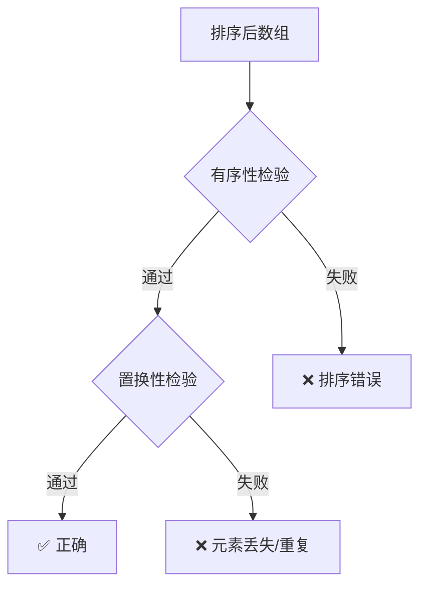
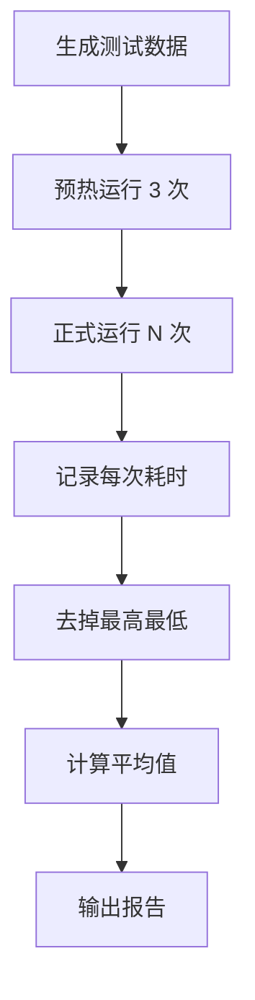

# 测试与基准指南

> 如何验证排序算法的正确性，如何进行性能基准测试。

---

## 📚 目录

1. [正确性测试](#1-正确性测试)
2. [稳定性测试](#2-稳定性测试)
3. [边界情况覆盖](#3-边界情况覆盖)
4. [性能基准测试](#4-性能基准测试)
5. [测试用例设计](#5-测试用例设计)
6. [如何使用基准测试框架](#6-如何使用基准测试框架)

---

## 1. 正确性测试

排序算法的正确性需要验证两点：

### 1.1 有序性 (Sortedness)

排序后的数组必须满足：`arr[i] <= arr[i+1]`（升序）

```typescript
function isSorted<T>(arr: T[], cmp: (a: T, b: T) => number): boolean {
  for (let i = 1; i < arr.length; i++) {
    if (cmp(arr[i - 1], arr[i]) > 0) return false;
  }
  return true;
}
```

### 1.2 置换性 (Permutation)

排序后的数组必须是原数组的重排，不能丢失或新增元素。

```typescript
function isPermutation<T>(original: T[], sorted: T[]): boolean {
  if (original.length !== sorted.length) return false;

  const countMap = new Map<T, number>();

  for (const item of original) {
    countMap.set(item, (countMap.get(item) || 0) + 1);
  }

  for (const item of sorted) {
    const count = countMap.get(item);
    if (!count) return false;
    countMap.set(item, count - 1);
  }

  return true;
}
```

### Mermaid：正确性检验流程



---

## 2. 稳定性测试

对于声称稳定的排序算法，还需要额外验证。

### 2.1 稳定性定义

相等元素在排序后保持原始相对顺序。

### 2.2 测试方法

```typescript
interface IndexedItem<T> {
  value: T;
  originalIndex: number;
}

function isStable<T>(
  original: T[],
  sorted: T[],
  cmp: (a: T, b: T) => number
): boolean {
  // 给原始数组附加索引
  const indexed: IndexedItem<T>[] = original.map((value, index) => ({
    value,
    originalIndex: index,
  }));

  // 找出 sorted 中每个元素对应的原始索引
  const sortedIndexes: number[] = [];
  const used = new Set<number>();

  for (const item of sorted) {
    for (const { value, originalIndex } of indexed) {
      if (!used.has(originalIndex) && cmp(value, item) === 0) {
        sortedIndexes.push(originalIndex);
        used.add(originalIndex);
        break;
      }
    }
  }

  // 检查相等元素的原始索引是否递增
  for (let i = 1; i < sorted.length; i++) {
    if (cmp(sorted[i - 1], sorted[i]) === 0) {
      if (sortedIndexes[i - 1] > sortedIndexes[i]) {
        return false;
      }
    }
  }

  return true;
}
```

### 2.3 测试用例示例

```typescript
// 测试稳定性的典型用例：多个相等元素
const testCase = [
  { key: 1, id: 'a' },
  { key: 2, id: 'b' },
  { key: 1, id: 'c' },
  { key: 2, id: 'd' },
  { key: 1, id: 'e' },
];

// 按 key 排序后，相同 key 的元素应保持 a < c < e, b < d
```

---

## 3. 边界情况覆盖

### 3.1 必须覆盖的边界

| 用例 | 描述 | 预期行为 |
|------|------|----------|
| 空数组 | `[]` | 返回 `[]` |
| 单元素 | `[1]` | 返回 `[1]` |
| 两元素（已序） | `[1, 2]` | 返回 `[1, 2]` |
| 两元素（逆序） | `[2, 1]` | 返回 `[1, 2]` |
| 全相同 | `[5, 5, 5, 5]` | 返回 `[5, 5, 5, 5]` |
| 已排序 | `[1, 2, 3, 4, 5]` | 返回原序 |
| 完全逆序 | `[5, 4, 3, 2, 1]` | 返回 `[1, 2, 3, 4, 5]` |
| 含负数 | `[-3, 1, -1, 2, 0]` | 正确排序 |
| 含浮点 | `[1.5, 1.1, 1.9]` | 正确排序 |

### 3.2 数据分布测试

| 分布类型 | 描述 | 用途 |
|----------|------|------|
| 随机 | 完全随机 | 平均情况 |
| 近乎有序 | 90%+ 已排序 | 测试最好情况 |
| 逆序 | 完全逆序 | 测试最坏情况 |
| 重复多 | 大量重复值 | 测试相等处理 |
| 锯齿形 | 升降交替 | 测试边界处理 |

---

## 4. 性能基准测试

### 4.1 测试指标

| 指标 | 单位 | 说明 |
|------|------|------|
| 执行时间 | ms | 排序耗时 |
| 比较次数 | 次 | 调用 comparator 次数 |
| 交换次数 | 次 | 元素交换次数 |
| 内存峰值 | MB | 额外内存使用（如果可测） |

### 4.2 测试规模

```typescript
const SCALES = [
  100,      // 小规模
  1_000,    // 中小规模
  10_000,   // 中等规模
  100_000,  // 大规模
  1_000_000 // 超大规模（O(n²) 算法慎用）
];
```

### 4.3 预热与多次运行

```typescript
function benchmark(fn: () => void, runs: number = 10): number {
  // 预热：让 JIT 优化
  for (let i = 0; i < 3; i++) fn();

  const times: number[] = [];
  for (let i = 0; i < runs; i++) {
    const start = performance.now();
    fn();
    times.push(performance.now() - start);
  }

  // 去掉最高最低，取平均
  times.sort((a, b) => a - b);
  const trimmed = times.slice(1, -1);
  return trimmed.reduce((a, b) => a + b, 0) / trimmed.length;
}
```

### Mermaid：基准测试流程



---

## 5. 测试用例设计

### 5.1 数据生成器类型

```typescript
// 见 算法包/公共库/src/数据生成器.ts

type DataDistribution =
  | 'random'        // 完全随机
  | 'sorted'        // 已排序
  | 'reversed'      // 完全逆序
  | 'nearlySorted'  // 近乎有序
  | 'fewUnique'     // 少量唯一值（重复多）
  | 'sawtooth';     // 锯齿形
```

### 5.2 表格数据测试

```typescript
interface TableRow {
  id: number;
  name: string;
  score: number;
  timestamp: number;
}

// 测试场景：按 score 降序，同分按 name 升序
const tableData: TableRow[] = generateTableData(1000);
```

### 5.3 搜索结果测试

```typescript
interface SearchResult {
  id: string;
  title: string;
  relevance: number;
  publishTime: Date;
}

// 测试场景：按 relevance 降序，同分按 publishTime 降序
const searchResults: SearchResult[] = generateSearchResults(100);
```

---

## 6. 如何使用基准测试框架

### 6.1 运行基准测试

```bash
# 使用 ts-node 运行
npx ts-node 基准测试/src/运行基准.ts

# 或编译后运行
npx tsc && node 基准测试/dist/运行基准.js
```

### 6.2 基准测试报告示例

```
┌──────────────┬────────┬─────────┬──────────┬──────────┐
│ 算法         │ n=1000 │ n=10000 │ n=100000 │ 稳定性   │
├──────────────┼────────┼─────────┼──────────┼──────────┤
│ 冒泡排序     │ 5ms    │ 450ms   │ 超时     │ ✅       │
│ 选择排序     │ 3ms    │ 280ms   │ 超时     │ ❌       │
│ 插入排序     │ 2ms    │ 180ms   │ 超时     │ ✅       │
│ 希尔排序     │ 1ms    │ 15ms    │ 250ms    │ ❌       │
│ 归并排序     │ 1ms    │ 12ms    │ 150ms    │ ✅       │
│ 快速排序     │ 0.5ms  │ 8ms     │ 100ms    │ ❌       │
│ 堆排序       │ 1ms    │ 15ms    │ 180ms    │ ❌       │
│ TimSort      │ 0.8ms  │ 10ms    │ 120ms    │ ✅       │
└──────────────┴────────┴─────────┴──────────┴──────────┘
```

### 6.3 添加新算法到基准

```typescript
// 在 基准测试/src/运行基准.ts 中注册

import { sort as bubbleSort, meta as bubbleMeta } from '../../算法包/冒泡排序/src';

const algorithms = [
  { name: bubbleMeta.name, sort: bubbleSort, meta: bubbleMeta },
  // ... 其他算法
];
```

---

## 📋 测试清单

在发布排序算法前，确保通过以下测试：

- [ ] 空数组
- [ ] 单元素
- [ ] 两元素（已序/逆序）
- [ ] 全相同元素
- [ ] 已排序数据
- [ ] 完全逆序数据
- [ ] 随机数据（多种规模）
- [ ] 重复多的数据
- [ ] 稳定性测试（如声称稳定）
- [ ] 性能基准（与预期复杂度吻合）

