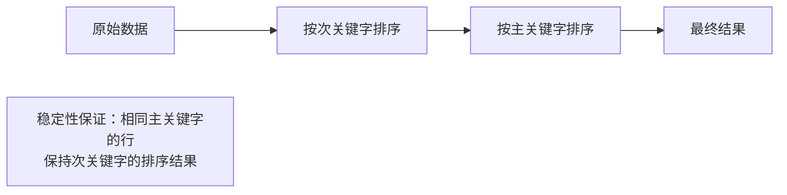
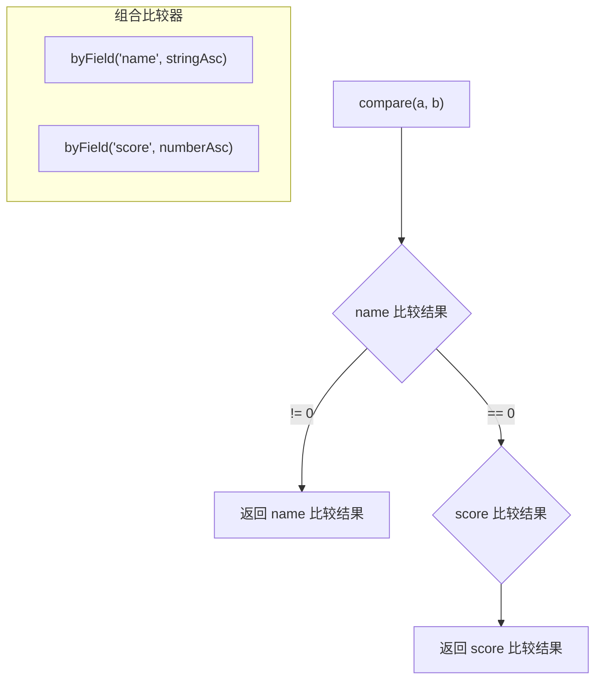

# 表格排序实战

## 📌 核心问题

前端表格排序的典型需求：
- 点击列头切换升序/降序
- 多列排序（先按 A 列，再按 B 列）
- 保持相同值的原始顺序（稳定性）
- 支持自定义比较逻辑

---

## 🎯 稳定性的真实含义

### 什么是稳定排序？

> 相等的元素在排序后保持它们在原数组中的相对顺序。

**实际意义**：用户先按 A 列排序，再按 B 列排序后，A 列相同的行仍保持之前的顺序。

### 示例

```typescript
const data = [
  { name: 'Alice', score: 85 },
  { name: 'Bob', score: 92 },
  { name: 'Charlie', score: 85 }, // 与 Alice 同分
];

// 稳定排序后：Alice 仍在 Charlie 前面
// [Alice(85), Charlie(85), Bob(92)] ❌
// [Alice(85), Charlie(85), Bob(92)] ✅ 保持原顺序
```

---

## 🔧 两种多列排序方式

### 方式 A：稳定排序 + 逆序排序

**思路**：从次关键字到主关键字依次排序



**代码示例**：

```typescript
import { stableSortBy } from '../算法包/公共库/src/稳定排序辅助';

// 先按 score，再按 name（最终主排序键是 name）
let result = [...data];
result = stableSortBy(result, r => r.score, numberAsc);  // 次关键字
result = stableSortBy(result, r => r.name, stringAsc);   // 主关键字
```

**优点**：
- 直观，容易理解
- 每一步可调试

**缺点**：
- 多次排序，性能较低
- 代码顺序与排序优先级相反

---

### 方式 B：组合比较器一次排序

**思路**：用 `compose` 组合多个比较器，一次排序完成



**代码示例**：

```typescript
import { compose, byField, numberAsc, stringAsc } from '../算法包/公共库/src/比较器';

// 先按 name，相同再按 score
const comparator = compose(
  byField('name', stringAsc),
  byField('score', numberAsc)
);

const result = [...data].sort(comparator);
```

**优点**：
- 一次排序，性能最优
- 排序优先级与代码顺序一致

**缺点**：
- 比较器组合可能较复杂
- 需要确保比较器满足数学性质

---

## 📊 两种方式对比

| 维度 | 方式 A（逆序多次排序） | 方式 B（组合比较器） |
|------|----------------------|-------------------|
| **性能** | O(k · n log n) | O(n log n) |
| **可读性** | 顺序与优先级相反 | 顺序与优先级一致 |
| **可维护性** | 简单直接 | 需要理解比较器组合 |
| **动态列** | 容易添加/移除 | 需要重建比较器 |
| **推荐场景** | 少量固定列 | 性能敏感/列多 |

---

## 💻 实战代码

### 1. 使用稳定排序辅助

```typescript
import { stableSortBy, makeStableComparator } from '../算法包/公共库/src/稳定排序辅助';
import { byField, numberAsc, stringAsc } from '../算法包/公共库/src/比较器';

interface TableRow {
  id: number;
  name: string;
  score: number;
  department: string;
}

// 方式 A：逆序多次排序
function sortByMultipleColumnsA(
  data: TableRow[],
  columns: Array<{ field: keyof TableRow; order: 'asc' | 'desc' }>
): TableRow[] {
  let result = [...data];

  // 从后往前排序（最后的是主关键字）
  for (let i = columns.length - 1; i >= 0; i--) {
    const { field, order } = columns[i];
    const cmp = order === 'asc' ? numberAsc : (a: number, b: number) => -numberAsc(a, b);
    result = stableSortBy(result, r => r[field] as number, cmp);
  }

  return result;
}
```

### 2. 使用组合比较器

```typescript
import { compose, byField, reverse, numberAsc, stringAsc } from '../算法包/公共库/src/比较器';

interface SortColumn<T> {
  field: keyof T;
  order: 'asc' | 'desc';
  type: 'number' | 'string';
}

function createMultiColumnComparator<T>(
  columns: SortColumn<T>[]
): (a: T, b: T) => number {
  const comparators = columns.map(({ field, order, type }) => {
    const baseCmp = type === 'number' ? numberAsc : stringAsc;
    const fieldCmp = byField(field, baseCmp as any);
    return order === 'desc' ? reverse(fieldCmp) : fieldCmp;
  });

  return compose(...comparators);
}

// 使用
const comparator = createMultiColumnComparator<TableRow>([
  { field: 'department', order: 'asc', type: 'string' },
  { field: 'score', order: 'desc', type: 'number' },
]);

const sorted = [...data].sort(comparator);
```

### 3. 表格组件集成

```typescript
interface TableState<T> {
  data: T[];
  sortColumns: SortColumn<T>[];
}

function handleColumnClick<T>(
  state: TableState<T>,
  field: keyof T,
  type: 'number' | 'string'
): TableState<T> {
  const existing = state.sortColumns.find(c => c.field === field);

  let newSortColumns: SortColumn<T>[];

  if (existing) {
    // 已存在：切换排序方向或移除
    if (existing.order === 'asc') {
      newSortColumns = state.sortColumns.map(c =>
        c.field === field ? { ...c, order: 'desc' as const } : c
      );
    } else {
      // 移除该列
      newSortColumns = state.sortColumns.filter(c => c.field !== field);
    }
  } else {
    // 新增排序列
    newSortColumns = [...state.sortColumns, { field, order: 'asc', type }];
  }

  const comparator = createMultiColumnComparator(newSortColumns);
  const sortedData = [...state.data].sort(comparator);

  return {
    data: sortedData,
    sortColumns: newSortColumns,
  };
}
```

---

## ⚠️ 常见陷阱

### 1. JavaScript sort() 不保证稳定

```typescript
// ❌ 不同浏览器/版本可能不稳定
data.sort((a, b) => a.score - b.score);

// ✅ 使用 stableSortBy 保证稳定
const sorted = stableSortBy(data, r => r.score, numberAsc);
```

### 2. 比较器返回 NaN

```typescript
// ❌ 可能返回 NaN
const cmp = (a, b) => a.value - b.value; // value 可能是 undefined

// ✅ 处理边界情况
import { nullSafe, numberAsc } from '../算法包/公共库/src/比较器';
const safeCmp = nullSafe(numberAsc);
```

### 3. 混合类型比较

```typescript
// ❌ 字符串和数字混合
const data = [{ val: '10' }, { val: 2 }];
data.sort((a, b) => a.val - b.val); // NaN

// ✅ 统一类型
data.sort((a, b) => Number(a.val) - Number(b.val));
```

---

## ✅ 自检清单

- [ ] 理解稳定排序在多列场景的作用
- [ ] 能用两种方式实现多列排序
- [ ] 知道 JavaScript sort() 稳定性的历史问题
- [ ] 能处理 null/undefined 和混合类型
- [ ] 能实现动态列排序的表格组件

