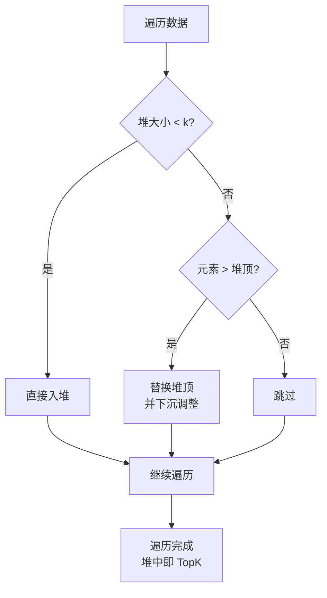
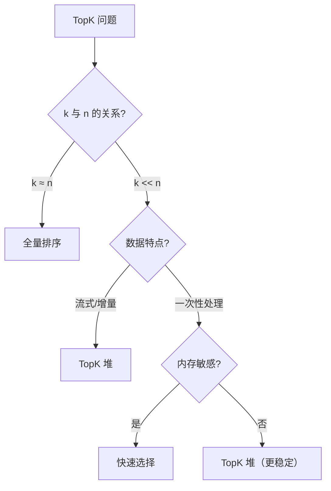
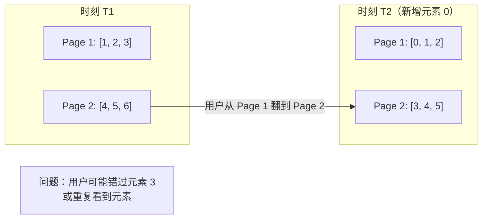

# 搜索结果与 TopK 排序

## 📌 核心问题

搜索结果排序的典型需求：
- 只需要前 K 个最相关的结果
- 结果持续到来（流式/增量更新）
- 分页浏览（第 N 页的结果）
- 多维度排序（相关度、时间、热度）

---

## 🎯 TopK 的工程动机

### 为什么不用全量排序？

| 场景 | 数据量 | 需要的结果 | 全量排序 | TopK |
|------|--------|-----------|---------|------|
| 搜索结果 | 100 万条 | 前 20 条 | O(n log n) | O(n log k) |
| 热门商品 | 10 万条 | 前 10 条 | O(n log n) | O(n log k) |
| 实时排行榜 | 持续更新 | 前 100 条 | 每次重排 | 增量维护 |

**核心洞察**：当 k << n 时，TopK 方法显著更高效。

---

## 🔧 三种方案对比

### 方案 1：全量排序

```typescript
function topKBySort<T>(arr: T[], k: number, cmp: Comparator<T>): T[] {
  return [...arr].sort(cmp).slice(0, k);
}
```

| 指标 | 值 |
|------|-----|
| 时间复杂度 | O(n log n) |
| 空间复杂度 | O(n) |
| 适用场景 | k ≈ n，数据量小 |

### 方案 2：TopK 堆



```typescript
function topKByHeap<T>(arr: T[], k: number, cmp: Comparator<T>): T[] {
  if (k <= 0) return [];
  if (arr.length <= k) return [...arr].sort(cmp);

  // 使用小顶堆维护最大的 k 个元素
  const heap = new MinHeap<T>((a, b) => cmp(a, b));

  for (const item of arr) {
    if (heap.size() < k) {
      heap.push(item);
    } else if (cmp(item, heap.peek()!) > 0) {
      heap.pop();
      heap.push(item);
    }
  }

  return heap.toSortedArray(cmp);
}
```

| 指标 | 值 |
|------|-----|
| 时间复杂度 | O(n log k) |
| 空间复杂度 | O(k) |
| 适用场景 | k << n，流式数据 |

### 方案 3：快速选择

```typescript
function topKByQuickSelect<T>(arr: T[], k: number, cmp: Comparator<T>): T[] {
  if (k <= 0) return [];
  if (arr.length <= k) return [...arr].sort(cmp);

  const result = [...arr];
  quickSelect(result, k, cmp);

  // 前 k 个元素是最大的 k 个，但未排序
  return result.slice(0, k).sort(cmp);
}
```

| 指标 | 值 |
|------|-----|
| 时间复杂度 | O(n) 平均，O(n²) 最坏 |
| 空间复杂度 | O(1) |
| 适用场景 | 内存敏感，不需要流式 |

---

## 📊 方案选择指南



---

## 🔄 增量更新排序

### 场景：新结果持续到来

```typescript
class TopKTracker<T> {
  private heap: MinHeap<T>;
  private k: number;
  private cmp: Comparator<T>;

  constructor(k: number, cmp: Comparator<T>) {
    this.k = k;
    this.cmp = cmp;
    this.heap = new MinHeap(cmp);
  }

  /**
   * 添加新元素
   * @returns 是否进入 TopK
   */
  add(item: T): boolean {
    if (this.heap.size() < this.k) {
      this.heap.push(item);
      return true;
    }

    if (this.cmp(item, this.heap.peek()!) > 0) {
      this.heap.pop();
      this.heap.push(item);
      return true;
    }

    return false;
  }

  /**
   * 批量添加
   */
  addBatch(items: T[]): void {
    for (const item of items) {
      this.add(item);
    }
  }

  /**
   * 获取当前 TopK（已排序）
   */
  getTopK(): T[] {
    return this.heap.toSortedArray(this.cmp);
  }

  /**
   * 获取最小值（第 k 名的门槛）
   */
  getThreshold(): T | null {
    return this.heap.peek();
  }
}
```

### 使用示例

```typescript
const tracker = new TopKTracker<SearchResult>(10, (a, b) => a.relevance - b.relevance);

// 初始批次
tracker.addBatch(initialResults);

// 新结果到来
websocket.on('newResult', (result) => {
  const entered = tracker.add(result);
  if (entered) {
    updateUI(tracker.getTopK());
  }
});
```

---

## 📖 分页与游标

### 分页的稳定性问题



### 解决方案：游标分页

```typescript
interface CursorPage<T> {
  items: T[];
  nextCursor: string | null;
  hasMore: boolean;
}

function paginateWithCursor<T>(
  data: T[],
  cursor: string | null,
  pageSize: number,
  getKey: (item: T) => string
): CursorPage<T> {
  // 找到游标位置
  let startIndex = 0;
  if (cursor) {
    startIndex = data.findIndex(item => getKey(item) === cursor) + 1;
    if (startIndex === 0) {
      // 游标失效，从头开始
      startIndex = 0;
    }
  }

  const items = data.slice(startIndex, startIndex + pageSize);
  const hasMore = startIndex + pageSize < data.length;
  const nextCursor = hasMore ? getKey(items[items.length - 1]) : null;

  return { items, nextCursor, hasMore };
}
```

### 游标 vs 偏移量

| 特性 | 偏移量分页 | 游标分页 |
|------|-----------|---------|
| 实现复杂度 | 简单 | 较复杂 |
| 数据变化时 | 不稳定 | 稳定 |
| 随机跳页 | 支持 | 不支持 |
| 适用场景 | 静态数据 | 动态数据 |

---

## 🌐 前端实战场景

### 1. 搜索结果排序

```typescript
interface SearchResult {
  id: string;
  title: string;
  relevance: number;
  publishTime: number;
  viewCount: number;
}

// 多维度排序：相关度 > 时间 > 热度
const searchComparator = compose(
  byField('relevance', (a, b) => b - a),  // 降序
  byField('publishTime', (a, b) => b - a),
  byField('viewCount', (a, b) => b - a)
);

// 只取前 20 条
const topResults = topKByHeap(allResults, 20, searchComparator);
```

### 2. 实时排行榜

```typescript
class Leaderboard<T> {
  private tracker: TopKTracker<T>;

  constructor(topN: number, scoreField: keyof T) {
    this.tracker = new TopKTracker(topN, (a, b) =>
      (a[scoreField] as number) - (b[scoreField] as number)
    );
  }

  update(item: T): boolean {
    return this.tracker.add(item);
  }

  getLeaderboard(): T[] {
    return this.tracker.getTopK().reverse(); // 降序
  }
}
```

### 3. 带过滤的 TopK

```typescript
function topKWithFilter<T>(
  arr: T[],
  k: number,
  filter: (item: T) => boolean,
  cmp: Comparator<T>
): T[] {
  const filtered = arr.filter(filter);
  return topKByHeap(filtered, k, cmp);
}

// 只要最近 7 天的热门文章
const recentHot = topKWithFilter(
  articles,
  10,
  a => a.publishTime > Date.now() - 7 * 24 * 60 * 60 * 1000,
  (a, b) => b.viewCount - a.viewCount
);
```

---

## ⚠️ 性能注意事项

1. **k 的选择**：k 过大时堆方法优势减小
2. **内存占用**：堆方法需要 O(k) 额外空间
3. **流式处理**：考虑使用 Web Worker 避免阻塞 UI
4. **缓存策略**：TopK 结果可以缓存，避免重复计算

---

## ✅ 自检清单

- [ ] 理解 TopK 相比全量排序的优势
- [ ] 能根据场景选择合适的 TopK 方案
- [ ] 知道如何实现增量更新的 TopK
- [ ] 理解分页稳定性问题及游标分页解决方案
- [ ] 能实现多维度排序的搜索结果

