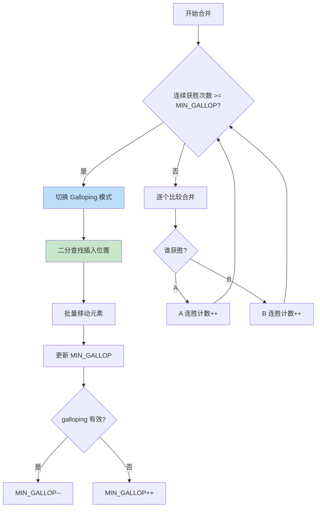
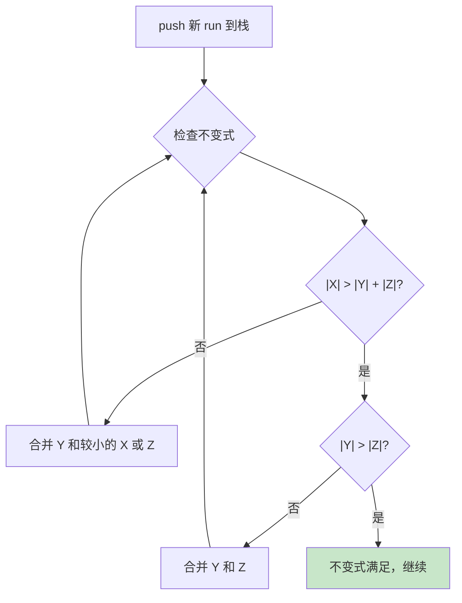
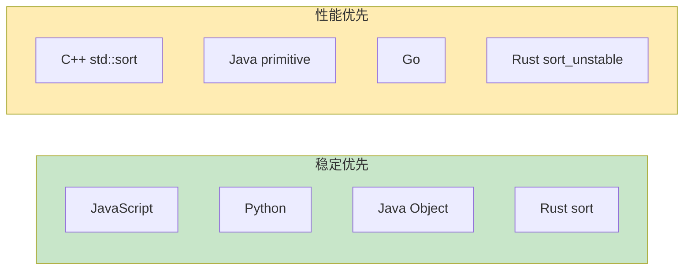
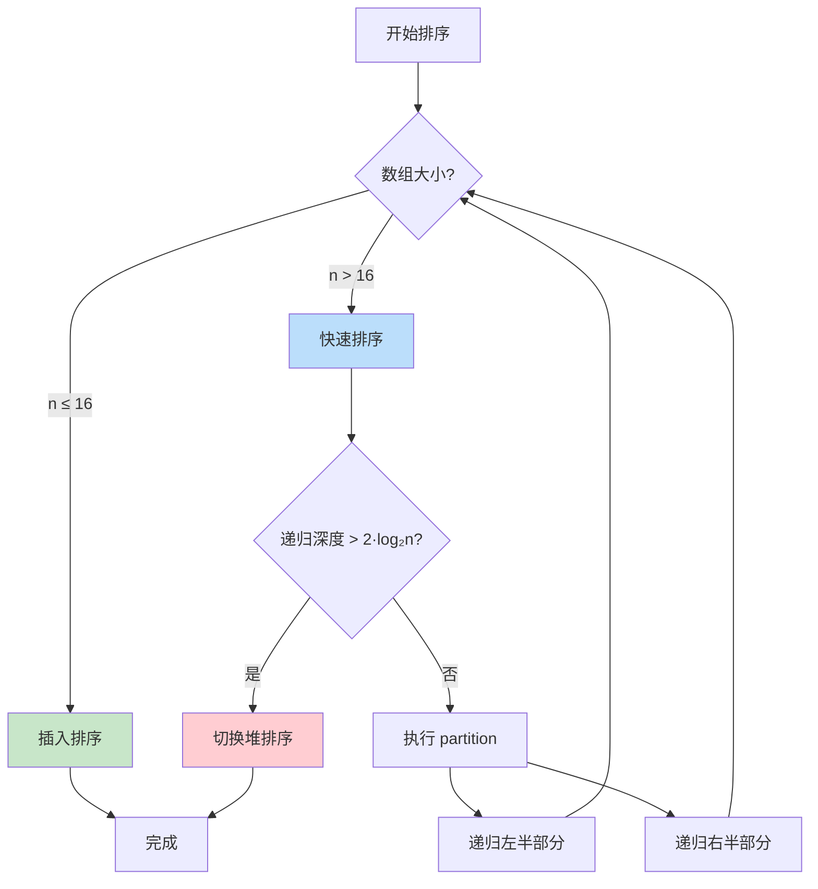
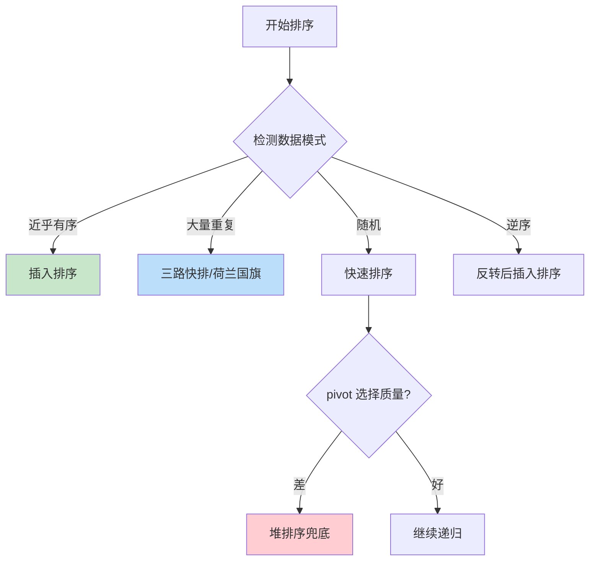

# 底层实现深度剖析

> 深入理解 V8 TimSort、各语言标准库实现，知其然更知其所以然

## 📚 目录

1. [V8 TimSort 源码分析](#1-v8-timsort-源码分析)
2. [各语言标准库对比](#2-各语言标准库对比)
3. [为什么 TimSort 成为主流](#3-为什么-timsort-成为主流)
4. [Java 双轴快排分析](#4-java-双轴快排分析)
5. [C++ Introsort 分析](#5-c-introsort-分析)
6. [Go pdqsort 分析](#6-go-pdqsort-分析)

---

## 1. V8 TimSort 源码分析

### 1.1 源码位置

V8 的排序实现位于：
- **Torque 实现**：`v8/src/builtins/array-sort.tq`
- **旧版 JS 实现**：`v8/src/js/array.js`（已废弃）

从 V8 v7.0 开始，`Array.prototype.sort` 使用 TimSort 并保证稳定性。

### 1.2 Run 检测

**Run** 是已有序的连续子序列。TimSort 首先识别数据中已存在的有序片段。

```
原始数组: [1, 3, 5, 4, 2, 8, 9, 7]
           └─────┘  └────────┘
            run1      run2
```

**检测逻辑**：

```typescript
// 伪代码：V8 的 run 检测
function countRunAndMakeAscending<T>(
  arr: T[],
  lo: number,
  hi: number,
  cmp: Comparator<T>
): number {
  let runHi = lo + 1;
  if (runHi === hi) return 1;

  // 判断是升序还是降序
  if (cmp(arr[runHi], arr[lo]) < 0) {
    // 降序 run：继续向后找
    while (runHi < hi && cmp(arr[runHi], arr[runHi - 1]) < 0) {
      runHi++;
    }
    // 反转降序 run 为升序
    reverseRange(arr, lo, runHi);
  } else {
    // 升序 run：继续向后找
    while (runHi < hi && cmp(arr[runHi], arr[runHi - 1]) >= 0) {
      runHi++;
    }
  }

  return runHi - lo;
}
```

### 1.3 MinRun 计算

**目标**：让 run 数量接近 2 的幂，优化归并效率。

```typescript
// V8 的 minrun 计算
function computeMinRunLength(n: number): number {
  let r = 0;  // 如果 n 不是 2 的幂，r 会变成 1
  while (n >= 64) {
    r |= n & 1;
    n >>= 1;
  }
  return n + r;
}

// 结果：minrun 在 32-64 之间
// n = 64  → minrun = 32
// n = 65  → minrun = 33
// n = 128 → minrun = 32
// n = 256 → minrun = 32
```

**原理**：
- 如果 n 是 2 的幂，minrun = 32
- 否则 minrun 稍大，确保 run 数量接近 2 的幂
- 目标：`n / minrun` 接近 2 的幂

### 1.4 Galloping 模式

当一个 run 连续"获胜"多次时，切换到 galloping 模式加速查找。



**MIN_GALLOP 的自适应调整**：

```typescript
const MIN_GALLOP_INITIAL = 7;
let minGallop = MIN_GALLOP_INITIAL;

// galloping 有效时：减小阈值，更容易触发
if (gallopingWasEffective) {
  minGallop = Math.max(1, minGallop - 1);
}

// galloping 无效时：增大阈值，减少触发
if (!gallopingWasEffective) {
  minGallop++;
}
```

### 1.5 合并栈不变式

TimSort 使用栈管理待合并的 run，必须维护以下不变式：

```
对于栈顶三个 run（从栈底到栈顶为 X, Y, Z）：
1. |X| > |Y| + |Z|
2. |Y| > |Z|
```



**为什么需要这个不变式？**
- 保证合并的 run 大小相近（效率高）
- 避免过早合并小 run（浪费工作）
- 控制栈深度为 O(log n)

### 1.6 V8 vs Python TimSort 差异

| 特性 | Python TimSort | V8 TimSort |
|------|---------------|------------|
| 语言 | C | Torque (V8 内部 DSL) |
| 最小 run 阈值 | 64 | 64 |
| galloping 初始值 | 7 | 7 |
| 合并缓冲区 | 固定分配 | 动态分配 |
| 对象比较 | Python 协议 | JS comparator |

---

## 2. 各语言标准库对比

### 2.1 完整对比表

| 语言 | 函数 | 算法 | 稳定性 | 时间复杂度 | 特点 |
|------|------|------|:------:|-----------|------|
| **JavaScript (V8)** | `Array.sort()` | TimSort | ✅ | O(n log n) | ES2019 后规范要求稳定 |
| **Python** | `list.sort()` / `sorted()` | TimSort | ✅ | O(n log n) | TimSort 的发源地 (2002) |
| **Java** | `Arrays.sort(Object[])` | TimSort | ✅ | O(n log n) | Java 7+ |
| **Java** | `Arrays.sort(int[])` | 双轴快排 | ❌ | O(n log n) | 基本类型专用 |
| **C++** | `std::sort()` | Introsort | ❌ | O(n log n) | 快排+堆排+插入 |
| **C++** | `std::stable_sort()` | 归并 | ✅ | O(n log n) | 需要额外空间 |
| **Rust** | `slice.sort()` | 改进归并 | ✅ | O(n log n) | 默认稳定 |
| **Rust** | `slice.sort_unstable()` | pdqsort | ❌ | O(n log n) | 更快但不稳定 |
| **Go** | `sort.Sort()` | pdqsort | ❌ | O(n log n) | Go 1.19+ |
| **Swift** | `Array.sort()` | Introsort | ❌ | O(n log n) | - |

### 2.2 稳定性设计选择



---

## 3. 为什么 TimSort 成为主流

### 3.1 现实数据的特点

现实世界的数据**不是随机的**，通常具有以下特点：

```
✓ 部分有序（数据库查询结果、日志、时间序列）
✓ 存在大量重复（分类数据、状态码）
✓ 多次排序（表格多列排序）
```

**TimSort 针对这些特点优化**：
- Run 检测：利用已有顺序
- 稳定性：多次排序不打乱
- 自适应：接近有序时接近 O(n)

### 3.2 实际性能对比

```
数据类型                 | 快排    | 归并    | TimSort
------------------------|---------|---------|----------
完全随机                 | 1.0x    | 1.2x    | 1.1x
近乎有序（90% 有序）      | 1.0x    | 1.2x    | 0.3x ⭐
逆序                     | 1.0x    | 1.2x    | 0.5x ⭐
大量重复（10 种值）       | 2.0x    | 1.2x    | 0.8x ⭐
```

### 3.3 稳定性的业务价值

```typescript
// 表格排序场景
const users = [
  { name: 'Alice', age: 30, dept: 'IT' },
  { name: 'Bob', age: 25, dept: 'HR' },
  { name: 'Charlie', age: 30, dept: 'IT' },
];

// 先按部门排序
users.sort((a, b) => a.dept.localeCompare(b.dept));
// 再按年龄排序
users.sort((a, b) => a.age - b.age);

// 稳定排序：相同年龄的人保持部门排序
// 不稳定排序：相同年龄的人顺序不确定
```

---

## 4. Java 双轴快排分析

Java 对基本类型数组使用 **Dual-Pivot Quicksort**（双轴快排），比单轴快排快约 10%。

### 4.1 核心思想

使用两个 pivot 将数组分成三部分：

```
      < P1       P1 ≤ x ≤ P2       > P2
   ┌─────────┬──────────────┬──────────┐
   │  小区   │    中间区    │   大区   │
   └─────────┴──────────────┴──────────┘
       P1                        P2
```

### 4.2 为什么更快？

| 特性 | 单轴快排 | 双轴快排 |
|------|---------|---------|
| 分区数 | 2 | 3 |
| 每次递归处理 | n/2 | n/3 |
| 比较次数 | 2n ln n | 1.9n ln n |
| 缓存友好性 | 好 | 更好 |

### 4.3 Java 的混合策略

```java
// java.util.DualPivotQuicksort 简化逻辑
void sort(int[] a, int left, int right) {
    int length = right - left + 1;

    // 小数组：插入排序
    if (length < INSERTION_SORT_THRESHOLD) {  // 47
        insertionSort(a, left, right);
        return;
    }

    // 中等数组：双轴快排
    if (length < QUICKSORT_THRESHOLD) {  // 286
        dualPivotQuicksort(a, left, right);
        return;
    }

    // 大数组：检测是否近乎有序
    if (isNearlyOrdered(a, left, right)) {
        mergeSort(a, left, right);  // 归并
    } else {
        dualPivotQuicksort(a, left, right);
    }
}
```

---

## 5. C++ Introsort 分析

C++ `std::sort()` 使用 **Introsort**，结合快排、堆排、插入排序的优点。

### 5.1 决策流程



### 5.2 为什么这样设计？

| 组件 | 目的 |
|------|------|
| 快排 | 平均性能最好 |
| 堆排兜底 | 避免 O(n²) 最坏情况 |
| 插入排序 | 小数组常数因子小 |

### 5.3 深度阈值的选择

```cpp
// 典型实现
const int DEPTH_LIMIT = 2 * floor(log2(n));

// 为什么是 2·log₂n？
// - 理想快排递归深度：log₂n
// - 允许 2 倍余量应对不均匀分区
// - 超过则说明 pivot 选择很差，切换堆排
```

---

## 6. Go pdqsort 分析

Go 1.19+ 使用 **Pattern-Defeating Quicksort (pdqsort)**，专门优化常见数据模式。

### 6.1 核心创新



### 6.2 模式检测

```go
// 伪代码：pdqsort 的模式检测
func pdqsort(data []int) {
    // 1. 检测是否近乎有序
    if partialInsertionSort(data) {
        return  // 插入排序搞定
    }

    // 2. 检测是否有大量重复
    pivot := choosePivot(data)
    lt, gt := partition3Way(data, pivot)

    // 3. 检测 pivot 质量
    if badPivot(lt, gt, len(data)) {
        heapsort(data)
        return
    }

    // 4. 递归
    pdqsort(data[:lt])
    pdqsort(data[gt:])
}
```

### 6.3 性能特点

| 数据模式 | pdqsort | 传统快排 |
|---------|---------|---------|
| 随机 | O(n log n) | O(n log n) |
| 有序 | O(n) ⭐ | O(n²) |
| 逆序 | O(n) ⭐ | O(n²) |
| 大量重复 | O(n) ⭐ | O(n²) |
| 恶意输入 | O(n log n) | O(n²) |

---

## 📖 延伸阅读

### 论文与源码

- [TimSort 原始论文](https://bugs.python.org/file4451/timsort.txt) - Tim Peters, 2002
- [V8 排序源码](https://github.com/nicknisi/cs101/blob/master/array-sort.tq) - Torque 实现
- [pdqsort 论文](https://arxiv.org/abs/2106.05123) - Pattern-defeating Quicksort
- [Java DualPivotQuicksort](https://github.com/openjdk/jdk/blob/master/src/java.base/share/classes/java/util/DualPivotQuicksort.java)

### 博客与讲解

- [V8 Blog: Stable Sort](https://v8.dev/features/stable-sort)
- [Rust 排序算法选择](https://github.com/rust-lang/rust/pull/38192)
- [Go pdqsort 引入](https://github.com/golang/go/commit/72e77a7f41bbf45d466119444307fd3ae996e257)

---

## 🎯 面试要点

### 必须能回答的问题

1. **为什么 JavaScript 的 sort 是稳定的？**
   - ES2019 规范要求
   - V8 使用 TimSort 实现

2. **TimSort 为什么对近乎有序数据快？**
   - Run 检测利用已有顺序
   - 避免不必要的比较和移动

3. **Introsort 如何避免快排的 O(n²)？**
   - 监控递归深度
   - 超过阈值切换堆排序

4. **为什么 Java 对基本类型用双轴快排？**
   - 基本类型不需要稳定性
   - 双轴快排比单轴快 10%

