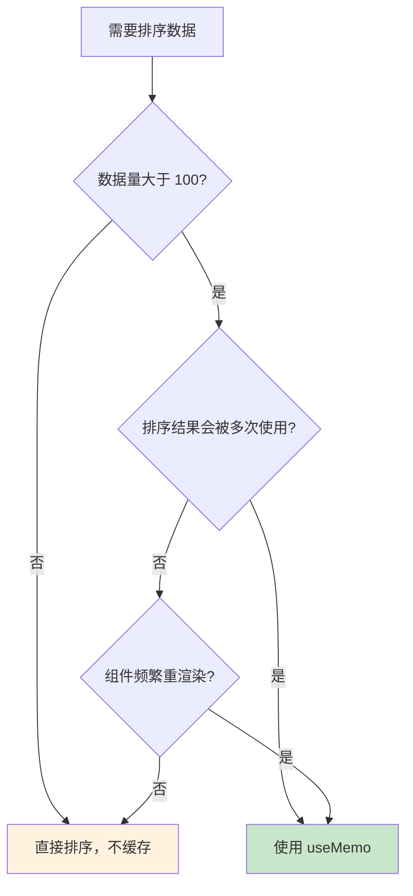
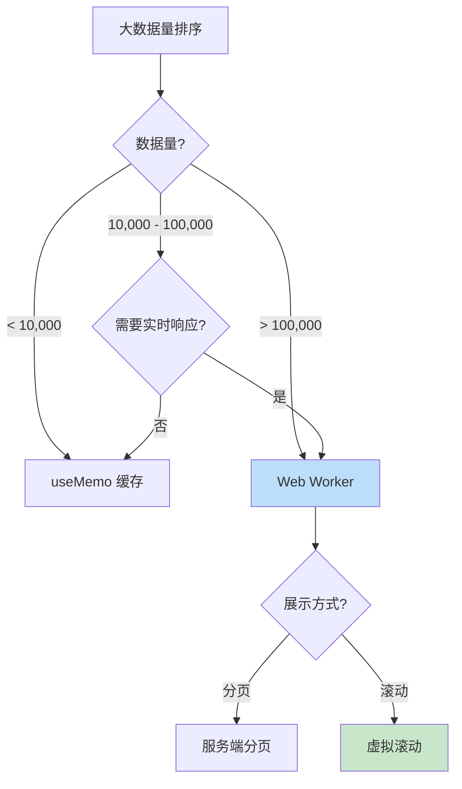
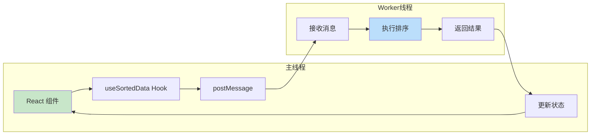
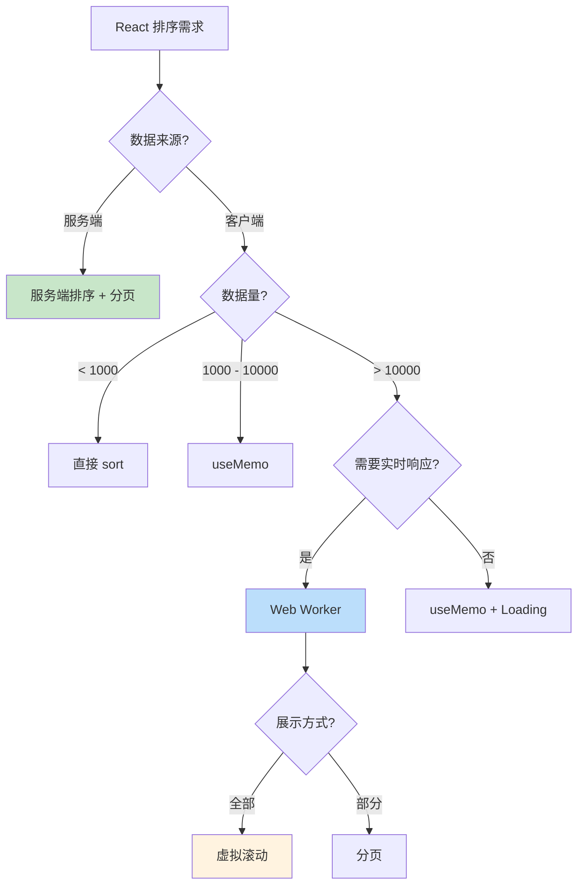

# React 排序最佳实践

> 在 React 应用中高效处理排序，从 useMemo 到 Web Worker

## 📚 目录

1. [useMemo 缓存排序结果](#1-usememo-缓存排序结果)
2. [大数据量优化策略](#2-大数据量优化策略)
3. [Web Worker 排序实现](#3-web-worker-排序实现)
4. [表格组件的排序状态管理](#4-表格组件的排序状态管理)
5. [性能对比与选型建议](#5-性能对比与选型建议)

---

## 1. useMemo 缓存排序结果

### 1.1 基础用法

```typescript
import { useMemo, useState } from 'react';

interface User {
  id: number;
  name: string;
  age: number;
}

function UserList({ users }: { users: User[] }) {
  const [sortKey, setSortKey] = useState<keyof User>('name');
  const [sortOrder, setSortOrder] = useState<'asc' | 'desc'>('asc');

  // ✅ 使用 useMemo 缓存排序结果
  const sortedUsers = useMemo(() => {
    const sorted = [...users].sort((a, b) => {
      const aVal = a[sortKey];
      const bVal = b[sortKey];

      if (typeof aVal === 'string' && typeof bVal === 'string') {
        return sortOrder === 'asc'
          ? aVal.localeCompare(bVal)
          : bVal.localeCompare(aVal);
      }

      return sortOrder === 'asc'
        ? (aVal as number) - (bVal as number)
        : (bVal as number) - (aVal as number);
    });
    return sorted;
  }, [users, sortKey, sortOrder]); // 依赖数组

  return (
    <ul>
      {sortedUsers.map(user => (
        <li key={user.id}>{user.name} - {user.age}</li>
      ))}
    </ul>
  );
}
```

### 1.2 何时使用 useMemo



### 1.3 依赖数组的正确写法

```typescript
// ❌ 错误：每次渲染都会创建新的比较函数
const sortedData = useMemo(() => {
  return [...data].sort((a, b) => a.name.localeCompare(b.name));
}, [data, (a, b) => a.name.localeCompare(b.name)]); // comparator 每次都是新引用

// ✅ 正确：使用 useCallback 稳定比较函数
const comparator = useCallback(
  (a: User, b: User) => a.name.localeCompare(b.name),
  []
);

const sortedData = useMemo(() => {
  return [...data].sort(comparator);
}, [data, comparator]);

// ✅ 更简单：将排序逻辑内联，依赖排序字段
const sortedData = useMemo(() => {
  return [...data].sort((a, b) => {
    const aVal = a[sortKey];
    const bVal = b[sortKey];
    return sortOrder === 'asc' ? aVal - bVal : bVal - aVal;
  });
}, [data, sortKey, sortOrder]);
```

### 1.4 避免常见陷阱

```typescript
// ❌ 陷阱 1：直接修改原数组
const sortedData = useMemo(() => {
  return data.sort((a, b) => a - b); // 修改了 props！
}, [data]);

// ✅ 正确：创建副本
const sortedData = useMemo(() => {
  return [...data].sort((a, b) => a - b);
}, [data]);

// ❌ 陷阱 2：对象引用不稳定
const [config, setConfig] = useState({ key: 'name', order: 'asc' });
const sortedData = useMemo(() => {
  // config 对象每次都是新引用（如果在渲染时创建）
}, [data, config]);

// ✅ 正确：拆分为基本类型
const [sortKey, setSortKey] = useState('name');
const [sortOrder, setSortOrder] = useState('asc');
const sortedData = useMemo(() => {
  // ...
}, [data, sortKey, sortOrder]);
```

---

## 2. 大数据量优化策略

### 2.1 策略选择流程



### 2.2 虚拟滚动 + 排序

虚拟滚动只渲染可见区域的元素，大幅减少 DOM 节点：

```typescript
import { useVirtualList } from './hooks/useVirtualList';

function VirtualSortedList<T>({
  data,
  sortConfig,
  itemHeight,
  containerHeight
}: Props<T>) {
  // 1. 先排序
  const sortedData = useMemo(() => {
    if (!sortConfig) return data;
    return [...data].sort(sortConfig.comparator);
  }, [data, sortConfig]);

  // 2. 再虚拟化
  const {
    visibleItems,
    containerProps,
    wrapperProps
  } = useVirtualList({
    items: sortedData,
    itemHeight,
    containerHeight,
  });

  return (
    <div {...containerProps}>
      <div {...wrapperProps}>
        {visibleItems.map(({ item, index, style }) => (
          <div key={index} style={style}>
            {renderItem(item)}
          </div>
        ))}
      </div>
    </div>
  );
}
```

### 2.3 分页 vs 虚拟滚动

| 特性 | 分页 | 虚拟滚动 |
|------|------|---------|
| 实现复杂度 | 低 | 中 |
| 用户体验 | 需要点击 | 无缝滚动 |
| 内存占用 | 低 | 中（需要全量数据） |
| SEO 友好 | 是 | 否 |
| 适用场景 | 表格、列表 | 长列表、瀑布流 |

---

## 3. Web Worker 排序实现

### 3.1 为什么需要 Web Worker

排序是 CPU 密集型操作，大数据量会阻塞主线程：

```
主线程（无 Worker）:
├── 用户点击排序
├── 执行排序（500ms）← 页面卡顿！
└── 更新 UI

主线程 + Worker:
├── 用户点击排序
├── 发送数据到 Worker
├── 等待结果（UI 保持响应）← 可以显示 loading
└── 接收结果，更新 UI
```

### 3.2 实现架构



### 3.3 Worker 文件实现

```typescript
// sort.worker.ts
interface SortMessage<T> {
  id: string;
  data: T[];
  sortKey: string;
  sortOrder: 'asc' | 'desc';
}

self.onmessage = function<T>(e: MessageEvent<SortMessage<T>>) {
  const { id, data, sortKey, sortOrder } = e.data;

  const sorted = [...data].sort((a: any, b: any) => {
    const aVal = a[sortKey];
    const bVal = b[sortKey];

    let result: number;
    if (typeof aVal === 'string') {
      result = aVal.localeCompare(bVal);
    } else {
      result = aVal - bVal;
    }

    return sortOrder === 'asc' ? result : -result;
  });

  self.postMessage({ id, sorted });
};
```

### 3.4 Hook 封装

```typescript
// useSortedData.ts
import { useState, useEffect, useRef, useMemo } from 'react';

interface SortConfig<T> {
  key: keyof T;
  order: 'asc' | 'desc';
}

interface UseSortedDataOptions {
  useWorker?: boolean;
  workerThreshold?: number; // 超过此数量使用 Worker
}

export function useSortedData<T>(
  data: T[],
  sortConfig: SortConfig<T> | null,
  options: UseSortedDataOptions = {}
): { sortedData: T[]; isLoading: boolean } {
  const { useWorker = false, workerThreshold = 10000 } = options;

  const [sortedData, setSortedData] = useState<T[]>(data);
  const [isLoading, setIsLoading] = useState(false);
  const workerRef = useRef<Worker | null>(null);
  const requestIdRef = useRef(0);

  // 决定是否使用 Worker
  const shouldUseWorker = useWorker && data.length > workerThreshold;

  useEffect(() => {
    if (!sortConfig) {
      setSortedData(data);
      return;
    }

    if (shouldUseWorker) {
      // Web Worker 排序
      setIsLoading(true);

      if (!workerRef.current) {
        workerRef.current = new Worker(
          new URL('./sort.worker.ts', import.meta.url)
        );
      }

      const currentId = ++requestIdRef.current;

      workerRef.current.onmessage = (e) => {
        if (e.data.id === currentId) {
          setSortedData(e.data.sorted);
          setIsLoading(false);
        }
      };

      workerRef.current.postMessage({
        id: currentId,
        data,
        sortKey: sortConfig.key,
        sortOrder: sortConfig.order,
      });
    } else {
      // 主线程排序
      const sorted = [...data].sort((a, b) => {
        const aVal = a[sortConfig.key];
        const bVal = b[sortConfig.key];

        let result: number;
        if (typeof aVal === 'string' && typeof bVal === 'string') {
          result = aVal.localeCompare(bVal);
        } else {
          result = (aVal as number) - (bVal as number);
        }

        return sortConfig.order === 'asc' ? result : -result;
      });
      setSortedData(sorted);
    }

    return () => {
      // 清理
    };
  }, [data, sortConfig, shouldUseWorker]);

  // 清理 Worker
  useEffect(() => {
    return () => {
      workerRef.current?.terminate();
    };
  }, []);

  return { sortedData, isLoading };
}
```

### 3.5 Transferable Objects 优化

对于超大数组，使用 Transferable Objects 避免复制：

```typescript
// 主线程
const buffer = new ArrayBuffer(data.length * 8); // Float64Array
const view = new Float64Array(buffer);
data.forEach((val, i) => view[i] = val);

worker.postMessage({ buffer }, [buffer]); // 转移所有权，零复制

// Worker
self.onmessage = (e) => {
  const view = new Float64Array(e.data.buffer);
  // 排序 view...
  self.postMessage({ buffer: view.buffer }, [view.buffer]);
};
```

---

## 4. 表格组件的排序状态管理

### 4.1 排序状态设计

```typescript
// 单列排序
interface SingleSortState {
  key: string;
  order: 'asc' | 'desc';
}

// 多列排序
interface MultiSortState {
  columns: Array<{
    key: string;
    order: 'asc' | 'desc';
    priority: number; // 优先级
  }>;
}

// 推荐：统一接口
type SortState = {
  key: string;
  order: 'asc' | 'desc';
}[];
```

### 4.2 点击表头排序逻辑

```typescript
function useTableSort<T>(initialState: SortState = []) {
  const [sortState, setSortState] = useState<SortState>(initialState);

  const handleHeaderClick = (key: string, isMultiSort: boolean) => {
    setSortState(prev => {
      const existingIndex = prev.findIndex(s => s.key === key);

      if (isMultiSort) {
        // Shift + 点击：多列排序
        if (existingIndex >= 0) {
          // 已存在：切换顺序或移除
          const existing = prev[existingIndex];
          if (existing.order === 'asc') {
            return prev.map((s, i) =>
              i === existingIndex ? { ...s, order: 'desc' } : s
            );
          } else {
            return prev.filter((_, i) => i !== existingIndex);
          }
        } else {
          // 不存在：添加
          return [...prev, { key, order: 'asc' }];
        }
      } else {
        // 普通点击：单列排序
        if (existingIndex >= 0 && prev.length === 1) {
          const existing = prev[0];
          if (existing.order === 'asc') {
            return [{ key, order: 'desc' }];
          } else {
            return []; // 取消排序
          }
        }
        return [{ key, order: 'asc' }];
      }
    });
  };

  return { sortState, handleHeaderClick };
}
```

### 4.3 排序指示器组件

```tsx
interface SortIndicatorProps {
  order: 'asc' | 'desc' | null;
  priority?: number; // 多列排序时的优先级
}

function SortIndicator({ order, priority }: SortIndicatorProps) {
  if (!order) {
    return <span className="sort-indicator inactive">⇅</span>;
  }

  return (
    <span className="sort-indicator active">
      {order === 'asc' ? '↑' : '↓'}
      {priority !== undefined && priority > 0 && (
        <sup className="sort-priority">{priority + 1}</sup>
      )}
    </span>
  );
}
```

### 4.4 完整表格组件

```tsx
interface Column<T> {
  key: keyof T;
  title: string;
  sortable?: boolean;
  render?: (value: T[keyof T], record: T) => React.ReactNode;
}

interface SortableTableProps<T> {
  data: T[];
  columns: Column<T>[];
  rowKey: keyof T;
}

function SortableTable<T>({ data, columns, rowKey }: SortableTableProps<T>) {
  const { sortState, handleHeaderClick } = useTableSort<T>();
  const { sortedData, isLoading } = useSortedData(data, sortState);

  return (
    <div className="table-container">
      {isLoading && <div className="loading-overlay">排序中...</div>}

      <table>
        <thead>
          <tr>
            {columns.map(col => {
              const sortInfo = sortState.find(s => s.key === col.key);
              const priority = sortState.findIndex(s => s.key === col.key);

              return (
                <th
                  key={String(col.key)}
                  onClick={(e) => col.sortable && handleHeaderClick(
                    String(col.key),
                    e.shiftKey
                  )}
                  className={col.sortable ? 'sortable' : ''}
                >
                  {col.title}
                  {col.sortable && (
                    <SortIndicator
                      order={sortInfo?.order ?? null}
                      priority={priority >= 0 ? priority : undefined}
                    />
                  )}
                </th>
              );
            })}
          </tr>
        </thead>
        <tbody>
          {sortedData.map(record => (
            <tr key={String(record[rowKey])}>
              {columns.map(col => (
                <td key={String(col.key)}>
                  {col.render
                    ? col.render(record[col.key], record)
                    : String(record[col.key])
                  }
                </td>
              ))}
            </tr>
          ))}
        </tbody>
      </table>
    </div>
  );
}
```

---

## 5. 性能对比与选型建议

### 5.1 性能对比表

| 数据量 | 直接排序 | useMemo | Web Worker | 建议 |
|-------:|--------:|--------:|-----------:|------|
| 100 | <1ms | <1ms | 不值得 | 直接排序 |
| 1,000 | ~5ms | 缓存后 <1ms | 不值得 | useMemo |
| 10,000 | ~50ms | 缓存后 <1ms | ~60ms | useMemo |
| 100,000 | ~500ms | 缓存后 <1ms | ~100ms | Worker |
| 1,000,000 | ~5s 卡顿 | 首次 ~5s | ~1s | Worker + 虚拟滚动 |

### 5.2 选型决策树



### 5.3 最佳实践清单

```
✅ 排序前始终创建数组副本
✅ 使用 useMemo 缓存排序结果
✅ 依赖数组只包含基本类型或稳定引用
✅ 大数据量考虑 Web Worker
✅ 超大列表使用虚拟滚动
✅ 提供排序加载状态反馈
✅ 支持 Shift+点击 多列排序
✅ 显示当前排序状态指示器
```

---

## 📖 相关资源

- [React 文档 - useMemo](https://react.dev/reference/react/useMemo)
- [Web Workers API](https://developer.mozilla.org/en-US/docs/Web/API/Web_Workers_API)
- [react-window](https://github.com/bvaughn/react-window) - 虚拟滚动库
- [TanStack Table](https://tanstack.com/table) - 功能完整的表格库

