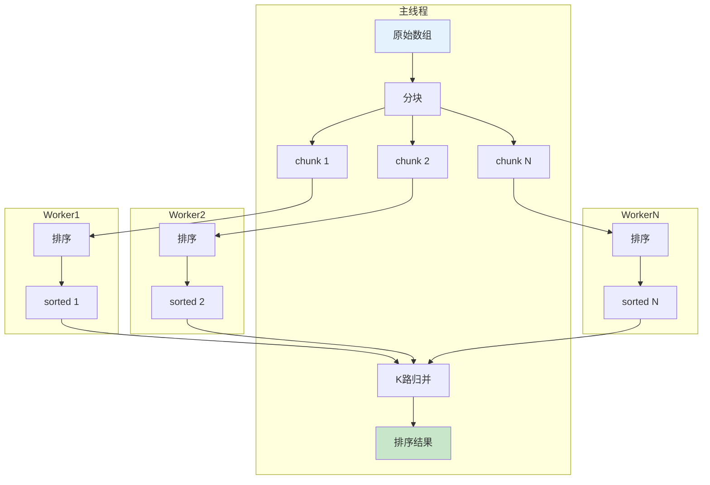
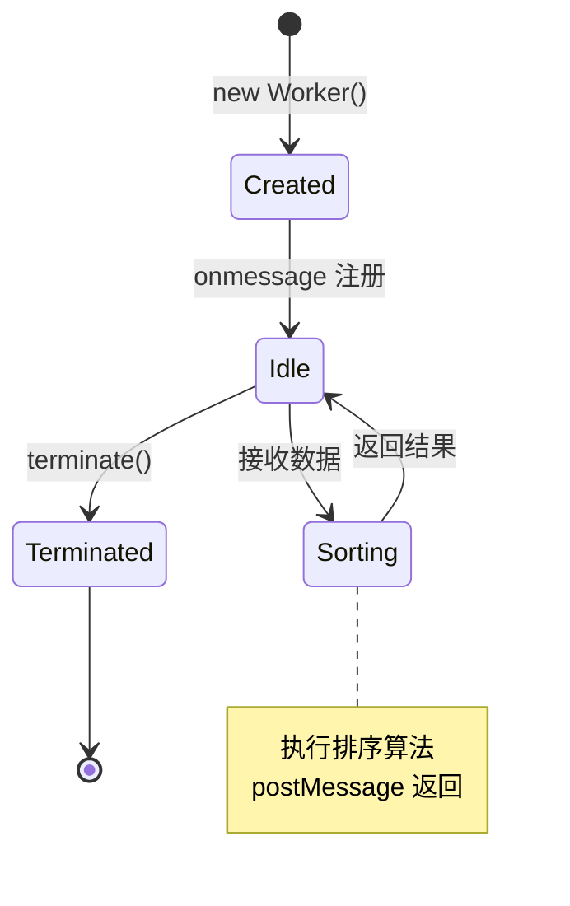
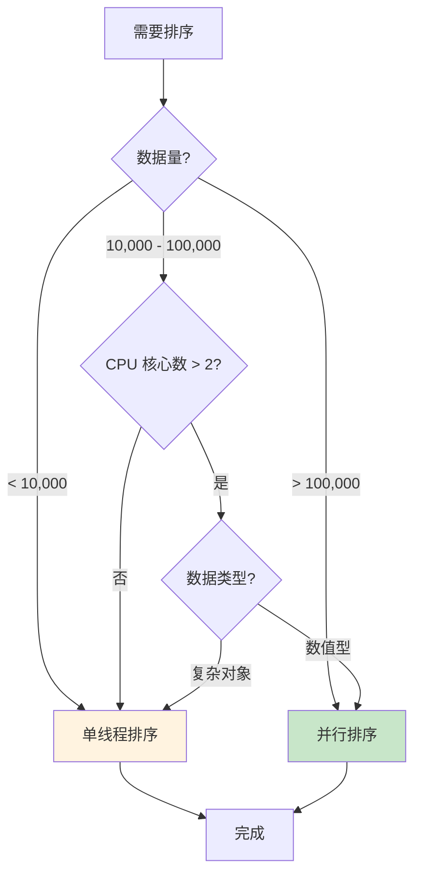
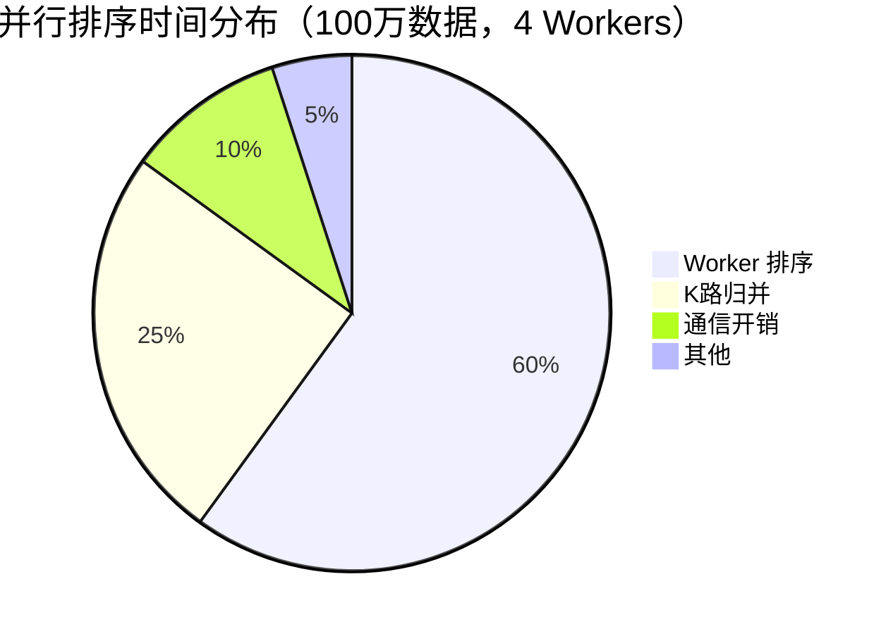

# 并行排序

> 利用多核 CPU 加速大规模数据排序

## 📚 目录

1. [并行排序原理](#1-并行排序原理)
2. [Web Worker 实现方案](#2-web-worker-实现方案)
3. [何时使用并行排序](#3-何时使用并行排序)
4. [性能分析](#4-性能分析)
5. [代码实现](#5-代码实现)

---

## 1. 并行排序原理

### 1.1 核心思想

```
分块 → 并行排序 → 多路归并
```

将大数组分成多个块，每个块在独立的 Worker 中排序，最后合并结果。

### 1.2 数据流



### 1.3 时间复杂度分析

| 阶段 | 单线程 | P 个 Worker |
|------|--------|-------------|
| 分块 | O(n) | O(n) |
| 排序 | O(n log n) | O(n/P · log(n/P)) |
| 归并 | - | O(n log P) |
| **总计** | O(n log n) | O(n/P · log(n/P) + n log P) |

**理想加速比**：接近 P（Worker 数量）

**实际加速比**：受通信开销、内存复制影响，通常 < P

---

## 2. Web Worker 实现方案

### 2.1 架构图

```
主线程                 Worker 1              Worker 2
   │                      │                     │
   ├──── chunk1 ─────────►│                     │
   ├──── chunk2 ──────────┼────────────────────►│
   │                      │                     │
   │◄──── sorted1 ────────┤                     │
   │◄──── sorted2 ────────┼─────────────────────┤
   │                      │                     │
   ├── k-way merge ───────┴─────────────────────┘
   │
   ▼
final sorted array
```

### 2.2 Worker 生命周期



### 2.3 通信方式

| 方式 | 优点 | 缺点 | 适用场景 |
|------|------|------|---------|
| **结构化克隆** | 简单、支持复杂对象 | 有复制开销 | 中小数据 |
| **Transferable** | 零复制 | 只支持 ArrayBuffer | 大量数值 |
| **SharedArrayBuffer** | 真正共享 | 需要 CORS 头、复杂同步 | 极端性能需求 |

### 2.4 推荐方案

```typescript
// 小数据（< 100KB）：结构化克隆
worker.postMessage({ data: array });

// 大数据（数值型）：Transferable
const buffer = new Float64Array(array).buffer;
worker.postMessage({ buffer }, [buffer]);

// 接收时转回数组
const result = new Float64Array(e.data.buffer);
```

---

## 3. 何时使用并行排序

### 3.1 决策流程



### 3.2 阈值建议

| 场景 | 单线程 | 2 Workers | 4 Workers |
|------|:------:|:---------:|:---------:|
| n < 10,000 | ✅ | ❌ | ❌ |
| 10,000 ≤ n < 50,000 | ✅ | 可选 | ❌ |
| 50,000 ≤ n < 500,000 | 可选 | ✅ | 可选 |
| n ≥ 500,000 | ❌ | ✅ | ✅ |

### 3.3 不适合并行的场景

```
❌ 数据量太小（Worker 创建/通信开销 > 排序时间）
❌ 复杂对象（序列化开销大）
❌ 已经有其他 CPU 密集任务
❌ 目标环境不支持 Worker（部分旧浏览器）
```

---

## 4. 性能分析

### 4.1 实测数据（参考）

测试环境：Chrome 120，M1 MacBook Pro

| 数据量 | 单线程 | 2 Workers | 4 Workers | 最佳加速比 |
|-------:|-------:|----------:|----------:|-----------:|
| 10,000 | 5ms | 8ms | 12ms | 0.6x |
| 50,000 | 25ms | 18ms | 15ms | 1.7x |
| 100,000 | 55ms | 35ms | 28ms | 2.0x |
| 500,000 | 300ms | 170ms | 120ms | 2.5x |
| 1,000,000 | 650ms | 350ms | 220ms | 3.0x |

### 4.2 开销分析



### 4.3 加速比公式

```
实际加速比 = T_单线程 / T_并行

其中 T_并行 = T_通信 + T_排序/P + T_归并

加速比上限（阿姆达尔定律）:
S(P) = 1 / (s + (1-s)/P)

s = 串行部分比例（通信 + 归并）
P = Worker 数量
```

---

## 5. 代码实现

### 5.1 主线程 API

```typescript
import { parallelMergeSort, shouldUseParallel } from './并行归并排序';

// 判断是否值得并行
if (shouldUseParallel(data.length)) {
  const sorted = await parallelMergeSort(data, (a, b) => a - b);
}

// 指定 Worker 数量
const sorted = await parallelMergeSort(data, comparator, {
  workerCount: 4,
});
```

### 5.2 实现要点

```typescript
// 1. 分块策略
function splitIntoChunks<T>(arr: T[], chunkCount: number): T[][] {
  const chunkSize = Math.ceil(arr.length / chunkCount);
  const chunks: T[][] = [];

  for (let i = 0; i < arr.length; i += chunkSize) {
    chunks.push(arr.slice(i, i + chunkSize));
  }

  return chunks;
}

// 2. K路归并
function kWayMerge<T>(
  sortedArrays: T[][],
  cmp: (a: T, b: T) => number
): T[] {
  // 使用最小堆优化
  // 详见实现文件
}

// 3. Worker 管理
class WorkerPool {
  private workers: Worker[] = [];

  async sort<T>(chunks: T[][], cmp: Comparator<T>): Promise<T[][]> {
    // 并行排序所有块
  }

  terminate(): void {
    this.workers.forEach(w => w.terminate());
  }
}
```

### 5.3 使用示例

```typescript
// 数值排序
const numbers = Array.from({ length: 1000000 }, () => Math.random());
const sorted = await parallelMergeSort(numbers, (a, b) => a - b);

// 对象排序（需要注意序列化开销）
interface User { id: number; name: string; }
const users: User[] = generateUsers(100000);

// 对于对象，需要特殊处理比较函数
const sorted = await parallelMergeSort(
  users,
  (a, b) => a.name.localeCompare(b.name),
  { workerCount: 2 }  // 对象开销大，减少 Worker
);
```

---

## 📖 延伸阅读

### GPU 排序简介

**WebGPU** 可以利用 GPU 进行排序，适合大规模数值计算：

```
优点：
- 大规模并行（数千个核心）
- 适合数值型数据

缺点：
- API 复杂
- 浏览器支持有限
- 不适合复杂比较函数
```

**经典 GPU 排序算法**：
- Bitonic Sort（双调排序）
- Radix Sort（基数排序）

### 相关资源

- [Web Workers API](https://developer.mozilla.org/en-US/docs/Web/API/Web_Workers_API)
- [Transferable Objects](https://developer.mozilla.org/en-US/docs/Web/API/Web_Workers_API/Transferable_objects)
- [SharedArrayBuffer](https://developer.mozilla.org/en-US/docs/Web/JavaScript/Reference/Global_Objects/SharedArrayBuffer)
- [WebGPU](https://www.w3.org/TR/webgpu/)

