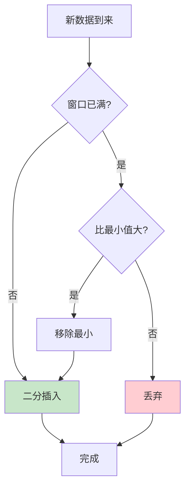
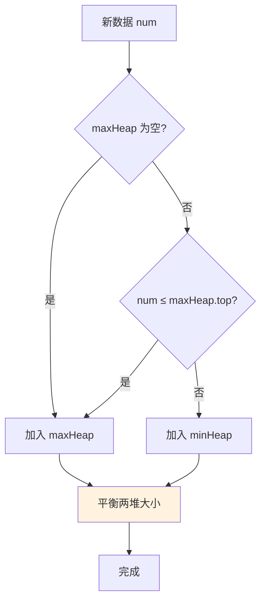
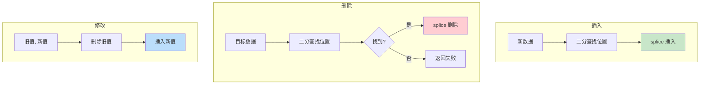

# 流式与增量排序

> 处理持续到来的数据流，维护实时有序状态

## 📚 目录

1. [应用场景](#1-应用场景)
2. [维护有序窗口](#2-维护有序窗口)
3. [在线中位数](#3-在线中位数)
4. [增量更新排序](#4-增量更新排序)
5. [代码实现](#5-代码实现)

---

## 1. 应用场景

### 1.1 典型场景

| 场景 | 数据特点 | 排序需求 |
|------|---------|---------|
| **日志实时监控** | 持续产生、时间戳排序 | Top N 最新 |
| **搜索结果更新** | 增量返回、相关度排序 | 动态 TopK |
| **股票行情** | 高频更新、价格/涨幅排序 | 实时排名 |
| **在线游戏排行榜** | 频繁变化、分数排序 | Top N + 排名 |
| **实时推荐** | 流式计算、得分排序 | 动态 TopK |

### 1.2 与批量排序的区别

```
批量排序:
┌─────────────────────────────┐
│ 所有数据 → 排序 → 结果      │  O(n log n) 一次性
└─────────────────────────────┘

流式排序:
┌─────────────────────────────┐
│ 数据1 → 更新 → 数据2 → ...  │  O(k) 每次更新
│     维护有序状态             │
└─────────────────────────────┘
```

---

## 2. 维护有序窗口

### 2.1 问题定义

```
数据持续到来，始终维护最近/最大/最小的 K 条有序数据
```

### 2.2 数据结构选择

| 方案 | 插入 | 删除 | 查询第k | 适用场景 |
|------|------|------|--------|---------|
| **有序数组 + 二分** | O(k) | O(k) | O(1) | K 较小 |
| **小顶堆/大顶堆** | O(log k) | O(log k) | O(1) | TopK |
| **平衡树/跳表** | O(log k) | O(log k) | O(log k) | 频繁增删 |

### 2.3 有序窗口更新流程



### 2.4 实现示例

```typescript
class SortedWindow<T> {
  private items: T[] = [];
  private capacity: number;
  private cmp: (a: T, b: T) => number;

  constructor(capacity: number, cmp: (a: T, b: T) => number) {
    this.capacity = capacity;
    this.cmp = cmp;
  }

  add(item: T): void {
    // 二分查找插入位置
    const pos = this.findInsertPosition(item);

    // 窗口未满，直接插入
    if (this.items.length < this.capacity) {
      this.items.splice(pos, 0, item);
      return;
    }

    // 窗口已满，判断是否需要替换
    // 假设维护的是 Top K 最大
    if (pos === 0) {
      return; // 比最小的还小，丢弃
    }

    // 移除最小，插入新元素
    this.items.shift();
    this.items.splice(pos - 1, 0, item);
  }

  private findInsertPosition(item: T): number {
    let lo = 0, hi = this.items.length;
    while (lo < hi) {
      const mid = (lo + hi) >>> 1;
      if (this.cmp(this.items[mid], item) < 0) {
        lo = mid + 1;
      } else {
        hi = mid;
      }
    }
    return lo;
  }

  toArray(): T[] {
    return [...this.items];
  }
}
```

---

## 3. 在线中位数

### 3.1 问题定义

```
数据持续到来，随时查询当前所有数据的中位数

LeetCode 295: 数据流的中位数
```

### 3.2 双堆方案

使用两个堆维护数据的两半：

```
       ┌────────────────────────────────────────┐
       │            所有数据                    │
       ├───────────────────┬────────────────────┤
       │     小的一半      │     大的一半       │
       │    (大顶堆)       │    (小顶堆)        │
       │     maxHeap       │     minHeap        │
       └───────────────────┴────────────────────┘
                          ↑
                       中位数
```

**不变式**：
1. `maxHeap` 存储较小的一半，堆顶是其中最大的
2. `minHeap` 存储较大的一半，堆顶是其中最小的
3. 两个堆大小差不超过 1

### 3.3 维护流程



### 3.4 获取中位数

```typescript
getMedian(): number {
  if (this.maxHeap.size() > this.minHeap.size()) {
    return this.maxHeap.peek();
  }
  if (this.minHeap.size() > this.maxHeap.size()) {
    return this.minHeap.peek();
  }
  // 大小相等，取平均
  return (this.maxHeap.peek() + this.minHeap.peek()) / 2;
}
```

### 3.5 复杂度

| 操作 | 时间复杂度 |
|------|-----------|
| 插入 | O(log n) |
| 查询中位数 | O(1) |
| 空间 | O(n) |

---

## 4. 增量更新排序

### 4.1 场景

已有有序数组，需要支持：
- 插入新元素
- 删除指定元素
- 修改元素值

### 4.2 操作策略

#### 插入：二分查找 + 插入

```typescript
function insertSorted<T>(
  arr: T[],
  item: T,
  cmp: (a: T, b: T) => number
): void {
  const pos = binarySearchInsertPos(arr, item, cmp);
  arr.splice(pos, 0, item);
}

// 时间复杂度：O(log n) 查找 + O(n) 移动 = O(n)
// 可优化：使用平衡树降到 O(log n)
```

#### 删除：直接删除

```typescript
function removeSorted<T>(
  arr: T[],
  item: T,
  cmp: (a: T, b: T) => number
): boolean {
  const pos = binarySearch(arr, item, cmp);
  if (pos < 0) return false;
  arr.splice(pos, 1);
  return true;
}

// 时间复杂度：O(log n) + O(n) = O(n)
```

#### 修改：删除 + 插入

```typescript
function updateSorted<T>(
  arr: T[],
  oldItem: T,
  newItem: T,
  cmp: (a: T, b: T) => number
): boolean {
  if (!removeSorted(arr, oldItem, cmp)) {
    return false;
  }
  insertSorted(arr, newItem, cmp);
  return true;
}
```

### 4.3 惰性删除优化

频繁删除时，可以使用惰性删除：

```typescript
class LazyDeleteArray<T> {
  private items: (T | null)[] = [];
  private deletedCount = 0;
  private readonly COMPACT_THRESHOLD = 0.5;

  delete(index: number): void {
    this.items[index] = null;
    this.deletedCount++;

    // 删除比例过高时，压缩数组
    if (this.deletedCount / this.items.length > this.COMPACT_THRESHOLD) {
      this.compact();
    }
  }

  private compact(): void {
    this.items = this.items.filter(item => item !== null);
    this.deletedCount = 0;
  }
}
```

### 4.4 增量更新流程图



---

## 5. 代码实现

### 5.1 在线中位数

```typescript
import { OnlineMedian } from './流式排序';

const median = new OnlineMedian();

median.add(1);
console.log(median.getMedian()); // 1

median.add(2);
console.log(median.getMedian()); // 1.5

median.add(3);
console.log(median.getMedian()); // 2
```

### 5.2 有序窗口

```typescript
import { SortedWindow } from './流式排序';

// 维护 Top 5 最大值
const window = new SortedWindow<number>(5, (a, b) => a - b);

window.add(10);
window.add(3);
window.add(7);
window.add(15);
window.add(8);
window.add(20); // 3 被淘汰

console.log(window.toArray()); // [7, 8, 10, 15, 20]
console.log(window.get(0));    // 7 (最小)
console.log(window.get(4));    // 20 (最大)
```

### 5.3 实际应用示例

```typescript
// 实时股票涨幅榜 Top 10
interface Stock {
  symbol: string;
  changePercent: number;
}

const topGainers = new SortedWindow<Stock>(
  10,
  (a, b) => a.changePercent - b.changePercent
);

// 模拟实时数据
function onStockUpdate(stock: Stock) {
  topGainers.add(stock);
  renderLeaderboard(topGainers.toArray());
}

// 实时日志最新 100 条
interface LogEntry {
  timestamp: number;
  message: string;
}

const recentLogs = new SortedWindow<LogEntry>(
  100,
  (a, b) => a.timestamp - b.timestamp
);
```

---

## 📖 LeetCode 相关题目

| 题号 | 题目 | 难度 | 关联知识点 |
|:----:|------|:----:|-----------|
| 295 | 数据流的中位数 | H | 双堆 |
| 480 | 滑动窗口中位数 | H | 双堆 + 惰性删除 |
| 703 | 数据流中的第 K 大元素 | E | 小顶堆 |
| 239 | 滑动窗口最大值 | H | 单调队列 |
| 352 | 将数据流变为多个不相交区间 | H | 有序集合 |

---

## 🎯 总结

| 场景 | 推荐方案 | 时间复杂度 |
|------|---------|-----------|
| TopK 维护 | 小顶堆/大顶堆 | O(log k) |
| 有序窗口 | 有序数组 + 二分 | O(k) |
| 在线中位数 | 双堆 | O(log n) |
| 频繁增删 | 平衡树/跳表 | O(log n) |
| 少量更新 | 二分 + splice | O(n) |

