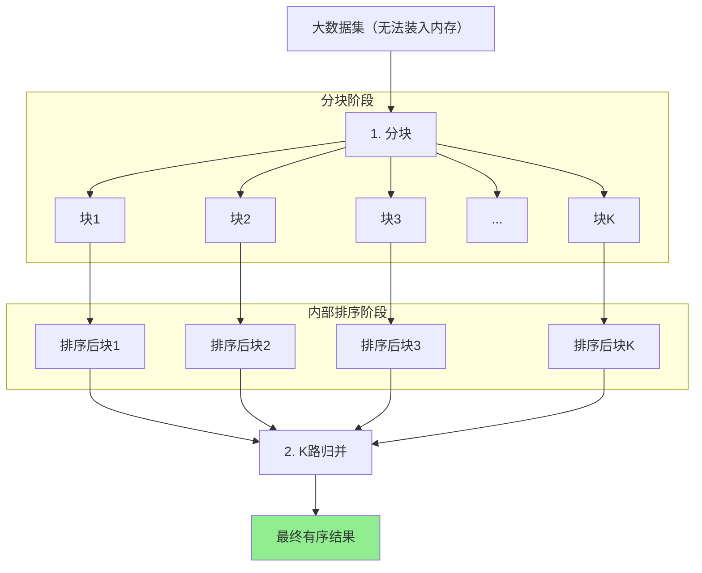
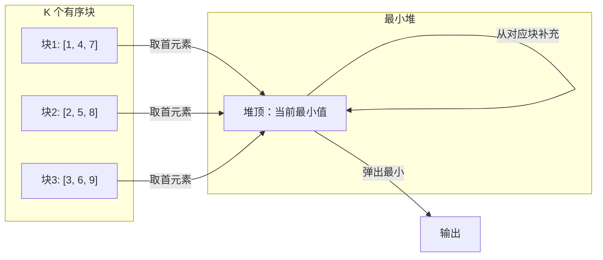

# 外部归并排序 (External Merge Sort)

## 📌 核心思想

当数据**无法一次装入内存**时：
1. **分块**：将数据分成能装入内存的小块
2. **内部排序**：对每个小块进行排序
3. **多路归并**：使用最小堆进行 K 路归并

> 关键洞察：磁盘 I/O 是瓶颈，尽量减少读写次数，顺序访问。

---

## 🚨 适用边界

| 条件 | 说明 |
|------|------|
| **数据量** | 超过可用内存 |
| **存储** | 需要外部存储（磁盘/文件） |
| **前端场景** | 大数组分片处理、流式数据 |

### ⚠️ 前端类比

虽然前端很少直接操作磁盘，但以下场景类似：
- 处理超大 JSON 数组（需要分片）
- 流式处理大量数据
- Web Worker 分片排序

---

## 🎯 场景识别信号

| 信号 | 推荐度 |
|------|-------|
| 数据太大无法一次装入内存 | ⭐⭐⭐⭐⭐ |
| 流式/分页数据排序 | ⭐⭐⭐⭐ |
| 需要合并多个有序数据源 | ⭐⭐⭐⭐ |
| 小数据量 | ❌ 不需要 |

---

## 📊 复杂度分析

| 指标 | 值 | 说明 |
|------|-----|------|
| **时间复杂度** | O(n log n) | 与归并排序相同 |
| **I/O 复杂度** | O(n/B · log_{M/B}(n/B)) | B 是块大小，M 是内存 |
| **空间复杂度** | O(M) | 可用内存 |

---

## 🔄 算法流程（Mermaid）



### K 路归并详解



---

## 💻 核心实现

```typescript
/**
 * 外部归并排序（内存模拟版）
 *
 * @param arr 待排序数组
 * @param chunkSize 每块大小（模拟内存限制）
 * @param cmp 比较函数
 */
export function externalMergeSort<T>(
  arr: readonly T[],
  chunkSize: number,
  cmp: Comparator<T>
): T[] {
  const n = arr.length;
  if (n <= chunkSize) {
    // 能一次装入内存，直接排序
    return [...arr].sort(cmp);
  }

  // 1. 分块并排序
  const sortedChunks: T[][] = [];
  for (let i = 0; i < n; i += chunkSize) {
    const chunk = arr.slice(i, Math.min(i + chunkSize, n));
    sortedChunks.push(chunk.sort(cmp));
  }

  // 2. K 路归并
  return kWayMerge(sortedChunks, cmp);
}

/**
 * K 路归并（使用最小堆）
 */
function kWayMerge<T>(
  chunks: T[][],
  cmp: Comparator<T>
): T[] {
  const k = chunks.length;
  if (k === 0) return [];
  if (k === 1) return chunks[0];

  // 堆元素：[值, 块索引, 块内索引]
  type HeapItem = { value: T; chunkIdx: number; itemIdx: number };

  // 初始化堆
  const heap: HeapItem[] = [];

  for (let i = 0; i < k; i++) {
    if (chunks[i].length > 0) {
      heap.push({
        value: chunks[i][0],
        chunkIdx: i,
        itemIdx: 0,
      });
    }
  }

  // 建最小堆
  buildMinHeap(heap, (a, b) => cmp(a.value, b.value));

  const result: T[] = [];

  while (heap.length > 0) {
    // 取出最小值
    const min = heap[0];
    result.push(min.value);

    // 从同一块取下一个元素
    const nextIdx = min.itemIdx + 1;
    if (nextIdx < chunks[min.chunkIdx].length) {
      heap[0] = {
        value: chunks[min.chunkIdx][nextIdx],
        chunkIdx: min.chunkIdx,
        itemIdx: nextIdx,
      };
      heapifyDown(heap, 0, (a, b) => cmp(a.value, b.value));
    } else {
      // 该块已空，移除
      heap[0] = heap[heap.length - 1];
      heap.pop();
      if (heap.length > 0) {
        heapifyDown(heap, 0, (a, b) => cmp(a.value, b.value));
      }
    }
  }

  return result;
}

// 最小堆辅助函数
function buildMinHeap<T>(heap: T[], cmp: Comparator<T>): void {
  for (let i = Math.floor(heap.length / 2) - 1; i >= 0; i--) {
    heapifyDown(heap, i, cmp);
  }
}

function heapifyDown<T>(heap: T[], i: number, cmp: Comparator<T>): void {
  const n = heap.length;
  while (true) {
    let smallest = i;
    const left = 2 * i + 1;
    const right = 2 * i + 2;

    if (left < n && cmp(heap[left], heap[smallest]) < 0) {
      smallest = left;
    }
    if (right < n && cmp(heap[right], heap[smallest]) < 0) {
      smallest = right;
    }

    if (smallest === i) break;

    [heap[i], heap[smallest]] = [heap[smallest], heap[i]];
    i = smallest;
  }
}
```

---

## 🔧 可插拔设计

```typescript
/**
 * 可配置的外部归并排序
 */
export interface ExternalSortOptions<T> {
  chunkSize: number;
  sortChunk: (chunk: T[], cmp: Comparator<T>) => T[];
  mergeChunks: (chunks: T[][], cmp: Comparator<T>) => T[];
}

export function externalMergeSortConfigurable<T>(
  arr: readonly T[],
  cmp: Comparator<T>,
  options: ExternalSortOptions<T>
): T[] {
  const { chunkSize, sortChunk, mergeChunks } = options;

  // 分块
  const chunks: T[][] = [];
  for (let i = 0; i < arr.length; i += chunkSize) {
    chunks.push(arr.slice(i, i + chunkSize));
  }

  // 排序每个块
  const sortedChunks = chunks.map(chunk => sortChunk([...chunk], cmp));

  // 合并
  return mergeChunks(sortedChunks, cmp);
}

// 使用示例
const options: ExternalSortOptions<number> = {
  chunkSize: 1000,
  sortChunk: (chunk, cmp) => timsort(chunk, cmp), // 使用 TimSort
  mergeChunks: kWayMerge,
};
```

---

## 🌐 前端业务场景

### 1. 大数组分片排序

```typescript
// 处理超大 JSON 数组
async function sortLargeArray<T>(
  data: T[],
  cmp: Comparator<T>,
  chunkSize = 10000
): Promise<T[]> {
  // 分片处理，避免阻塞主线程
  return externalMergeSort(data, chunkSize, cmp);
}
```

### 2. 使用 Web Worker 并行排序

```typescript
// 主线程
async function parallelSort<T>(data: T[], cmp: Comparator<T>): Promise<T[]> {
  const chunkSize = Math.ceil(data.length / navigator.hardwareConcurrency);
  const chunks: T[][] = [];

  for (let i = 0; i < data.length; i += chunkSize) {
    chunks.push(data.slice(i, i + chunkSize));
  }

  // 并行排序每个块
  const sortedChunks = await Promise.all(
    chunks.map(chunk => sortInWorker(chunk, cmp))
  );

  // 主线程归并
  return kWayMerge(sortedChunks, cmp);
}
```

### 3. 流式数据排序

```typescript
// 模拟流式数据到达后排序
class StreamSorter<T> {
  private chunks: T[][] = [];
  private buffer: T[] = [];
  private chunkSize: number;
  private cmp: Comparator<T>;

  constructor(chunkSize: number, cmp: Comparator<T>) {
    this.chunkSize = chunkSize;
    this.cmp = cmp;
  }

  add(item: T): void {
    this.buffer.push(item);
    if (this.buffer.length >= this.chunkSize) {
      this.flush();
    }
  }

  private flush(): void {
    if (this.buffer.length > 0) {
      const sorted = [...this.buffer].sort(this.cmp);
      this.chunks.push(sorted);
      this.buffer = [];
    }
  }

  getResult(): T[] {
    this.flush();
    return kWayMerge(this.chunks, this.cmp);
  }
}
```

---

## 📚 延伸阅读

1. **Replacement Selection**：生成更长的初始 run
2. **Polyphase Merge**：优化磁盘 I/O
3. **Multiway Merge**：平衡 I/O 和 CPU
4. **External Memory Algorithms**：更广泛的外部算法

---

## ✅ 自检清单

- [ ] 理解分块-排序-归并三步流程
- [ ] 知道为什么用最小堆做 K 路归并
- [ ] 能分析 I/O 复杂度
- [ ] 能实现可配置的外部排序接口
- [ ] 知道前端场景如何类比应用（大数组/Web Worker）

