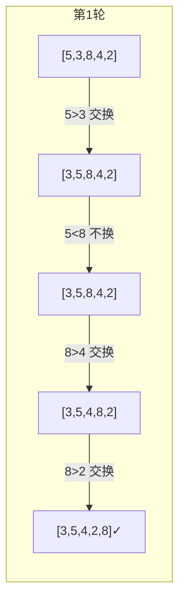

# 冒泡排序 (Bubble Sort)

> 最经典的入门排序算法，通过相邻元素比较交换，让大元素"冒泡"到末尾。

---

## 📚 目录

1. [核心思想](#1-核心思想)
2. [适用场景](#2-适用场景)
3. [优缺点分析](#3-优缺点分析)
4. [变种与优化](#4-变种与优化)
5. [复杂度分析](#5-复杂度分析)
6. [算法流程图](#6-算法流程图)
7. [正确性说明](#7-正确性说明)
8. [前端场景应用](#8-前端场景应用)

---

## 1. 核心思想

### 图解直觉

想象一排气泡在水中上升，**较大的气泡会先浮到水面**。

冒泡排序的过程：
1. 从左到右依次比较相邻的两个元素
2. 如果前一个比后一个大，就交换它们
3. 一轮下来，最大的元素会"冒泡"到最右边
4. 重复以上过程（每轮少比较一个元素）

```
初始: [5, 3, 8, 4, 2]

第1轮: 比较相邻，最大的8冒泡到末尾
  [5,3] → [3,5]  →  [3,5,8,4,2]
  [5,8] → 不换   →  [3,5,8,4,2]
  [8,4] → [4,8]  →  [3,5,4,8,2]
  [8,2] → [2,8]  →  [3,5,4,2,8] ✓ 8到位

第2轮: 5冒泡到倒数第二
  [3,5,4,2] → ... → [3,4,2,5,8] ✓ 5到位

继续...直到全部有序
```

---

## 2. 适用场景

### ✅ 什么时候用

| 场景 | 原因 |
|------|------|
| 教学演示 | 逻辑简单，易于理解 |
| 小规模数据 (n < 50) | 常数因子小，简单实现 |
| 需要稳定排序 | 相等元素不交换，保持相对顺序 |
| 检测数组是否有序 | 优化版一轮无交换即可判断 |

### ❌ 什么时候别用

| 场景 | 原因 |
|------|------|
| 大规模数据 | O(n²) 太慢 |
| 性能敏感场景 | 交换次数多，效率低 |
| 生产环境通用排序 | 有更好的选择 |

### 🎯 场景识别信号

> 看到这些信号 → 考虑冒泡排序：
> - "简单实现即可"
> - "数据量很小"
> - "需要稳定"
> - "检测是否已排序"

---

## 3. 优缺点分析

### 优点

| 优点 | 说明 |
|------|------|
| 实现简单 | 代码量最少的排序算法之一 |
| 稳定排序 | 相等元素保持原始相对顺序 |
| 原地排序 | 只需 O(1) 额外空间 |
| 可提前终止 | 优化版可检测已有序 |

### 缺点

| 缺点 | 说明 |
|------|------|
| 时间复杂度高 | O(n²)，不适合大数据 |
| 交换次数多 | 平均 O(n²) 次交换 |
| 缓存不友好 | 频繁交换导致缓存失效 |

### 工程视角

- **常数因子**：每次比较后可能有交换操作，开销较大
- **缓存局部性**：虽然是顺序访问，但频繁交换影响性能
- **分支预测**：交换条件不规律，分支预测命中率低

---

## 4. 变种与优化

### 4.1 提前终止优化

如果某一轮没有发生任何交换，说明数组已经有序，可以提前结束。

```typescript
function bubbleSortOptimized<T>(arr: T[], cmp: (a: T, b: T) => number): T[] {
  const result = [...arr];
  const n = result.length;

  for (let i = 0; i < n - 1; i++) {
    let swapped = false;  // 标记本轮是否有交换

    for (let j = 0; j < n - 1 - i; j++) {
      if (cmp(result[j], result[j + 1]) > 0) {
        [result[j], result[j + 1]] = [result[j + 1], result[j]];
        swapped = true;
      }
    }

    if (!swapped) break;  // 无交换，已有序
  }

  return result;
}
```

**效果**：对于已排序或近乎有序的数据，时间复杂度降到 O(n)。

### 4.2 记录最后交换位置

每轮记录最后一次交换的位置，下一轮只需比较到该位置。

```typescript
function bubbleSortBoundary<T>(arr: T[], cmp: (a: T, b: T) => number): T[] {
  const result = [...arr];
  let boundary = result.length - 1;

  while (boundary > 0) {
    let lastSwap = 0;

    for (let j = 0; j < boundary; j++) {
      if (cmp(result[j], result[j + 1]) > 0) {
        [result[j], result[j + 1]] = [result[j + 1], result[j]];
        lastSwap = j;
      }
    }

    boundary = lastSwap;
  }

  return result;
}
```

### 4.3 双向冒泡（鸡尾酒排序）

交替从左到右、从右到左冒泡，对于"乌龟"元素（小元素在右边）更有效。

---

## 5. 复杂度分析

| 指标 | 复杂度 | 说明 |
|------|--------|------|
| 时间（最好） | O(n) | 已排序 + 提前终止优化 |
| 时间（平均） | O(n²) | 随机数据 |
| 时间（最坏） | O(n²) | 完全逆序 |
| 空间 | O(1) | 原地排序 |
| 稳定性 | ✅ 稳定 | 相等元素不交换 |
| 原地 | ✅ 是 | 只需常数额外空间 |

### 比较与交换次数

- **比较次数**：n(n-1)/2 ≈ O(n²)（固定）
- **交换次数**：
  - 最好：0（已排序）
  - 平均：n(n-1)/4 ≈ O(n²)
  - 最坏：n(n-1)/2 ≈ O(n²)（逆序）

---

## 6. 算法流程图

### 基本流程

```mermaid
flowchart TD
    A[开始] --> B[i = 0]
    B --> C{i < n-1?}
    C -- 否 --> Z[结束]
    C -- 是 --> D[j = 0]
    D --> E{j < n-1-i?}
    E -- 否 --> F[i++]
    F --> C
    E -- 是 --> G{arr[j] > arr[j+1]?}
    G -- 是 --> H[交换 arr[j] 和 arr[j+1]]
    H --> I[j++]
    G -- 否 --> I
    I --> E
```

### 优化版流程

```mermaid
flowchart TD
    A[开始] --> B[i = 0, swapped = true]
    B --> C{i < n-1 且 swapped?}
    C -- 否 --> Z[结束: 已排序]
    C -- 是 --> D[swapped = false]
    D --> E[j = 0]
    E --> F{j < n-1-i?}
    F -- 否 --> G[i++]
    G --> C
    F -- 是 --> H{arr[j] > arr[j+1]?}
    H -- 是 --> I[交换, swapped = true]
    I --> J[j++]
    H -- 否 --> J
    J --> F
```

### 单轮冒泡过程示意



---

## 7. 正确性说明

### 循环不变式

**外层循环不变式**：
> 在第 i 轮开始前，数组的最后 i 个元素已经是最终排序位置上的最大 i 个元素。

**证明**：
1. **初始化**：i=0 时，没有元素需要满足条件，平凡成立。
2. **保持**：第 i 轮将 [0, n-1-i] 中的最大元素冒泡到位置 n-1-i。
3. **终止**：i = n-1 时，所有元素都在正确位置。

### 稳定性保证

```typescript
if (cmp(arr[j], arr[j + 1]) > 0) {  // 注意：是 > 0，不是 >= 0
  // 只有严格大于才交换
  // 相等时不交换，保持原始相对顺序
}
```

---

## 8. 前端场景应用

### 8.1 表格排序稳定性

用户先按"部门"排序，再按"姓名"排序时，期望同姓名的人保持原来的部门顺序。

```typescript
// 冒泡排序是稳定的，天然支持多列排序
const employees = [
  { name: 'Alice', dept: 'HR' },
  { name: 'Bob', dept: 'IT' },
  { name: 'Alice', dept: 'Finance' },
];

// 先按部门排序
bubbleSort(employees, (a, b) => a.dept.localeCompare(b.dept));

// 再按姓名排序 - 同名员工保持部门顺序
bubbleSort(employees, (a, b) => a.name.localeCompare(b.name));
// 结果：两个 Alice 仍保持 Finance < HR 的顺序
```

### 8.2 搜索结果场景

```typescript
interface SearchResult {
  title: string;
  relevance: number;
  publishTime: number;
}

// 按相关度降序，同相关度按发布时间降序
const results: SearchResult[] = [...];

bubbleSort(results, (a, b) => {
  if (a.relevance !== b.relevance) {
    return b.relevance - a.relevance;  // 降序
  }
  return b.publishTime - a.publishTime;  // 降序
});
```

### 8.3 小规模实时排序

```typescript
// 实时排行榜（人数少，频繁更新）
function updateLeaderboard(players: Player[], newScore: Player) {
  players.push(newScore);
  // 数据量小，冒泡即可
  bubbleSort(players, (a, b) => b.score - a.score);
  return players.slice(0, 10);  // 取前 10
}
```

---

## 📖 快速使用

详见 [算法包/冒泡排序/README.md](../../../算法包/冒泡排序/README.md)

```typescript
import { sort, sortInPlace, meta } from '算法包/冒泡排序/src';

const numbers = [5, 3, 8, 4, 2];
const sorted = sort(numbers, (a, b) => a - b);
// [2, 3, 4, 5, 8]

console.log(meta.stable);  // true
console.log(meta.timeComplexity.average);  // 'O(n²)'
```
