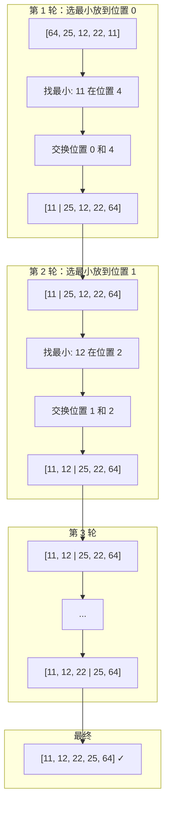
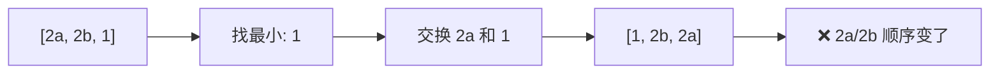

# 选择排序 (Selection Sort)

> 每轮选出最小元素放到前面，简单但不稳定。

---

## 📚 目录

1. [核心思想](#1-核心思想)
2. [适用场景](#2-适用场景)
3. [优缺点分析](#3-优缺点分析)
4. [变种与优化](#4-变种与优化)
5. [复杂度分析](#5-复杂度分析)
6. [正确性说明](#6-正确性说明)
7. [前端场景应用](#7-前端场景应用)

---

## 1. 核心思想

### 直觉理解

想象你在整理一排扑克牌：
1. 从未排序的牌中**找出最小的**
2. 把它放到已排序区域的末尾
3. 重复直到所有牌都排好

与冒泡的区别：
- 冒泡：通过相邻交换"冒泡"最大值
- 选择：直接"选择"最小值放到正确位置

### Mermaid 图解



### 伪代码

```
for i = 0 to n-2:
    minIndex = i
    for j = i+1 to n-1:
        if arr[j] < arr[minIndex]:
            minIndex = j
    swap(arr[i], arr[minIndex])
```

---

## 2. 适用场景

### ✅ 什么时候用

| 场景 | 原因 |
|------|------|
| 交换成本很高 | 选择排序交换次数最少：O(n) |
| 内存写入昂贵 | 如 Flash 存储，写入有限 |
| 小规模数据 | 实现简单 |
| 不需要稳定性 | 选择排序不稳定 |

### ❌ 什么时候别用

| 场景 | 原因 |
|------|------|
| 大规模数据 | O(n²) 太慢 |
| 需要稳定排序 | 选择排序不稳定 |
| 已近乎有序 | 无法利用已有序性 |

### 🎯 场景识别信号

```
看到 → 想到选择排序：
- "交换代价高"
- "写入受限（如 EEPROM、Flash）"
- "不关心稳定性 + 小规模"
```

---

## 3. 优缺点分析

### 优点

| 优点 | 说明 |
|------|------|
| 交换次数少 | 最多 O(n) 次交换（每轮最多 1 次） |
| 实现简单 | 逻辑直观 |
| 原地排序 | O(1) 额外空间 |
| 写入少 | 适合写入昂贵的存储 |

### 缺点

| 缺点 | 说明 |
|------|------|
| 不稳定 | 交换可能破坏相等元素顺序 |
| 比较次数固定 | 无论数据如何，都是 n(n-1)/2 次比较 |
| 无法提前终止 | 即使已排序也要遍历完 |

### 不稳定性示例

```
原数组：[2a, 2b, 1]
第1轮：找到最小 1，与 2a 交换
结果：[1, 2b, 2a]  ← 2a 和 2b 顺序颠倒了！
```



---

## 4. 变种与优化

### 4.1 双向选择排序

每轮同时找最小和最大，分别放到两端。

```typescript
function doubleSelectionSort<T>(arr: T[], cmp: (a: T, b: T) => number): void {
  let left = 0;
  let right = arr.length - 1;

  while (left < right) {
    let minIdx = left;
    let maxIdx = left;

    // 同时找最小和最大
    for (let i = left; i <= right; i++) {
      if (cmp(arr[i], arr[minIdx]) < 0) minIdx = i;
      if (cmp(arr[i], arr[maxIdx]) > 0) maxIdx = i;
    }

    // 交换最小到左边
    [arr[left], arr[minIdx]] = [arr[minIdx], arr[left]];

    // 如果最大值在 left 位置，它已经被换到 minIdx 了
    if (maxIdx === left) maxIdx = minIdx;

    // 交换最大到右边
    [arr[right], arr[maxIdx]] = [arr[maxIdx], arr[right]];

    left++;
    right--;
  }
}
```

### 4.2 堆选择（堆排序）

使用堆来加速"选最小"操作，将选择从 O(n) 降到 O(log n)。

→ 这就是堆排序的思想，详见 [堆排序](./07-堆排序.md)

---

## 5. 复杂度分析

| 指标 | 复杂度 | 说明 |
|------|--------|------|
| 时间（最好） | O(n²) | 无法提前终止 |
| 时间（平均） | O(n²) | |
| 时间（最坏） | O(n²) | |
| 空间 | O(1) | 原地排序 |
| 稳定性 | ❌ 不稳定 | 交换破坏顺序 |
| 原地 | ✅ 是 | |

### 比较与交换次数

- **比较次数**：固定 n(n-1)/2（无论数据如何）
- **交换次数**：
  - 最好：0（已排序，但仍需比较）
  - 最坏：n-1
  - 平均：O(n)

### 与冒泡对比

| | 选择排序 | 冒泡排序 |
|---|----------|----------|
| 比较次数 | n(n-1)/2 固定 | n(n-1)/2 最坏 |
| 交换次数 | O(n) | O(n²) 最坏 |
| 稳定性 | ❌ | ✅ |
| 可提前终止 | ❌ | ✅ |

---

## 6. 正确性说明

### 循环不变式

**不变式**：每轮开始时，`arr[0..i-1]` 包含整个数组最小的 i 个元素，且已排序。

### 证明

1. **初始化**：i=0 时，`arr[0..-1]` 为空，平凡成立。
2. **保持**：第 i 轮找到 `arr[i..n-1]` 中的最小值，放到位置 i。
3. **终止**：i = n-1 时，前 n-1 个位置正确，最后一个自然正确。

---

## 7. 前端场景应用

### 7.1 写入昂贵的场景

```typescript
// 场景：排序大对象数组，交换成本高
// 选择排序的交换次数最少

interface LargeObject {
  data: ArrayBuffer; // 大数据块
  priority: number;
}

// 如果交换对象本身（而非引用）代价高，选择排序有优势
// 但 JS 中交换的是引用，所以这个优势不明显
```

### 7.2 不需要稳定性的简单排序

```typescript
// 场景：对 ID 列表排序（ID 唯一，无稳定性需求）
const ids = [5, 2, 8, 1, 9];
selectionSort(ids, (a, b) => a - b);
```

### 7.3 注意：表格排序通常需要稳定性

```typescript
// ❌ 不推荐用选择排序做表格多列排序
// 因为选择排序不稳定，无法保证多列排序的正确性

// ✅ 推荐用插入排序或归并排序
```

---

## 📖 相关链接

- [算法实现](../../../算法包/选择排序/)
- [复杂度对比表](../../02-复杂度对比表.md)
- [堆排序（选择排序的优化）](./07-堆排序.md)
