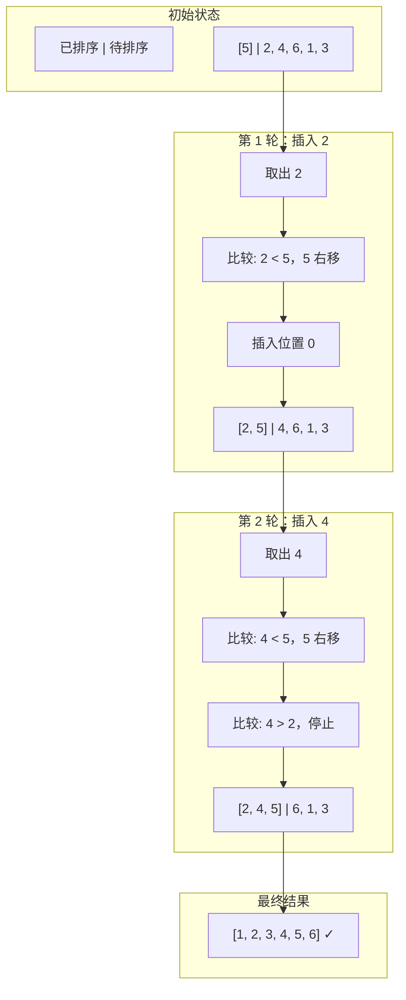

# 插入排序 (Insertion Sort)

> 像打牌一样，每次把新牌插入到已排序的正确位置。

---

## 📚 目录

1. [核心思想](#1-核心思想)
2. [适用场景](#2-适用场景)
3. [优缺点分析](#3-优缺点分析)
4. [变种与优化](#4-变种与优化)
5. [复杂度分析](#5-复杂度分析)
6. [正确性说明](#6-正确性说明)
7. [前端场景应用](#7-前端场景应用)

---

## 1. 核心思想

### 直觉理解

想象你在打扑克牌，手里的牌已经排好序：
1. 摸一张新牌
2. 从右往左找到它应该插入的位置
3. 把新牌插进去

插入排序就是这个过程的模拟。

### Mermaid 图解



### 伪代码

```
for i = 1 to n-1:
    key = arr[i]
    j = i - 1
    while j >= 0 and arr[j] > key:
        arr[j+1] = arr[j]  // 右移
        j = j - 1
    arr[j+1] = key  // 插入
```

---

## 2. 适用场景

### ✅ 什么时候用

| 场景 | 原因 |
|------|------|
| **近乎有序数据** | 最好情况 O(n)，几乎最优 |
| **小规模数据** | 常数因子小，实际很快 |
| **在线排序** | 边接收数据边排序 |
| **需要稳定排序** | 插入排序天然稳定 |
| **作为其他算法的子程序** | TimSort、Introsort 的小数组优化 |

### ❌ 什么时候别用

| 场景 | 原因 |
|------|------|
| 大规模随机数据 | O(n²) 太慢 |
| 完全逆序 | 最坏情况，每次都要移动 |

### 🎯 场景识别信号

```
看到 → 想到插入排序：
- "数据近乎有序"
- "数据量小"（n < 50）
- "在线/流式排序"
- "需要稳定 + 简单"
```

---

## 3. 优缺点分析

### 优点

| 优点 | 说明 |
|------|------|
| **近乎有序时极快** | O(n)，优于 O(n log n) 算法 |
| 稳定排序 | 相等元素不交换 |
| 原地排序 | O(1) 额外空间 |
| 在线算法 | 可边接收边排序 |
| 常数因子小 | 小数据量时实际最快 |
| 自适应 | 利用已有序性 |

### 缺点

| 缺点 | 说明 |
|------|------|
| 大规模随机慢 | O(n²) |
| 元素移动多 | 每次插入可能移动大量元素 |

### 工程实践

```typescript
// TimSort 和 Introsort 都用插入排序处理小数组
// 阈值通常是 16-64
const INSERTION_THRESHOLD = 16;

function hybridSort(arr, cmp) {
  if (arr.length < INSERTION_THRESHOLD) {
    return insertionSort(arr, cmp);
  }
  // 使用更高级的算法...
}
```

---

## 4. 变种与优化

### 4.1 二分插入排序

用二分查找定位插入位置，减少比较次数（但移动次数不变）。

```typescript
function binaryInsertionSort<T>(arr: T[], cmp: (a: T, b: T) => number): T[] {
  for (let i = 1; i < arr.length; i++) {
    const key = arr[i];

    // 二分查找插入位置
    let left = 0, right = i;
    while (left < right) {
      const mid = (left + right) >>> 1;
      if (cmp(arr[mid], key) > 0) {
        right = mid;
      } else {
        left = mid + 1;
      }
    }

    // 右移 [left, i) 的元素
    for (let j = i; j > left; j--) {
      arr[j] = arr[j - 1];
    }
    arr[left] = key;
  }
  return arr;
}
```

**效果**：
- 比较次数：O(n log n)
- 移动次数：仍是 O(n²)
- 实际场景中，二分查找的开销可能不值得

### 4.2 希尔排序（Shell Sort）

通过间隔分组，先让元素"大致有序"，最后用插入排序收尾。

→ 详见 [希尔排序](./04-希尔排序.md)

### 4.3 链表插入排序

对于链表，插入操作是 O(1)，总体 O(n²) 比较但无移动开销。

```mermaid
flowchart LR
    A[遍历链表] --> B[找到插入位置]
    B --> C[O(1) 插入]
    C --> D[继续下一个]
```

---

## 5. 复杂度分析

| 指标 | 复杂度 | 说明 |
|------|--------|------|
| 时间（最好） | **O(n)** | 已排序，内层循环不执行 |
| 时间（平均） | O(n²) | |
| 时间（最坏） | O(n²) | 完全逆序 |
| 空间 | O(1) | 原地排序 |
| 稳定性 | ✅ 稳定 | |
| 原地 | ✅ 是 | |

### 自适应性分析

假设数组有 k 个逆序对（i < j 但 arr[i] > arr[j]），则：
- 比较次数 ≈ n + k
- 移动次数 = k

当 k 很小时（近乎有序），插入排序接近 O(n)。

### 与其他 O(n²) 算法对比

| | 插入排序 | 冒泡排序 | 选择排序 |
|---|----------|----------|----------|
| 最好情况 | **O(n)** | O(n) | O(n²) |
| 自适应 | ✅ 强 | ✅ 弱 | ❌ |
| 稳定 | ✅ | ✅ | ❌ |
| 实际效率 | **最优** | 较差 | 中等 |

---

## 6. 正确性说明

### 循环不变式

**不变式**：每轮开始时，`arr[0..i-1]` 是原数组 `arr[0..i-1]` 的有序排列。

### 证明

1. **初始化**：i=1 时，`arr[0..0]` 只有一个元素，自然有序。
2. **保持**：第 i 轮将 `arr[i]` 插入到 `arr[0..i-1]` 的正确位置，使 `arr[0..i]` 有序。
3. **终止**：i = n 时，整个数组有序。

---

## 7. 前端场景应用

### 7.1 在线/实时排序

```typescript
// 场景：实时接收消息，保持列表有序
class SortedMessageList {
  private messages: Message[] = [];

  addMessage(msg: Message): void {
    // 找到插入位置
    let i = this.messages.length - 1;
    while (i >= 0 && this.messages[i].timestamp > msg.timestamp) {
      i--;
    }
    // 插入
    this.messages.splice(i + 1, 0, msg);
  }
}
```

### 7.2 增量更新排序

```typescript
// 场景：表格新增一行，保持排序
function addRow(sortedTable: Row[], newRow: Row, cmp: Comparator<Row>): void {
  // 因为已经有序，插入排序思想
  let i = sortedTable.length - 1;
  while (i >= 0 && cmp(sortedTable[i], newRow) > 0) {
    sortedTable[i + 1] = sortedTable[i];
    i--;
  }
  sortedTable[i + 1] = newRow;
}
```

### 7.3 表格多列稳定排序

```typescript
// 利用稳定性：从次要键到主要键依次排序
let data = [...originalData];
data = insertionSort(data, (a, b) => a.name.localeCompare(b.name)); // 次要
data = insertionSort(data, (a, b) => b.score - a.score);            // 主要
```

### 7.4 小规模数据优化

```typescript
// 在高级排序算法中，小规模用插入排序
function smartSort(arr, cmp) {
  if (arr.length <= 16) {
    return insertionSort(arr, cmp);  // 小规模插入排序更快
  }
  return quickSort(arr, cmp);        // 大规模快排
}
```

---

## 📖 相关链接

- [算法实现](../../../算法包/插入排序/)
- [希尔排序（插入排序的改进）](./04-希尔排序.md)
- [TimSort（使用插入排序优化小块）](./11-TimSort.md)
