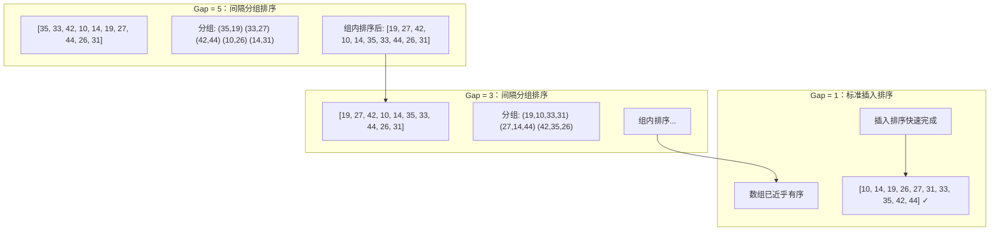
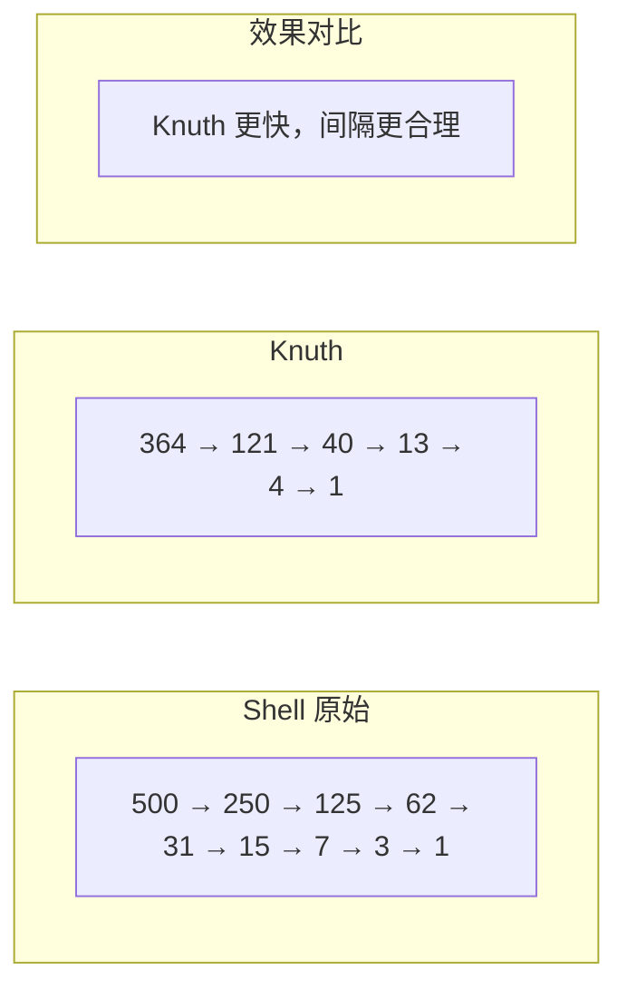

# 希尔排序 (Shell Sort)

> 插入排序的改进版，通过间隔分组突破 O(n²) 瓶颈。

---

## 📚 目录

1. [核心思想](#1-核心思想)
2. [适用场景](#2-适用场景)
3. [优缺点分析](#3-优缺点分析)
4. [间隔序列选择](#4-间隔序列选择)
5. [复杂度分析](#5-复杂度分析)
6. [正确性说明](#6-正确性说明)
7. [前端场景应用](#7-前端场景应用)

---

## 1. 核心思想

### 问题背景

插入排序的问题：小元素在数组末尾时，需要移动很多次才能到达正确位置（"乌龟问题"）。

### 希尔排序的解决方案

**分组 + 递减间隔**：
1. 选择一个间隔序列（如 5, 3, 1）
2. 对间隔为 gap 的元素进行插入排序
3. 逐渐缩小 gap，直到 gap = 1
4. 最后一轮 gap = 1 就是标准插入排序，但此时数组已近乎有序

### Mermaid 图解



### 伪代码

```
gaps = [5, 3, 1]  // 间隔序列
for gap in gaps:
    for i = gap to n-1:
        // 对间隔为 gap 的元素进行插入排序
        key = arr[i]
        j = i - gap
        while j >= 0 and arr[j] > key:
            arr[j + gap] = arr[j]
            j = j - gap
        arr[j + gap] = key
```

---

## 2. 适用场景

### ✅ 什么时候用

| 场景 | 原因 |
|------|------|
| 中等规模数据 (n < 10000) | 比 O(n²) 快，比高级排序简单 |
| 嵌入式/资源受限环境 | 代码简洁，无递归 |
| 不需要稳定排序 | 希尔排序不稳定 |
| 避免递归栈溢出 | 迭代实现，无递归 |

### ❌ 什么时候别用

| 场景 | 原因 |
|------|------|
| 大规模数据 | 归并/快排更快 |
| 需要稳定排序 | 希尔排序不稳定 |
| 已有更优实现 | 如 TimSort |

### 🎯 场景识别信号

```
看到 → 想到希尔排序：
- "中等规模 + 不需稳定"
- "嵌入式环境"
- "避免递归"
- "想要比 O(n²) 快但不想写复杂算法"
```

---

## 3. 优缺点分析

### 优点

| 优点 | 说明 |
|------|------|
| 比 O(n²) 快 | 打破了二次时间复杂度 |
| 实现简单 | 只是插入排序的小改动 |
| 原地排序 | O(1) 额外空间 |
| 无递归 | 避免栈溢出风险 |
| 缓存友好 | 顺序访问内存 |

### 缺点

| 缺点 | 说明 |
|------|------|
| 不稳定 | 间隔分组可能打乱相等元素顺序 |
| 复杂度难分析 | 取决于间隔序列 |
| 不如高级算法快 | 大规模不如快排、归并 |

### 不稳定性示例

```
原数组：[3a, 3b, 1, 2]
Gap=2：分组 (3a, 1) (3b, 2)
组内排序：(1, 3a) (2, 3b)
结果：[1, 2, 3a, 3b] ← 这次恰好稳定

但在某些情况下，3a 和 3b 可能交换位置
```

---

## 4. 间隔序列选择

间隔序列的选择**直接影响性能**，这是希尔排序的核心。

### 4.1 常见间隔序列

| 名称 | 序列 | 最坏复杂度 |
|------|------|------------|
| Shell 原始 | n/2, n/4, ..., 1 | O(n²) |
| Hibbard | 1, 3, 7, 15, ... (2^k - 1) | O(n^1.5) |
| Sedgewick | 1, 5, 19, 41, ... | O(n^(4/3)) |
| Knuth | 1, 4, 13, 40, ... (3^k - 1)/2 | O(n^1.5) |

### 4.2 推荐：Knuth 序列

```typescript
function getKnuthGaps(n: number): number[] {
  const gaps: number[] = [];
  let gap = 1;
  while (gap < n / 3) {
    gap = gap * 3 + 1;
  }
  while (gap >= 1) {
    gaps.push(gap);
    gap = Math.floor(gap / 3);
  }
  return gaps;
}

// n = 1000 时：[364, 121, 40, 13, 4, 1]
```

### 4.3 间隔序列对比图



---

## 5. 复杂度分析

| 指标 | 复杂度 | 说明 |
|------|--------|------|
| 时间（最好） | O(n log n) | 取决于间隔序列 |
| 时间（平均） | O(n^1.25) ~ O(n^1.5) | 取决于间隔序列 |
| 时间（最坏） | O(n²) | Shell 原始序列 |
| 空间 | O(1) | 原地排序 |
| 稳定性 | ❌ 不稳定 | |
| 原地 | ✅ 是 | |

### 不同间隔序列的复杂度

```
Shell:     O(n²) 最坏
Hibbard:   O(n^1.5) 最坏
Knuth:     O(n^1.5) 最坏
Sedgewick: O(n^(4/3)) ≈ O(n^1.33) 最坏
```

### 与其他算法对比

| | 希尔排序 | 插入排序 | 快速排序 |
|---|----------|----------|----------|
| 平均 | O(n^1.3) | O(n²) | O(n log n) |
| 稳定 | ❌ | ✅ | ❌ |
| 递归 | ❌ | ❌ | ✅ |
| 实现难度 | 简单 | 简单 | 中等 |

---

## 6. 正确性说明

### 核心不变式

**h-有序性**：对于任意 h，所有间隔为 h 的子序列都是有序的。

当 h = 1 时，整个数组有序。

### 证明

1. 每个 gap 值下，对所有间隔为 gap 的子序列进行插入排序。
2. 较大的 gap 让元素快速移动到大致正确的位置。
3. gap 减小时，数组变得"更有序"。
4. 当 gap = 1 时，进行标准插入排序，但此时数组已近乎有序，效率高。
5. 关键：较小 gap 的排序不会破坏较大 gap 的 h-有序性。

---

## 7. 前端场景应用

### 7.1 中等规模数据排序

```typescript
// 场景：1000-5000 条数据的排序
// 希尔排序是个不错的选择：简单、快于 O(n²)

const data = fetchData(); // 2000 条
shellSort(data, (a, b) => a.timestamp - b.timestamp);
```

### 7.2 嵌入式/IoT 前端

```typescript
// 场景：资源受限的嵌入式设备
// 希尔排序无递归，栈空间固定

function sortSensorData(readings: SensorReading[]): void {
  // 希尔排序：代码小，无递归，效率可接受
  shellSort(readings, (a, b) => a.value - b.value);
}
```

### 7.3 作为快排的后备

```typescript
// 场景：避免快排最坏情况
// 可以用希尔排序作为后备（但通常用堆排序）

function robustSort(arr, cmp) {
  if (detectBadPivot(arr)) {
    return shellSort(arr, cmp);
  }
  return quickSort(arr, cmp);
}
```

### 7.4 注意：不适合表格多列排序

```typescript
// ❌ 希尔排序不稳定，不适合多列排序
// ✅ 使用插入排序或归并排序
```

---

## 📖 相关链接

- [算法实现](../../../算法包/希尔排序/)
- [插入排序（希尔排序的基础）](./03-插入排序.md)
- [复杂度对比表](../../02-复杂度对比表.md)
