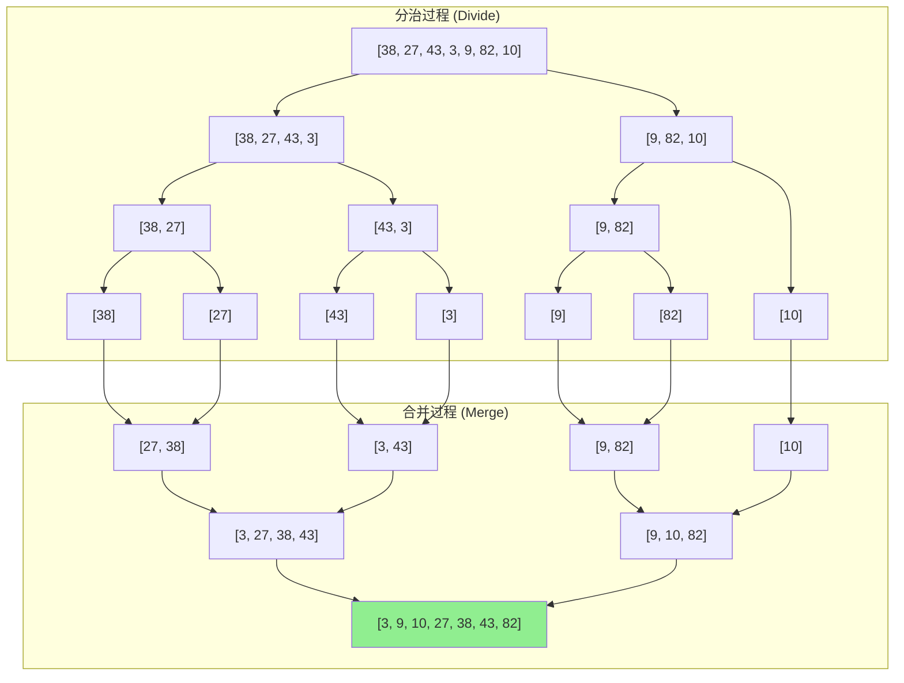
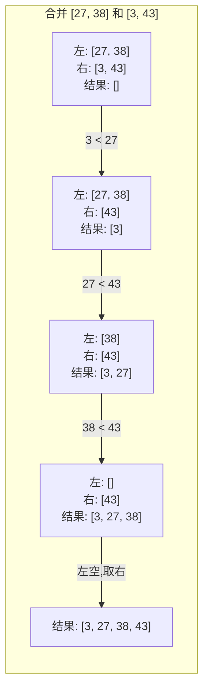

# 归并排序 (Merge Sort)

## 📌 核心思想

**分而治之**：将数组不断二分，直到每个子数组只有一个元素（天然有序），然后逐层**合并**两个有序数组。

> 关键洞察：合并两个有序数组的时间复杂度是 O(n)，而分治的层数是 O(log n)，所以总复杂度是 O(n log n)。

---

## 🎯 适用场景

### ✅ 推荐使用

| 场景 | 原因 |
|------|------|
| 需要稳定排序 | 归并是稳定的 O(n log n) 算法 |
| 链表排序 | 链表归并无需额外空间，且合并操作高效 |
| 外部排序 | 大文件分块排序再合并 |
| 并行计算 | 分治天然适合并行 |

### ❌ 不推荐使用

| 场景 | 原因 |
|------|------|
| 内存受限 | 需要 O(n) 辅助空间 |
| 小规模数据 | 常数因子大，不如插入排序 |

---

## 📊 复杂度分析

| 指标 | 值 | 说明 |
|------|-----|------|
| **最好时间** | O(n log n) | 无论数据分布如何 |
| **平均时间** | O(n log n) | 稳定的性能 |
| **最坏时间** | O(n log n) | ⭐ 不会退化 |
| **空间复杂度** | O(n) | 需要辅助数组（递归版还有栈空间 O(log n)） |
| **稳定性** | ✅ 稳定 | 合并时相等元素保持原顺序 |
| **原地性** | ❌ 非原地 | 需要额外空间 |

---

## 🔄 算法流程（Mermaid）



### 合并过程详解



---

## 💻 两种实现方式

### 1. 递归版（自顶向下）

```typescript
function mergeSortRecursive<T>(arr: T[], cmp: Comparator<T>): T[] {
  if (arr.length <= 1) return [...arr];

  const mid = arr.length >> 1;
  const left = mergeSortRecursive(arr.slice(0, mid), cmp);
  const right = mergeSortRecursive(arr.slice(mid), cmp);

  return merge(left, right, cmp);
}

function merge<T>(left: T[], right: T[], cmp: Comparator<T>): T[] {
  const result: T[] = [];
  let i = 0, j = 0;

  while (i < left.length && j < right.length) {
    // ⚠️ <= 保证稳定性（相等时取左边）
    if (cmp(left[i], right[j]) <= 0) {
      result.push(left[i++]);
    } else {
      result.push(right[j++]);
    }
  }

  // 合并剩余
  return result.concat(left.slice(i), right.slice(j));
}
```

### 2. 迭代版（自底向上）

```typescript
function mergeSortIterative<T>(arr: T[], cmp: Comparator<T>): T[] {
  const n = arr.length;
  if (n <= 1) return [...arr];

  const result = [...arr];
  const aux = new Array(n);

  // 从 size=1 开始，每次翻倍
  for (let size = 1; size < n; size *= 2) {
    // 遍历所有相邻的 size 块
    for (let left = 0; left < n - size; left += 2 * size) {
      const mid = left + size;
      const right = Math.min(left + 2 * size, n);
      mergeInPlace(result, aux, left, mid, right, cmp);
    }
  }

  return result;
}
```

> **迭代版优势**：无递归栈开销，更适合超大数组；**劣势**：代码稍复杂。

---

## ⚠️ 注意事项

### 1. 稳定性保证

```typescript
// ✅ 正确：相等时取左边元素
if (cmp(left[i], right[j]) <= 0) {
  result.push(left[i++]);
}

// ❌ 错误：相等时可能取右边，破坏稳定性
if (cmp(left[i], right[j]) < 0) {
  result.push(left[i++]);
}
```

### 2. 辅助空间优化

```typescript
// 方案 1：一次性分配，避免重复创建
const aux = new Array(arr.length);

// 方案 2：交替使用两个数组（减少拷贝）
let src = [...arr];
let dst = new Array(arr.length);
for (let size = 1; size < n; size *= 2) {
  // 合并 src → dst
  [src, dst] = [dst, src]; // 交换角色
}
```

### 3. 小数组优化

```typescript
// 当子数组足够小时，切换到插入排序
const INSERTION_THRESHOLD = 16;

function optimizedMergeSort<T>(arr: T[], cmp: Comparator<T>): T[] {
  if (arr.length <= INSERTION_THRESHOLD) {
    return insertionSort(arr, cmp);
  }
  // ... 归并逻辑
}
```

---

## 🌐 前端业务场景

### 1. 稳定排序表格数据

```typescript
// 用户先按"部门"排序，再按"入职时间"排序
// 希望同入职时间的员工保持之前的部门顺序
const employees = [
  { name: 'Alice', dept: 'HR', joinDate: '2023-01' },
  { name: 'Bob', dept: 'Dev', joinDate: '2023-01' },
  { name: 'Carol', dept: 'HR', joinDate: '2023-02' },
];

// 第一次：按部门排序
mergeSort(employees, (a, b) => a.dept.localeCompare(b.dept));

// 第二次：按入职时间排序（保持部门顺序）
mergeSort(employees, (a, b) => a.joinDate.localeCompare(b.joinDate));
```

### 2. 合并多个有序数据源

```typescript
// 合并多个分页 API 返回的有序结果
async function mergePagedResults<T>(
  pages: T[][],
  cmp: Comparator<T>
): Promise<T[]> {
  // 两两合并
  while (pages.length > 1) {
    const newPages: T[][] = [];
    for (let i = 0; i < pages.length; i += 2) {
      if (i + 1 < pages.length) {
        newPages.push(merge(pages[i], pages[i + 1], cmp));
      } else {
        newPages.push(pages[i]);
      }
    }
    pages = newPages;
  }
  return pages[0] || [];
}
```

---

## 🆚 与其他算法对比

| 算法 | 时间复杂度 | 空间复杂度 | 稳定性 | 特点 |
|------|-----------|-----------|--------|------|
| **归并排序** | O(n log n) | O(n) | ✅ 稳定 | 性能稳定，适合链表/外部排序 |
| 快速排序 | O(n log n) 平均 | O(log n) | ❌ 不稳定 | 原地排序，常数因子小 |
| 堆排序 | O(n log n) | O(1) | ❌ 不稳定 | 原地排序，性能稳定 |

---

## 📚 延伸阅读

1. **链表归并排序**：空间复杂度可达 O(1)
2. **自然归并排序**：利用已有的有序 run
3. **TimSort**：归并 + 插入的工业级实现（Python/Java 默认）
4. **多路归并**：外部排序的核心技术

---

## ✅ 自检清单

- [ ] 能手写递归版和迭代版
- [ ] 理解稳定性是如何保证的（`<=` vs `<`）
- [ ] 知道空间复杂度为何是 O(n)
- [ ] 能解释为什么适合外部排序和链表排序
- [ ] 能实现小数组优化（切换到插入排序）

