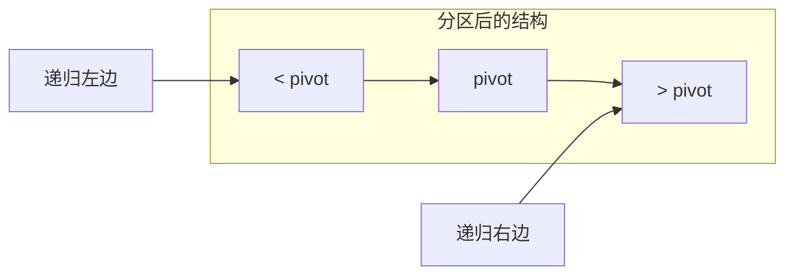

# 快速排序 (Quick Sort)

## 📌 核心思想

**分区征服**：选择一个**基准元素（pivot）**，将数组分为「小于 pivot」和「大于 pivot」两部分，然后递归排序两部分。

> 关键洞察：每次 partition 后，pivot 就在最终位置。平均情况下，每次分区将问题规模减半。

---

## 🎯 适用场景

### ✅ 推荐使用

| 场景 | 原因 |
|------|------|
| 通用内部排序 | 平均性能最优，常数因子小 |
| 内存受限 | 原地排序，只需 O(log n) 栈空间 |
| 随机数据 | 随机 pivot 表现优秀 |

### ❌ 不推荐使用

| 场景 | 原因 |
|------|------|
| 需要稳定排序 | 快排不稳定 |
| 数据已有序/逆序 | 最坏情况 O(n²) |
| 大量重复元素 | 标准快排效率下降（用三路快排） |

---

## 📊 复杂度分析

| 指标 | 值 | 说明 |
|------|-----|------|
| **最好时间** | O(n log n) | 每次分区均匀 |
| **平均时间** | O(n log n) | 期望情况 |
| **最坏时间** | O(n²) | ⚠️ 每次分区极不均匀 |
| **空间复杂度** | O(log n) | 递归栈空间（尾递归优化后） |
| **稳定性** | ❌ 不稳定 | 分区时元素交换会打乱相对顺序 |
| **原地性** | ✅ 原地 | 无需额外数组 |

---

## 🔄 Partition 过程（Mermaid）

```mermaid
graph TD
    subgraph "Lomuto Partition (pivot=43)"
        A["[38, 27, 43, 3, 9, 82, 10]<br/>pivot=43, i=-1"]
        A -->|"38<43, i++, swap"| B["[38, 27, 43, 3, 9, 82, 10]<br/>i=0"]
        B -->|"27<43, i++, swap"| C["[38, 27, 43, 3, 9, 82, 10]<br/>i=1"]
        C -->|"43>=43, skip"| D["[38, 27, 43, 3, 9, 82, 10]<br/>i=1"]
        D -->|"3<43, i++, swap(43,3)"| E["[38, 27, 3, 43, 9, 82, 10]<br/>i=2"]
        E -->|"9<43, i++, swap(43,9)"| F["[38, 27, 3, 9, 43, 82, 10]<br/>i=3"]
        F -->|"82>=43, skip"| G["[38, 27, 3, 9, 43, 82, 10]<br/>i=3"]
        G -->|"10<43, i++, swap(43,10)"| H["[38, 27, 3, 9, 10, 82, 43]<br/>i=4"]
        H -->|"swap pivot"| I["[38, 27, 3, 9, 10, 43, 82]<br/>pivot在位置5"]
    end

    style I fill:#90EE90
```



### Partition 分区示意



---

## 💻 核心实现

### 1. 基础版本（Lomuto 分区）

```typescript
function quickSort<T>(arr: T[], cmp: Comparator<T>): T[] {
  const result = [...arr];
  quickSortHelper(result, 0, result.length - 1, cmp);
  return result;
}

function quickSortHelper<T>(
  arr: T[],
  low: number,
  high: number,
  cmp: Comparator<T>
): void {
  if (low >= high) return;

  const pivotIndex = partition(arr, low, high, cmp);
  quickSortHelper(arr, low, pivotIndex - 1, cmp);
  quickSortHelper(arr, pivotIndex + 1, high, cmp);
}

function partition<T>(
  arr: T[],
  low: number,
  high: number,
  cmp: Comparator<T>
): number {
  const pivot = arr[high]; // 取最后一个作为 pivot
  let i = low - 1;

  for (let j = low; j < high; j++) {
    if (cmp(arr[j], pivot) < 0) {
      i++;
      [arr[i], arr[j]] = [arr[j], arr[i]];
    }
  }

  [arr[i + 1], arr[high]] = [arr[high], arr[i + 1]];
  return i + 1;
}
```

---

## ⚡ Pivot 选择策略

### 1. 首/尾元素（最简单，但有风险）

```typescript
const pivot = arr[high]; // 或 arr[low]
// ⚠️ 风险：有序数据时退化为 O(n²)
```

### 2. 随机选择（推荐）

```typescript
function randomPivotPartition<T>(
  arr: T[],
  low: number,
  high: number,
  cmp: Comparator<T>
): number {
  // 随机选择 pivot，与末尾交换
  const randomIndex = low + Math.floor(Math.random() * (high - low + 1));
  [arr[randomIndex], arr[high]] = [arr[high], arr[randomIndex]];
  return partition(arr, low, high, cmp);
}
```

### 3. 三数取中（Median-of-Three）⭐

```typescript
function medianOfThree<T>(
  arr: T[],
  low: number,
  high: number,
  cmp: Comparator<T>
): number {
  const mid = (low + high) >> 1;

  // 将 low, mid, high 三个位置排序
  if (cmp(arr[low], arr[mid]) > 0) [arr[low], arr[mid]] = [arr[mid], arr[low]];
  if (cmp(arr[low], arr[high]) > 0) [arr[low], arr[high]] = [arr[high], arr[low]];
  if (cmp(arr[mid], arr[high]) > 0) [arr[mid], arr[high]] = [arr[high], arr[mid]];

  // 将中值移到 high-1 位置
  [arr[mid], arr[high - 1]] = [arr[high - 1], arr[mid]];
  return high - 1;
}
```

> **三数取中**能有效避免有序/逆序数据的最坏情况。

---

## 🔧 尾递归优化

```typescript
function quickSortTailOptimized<T>(
  arr: T[],
  low: number,
  high: number,
  cmp: Comparator<T>
): void {
  while (low < high) {
    const pivotIndex = partition(arr, low, high, cmp);

    // 先递归较小的分区，较大的用循环处理
    if (pivotIndex - low < high - pivotIndex) {
      quickSortTailOptimized(arr, low, pivotIndex - 1, cmp);
      low = pivotIndex + 1; // 尾递归优化：用循环代替递归
    } else {
      quickSortTailOptimized(arr, pivotIndex + 1, high, cmp);
      high = pivotIndex - 1;
    }
  }
}
```

> **优化效果**：最坏情况下栈深度从 O(n) 降到 O(log n)。

---

## ⚠️ 最坏情况分析与规避

### 最坏情况触发条件

| 条件 | 示例 | 后果 |
|------|------|------|
| 已排序 + 取首/尾元素 | `[1,2,3,4,5]` | O(n²) |
| 完全逆序 + 取首/尾元素 | `[5,4,3,2,1]` | O(n²) |
| 大量重复元素 | `[1,1,1,1,1]` | O(n²)（标准版） |

### 规避策略

```typescript
// 组合策略：随机 + 三数取中 + 尾递归 + 小数组插入
function robustQuickSort<T>(arr: T[], cmp: Comparator<T>): T[] {
  const result = [...arr];
  robustHelper(result, 0, result.length - 1, cmp);
  return result;
}

function robustHelper<T>(
  arr: T[],
  low: number,
  high: number,
  cmp: Comparator<T>
): void {
  const INSERTION_THRESHOLD = 16;

  while (low < high) {
    // 小数组用插入排序
    if (high - low < INSERTION_THRESHOLD) {
      insertionSortRange(arr, low, high, cmp);
      return;
    }

    // 三数取中 + 分区
    const pivotIndex = medianOfThreePartition(arr, low, high, cmp);

    // 尾递归优化
    if (pivotIndex - low < high - pivotIndex) {
      robustHelper(arr, low, pivotIndex - 1, cmp);
      low = pivotIndex + 1;
    } else {
      robustHelper(arr, pivotIndex + 1, high, cmp);
      high = pivotIndex - 1;
    }
  }
}
```

---

## 🆚 Lomuto vs Hoare 分区

| 分区方式 | Lomuto | Hoare |
|----------|--------|-------|
| 理解难度 | 简单 | 中等 |
| 交换次数 | 多（3x） | 少 |
| 等值元素处理 | 不佳 | 较好 |
| 代码量 | 少 | 多 |
| 常见用途 | 教学 | 生产 |

### Hoare 分区实现

```typescript
function hoarePartition<T>(
  arr: T[],
  low: number,
  high: number,
  cmp: Comparator<T>
): number {
  const pivot = arr[(low + high) >> 1];
  let i = low - 1;
  let j = high + 1;

  while (true) {
    do { i++; } while (cmp(arr[i], pivot) < 0);
    do { j--; } while (cmp(arr[j], pivot) > 0);

    if (i >= j) return j;
    [arr[i], arr[j]] = [arr[j], arr[i]];
  }
}
```

---

## 🌐 前端业务场景

### 1. 实时数据排序

```typescript
// 低延迟排序（如游戏排行榜）
function realTimeSort<T>(data: T[], cmp: Comparator<T>): T[] {
  // 快排原地排序，无需额外内存分配
  return quickSortInPlace([...data], cmp);
}
```

### 2. 与 Array.sort 对比

```typescript
// 浏览器 Array.sort 通常使用 TimSort（稳定）
// 但某些场景快排更快（纯数字、无稳定性需求）
const numbers = Array.from({ length: 100000 }, () => Math.random());

console.time('Array.sort');
numbers.slice().sort((a, b) => a - b);
console.timeEnd('Array.sort');

console.time('quickSort');
quickSort(numbers, (a, b) => a - b);
console.timeEnd('quickSort');
```

---

## 📚 延伸阅读

1. **三路快排**：处理大量重复元素（详见 09-三路快排.md）
2. **Introsort**：快排 + 堆排 + 插入的混合算法（详见 10-Introsort.md）
3. **Dual-Pivot Quicksort**：Java 7+ 的默认排序
4. **快速选择（QuickSelect）**：O(n) 找第 K 大（详见 08-快速选择.md）

---

## ✅ 自检清单

- [ ] 能手写 Lomuto 和 Hoare 两种分区
- [ ] 理解 pivot 选择对性能的影响
- [ ] 能实现三数取中策略
- [ ] 能解释最坏情况何时发生及如何规避
- [ ] 能实现尾递归优化
- [ ] 知道为什么快排不稳定
- [ ] 能说明快排与归并的 trade-off

