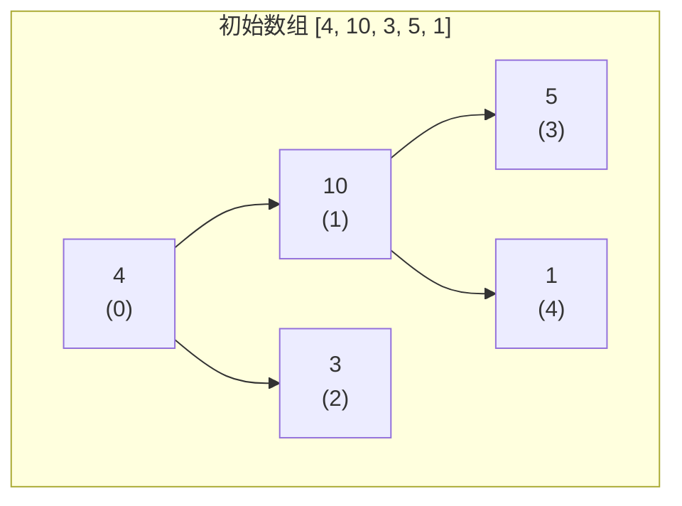
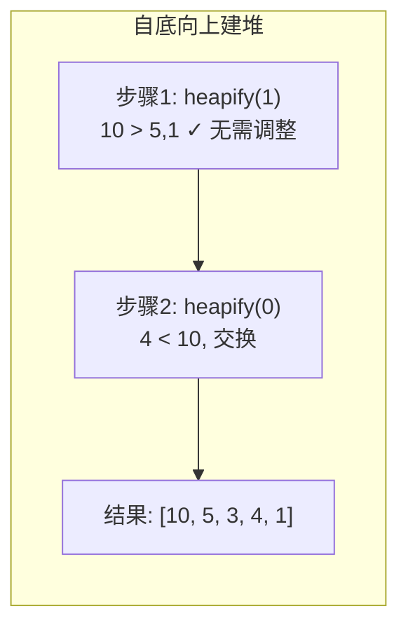
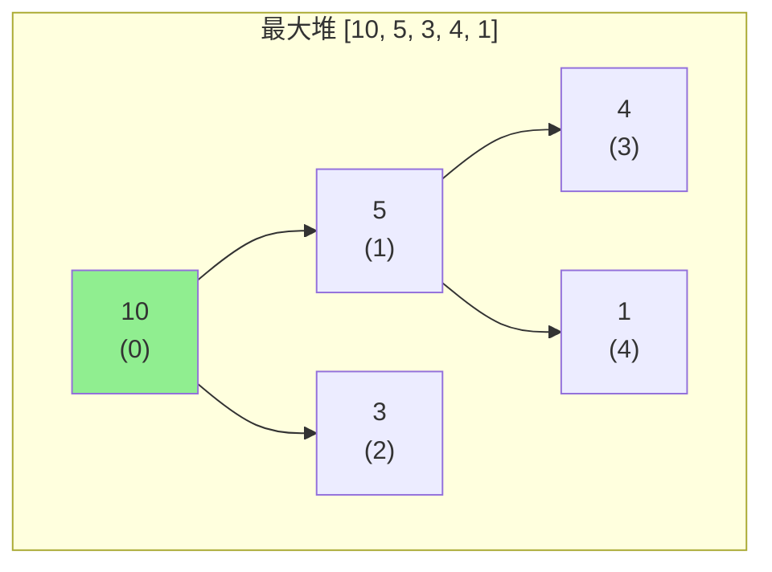
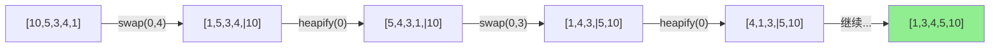

# 堆排序 (Heap Sort)

## 📌 核心思想

利用**堆**这种数据结构的性质进行排序：

1. **建堆**：将无序数组构建成最大堆
2. **排序**：反复将堆顶（最大值）与末尾交换，然后堆化调整

> 关键洞察：堆的根节点始终是最值；每次取出根节点后，只需 O(log n) 就能恢复堆性质。

---

## 🎯 适用场景

### ✅ 推荐使用

| 场景 | 原因 |
|------|------|
| 内存受限 | O(1) 额外空间 |
| 最坏情况敏感 | 保证 O(n log n)，不会退化 |
| TopK 问题 | 维护大小为 K 的堆 |
| 优先队列实现 | 堆天然支持 |

### ❌ 不推荐使用

| 场景 | 原因 |
|------|------|
| 需要稳定排序 | 堆排序不稳定 |
| 追求最快平均速度 | 快排的平均性能更优 |
| 近乎有序数据 | 插入排序或 TimSort 更快 |

---

## 📊 复杂度分析

| 指标 | 值 | 说明 |
|------|-----|------|
| **最好时间** | O(n log n) | 无论数据分布如何 |
| **平均时间** | O(n log n) | 稳定的性能 |
| **最坏时间** | O(n log n) | ⭐ 保证不退化 |
| **空间复杂度** | O(1) | 原地排序 |
| **稳定性** | ❌ 不稳定 | 交换打乱相对顺序 |
| **原地性** | ✅ 原地 | 无需额外数组 |

---

## 🌳 堆的基本概念

### 数组存储二叉堆

```
              0
           /     \
          1       2
         / \     / \
        3   4   5   6

数组索引：[0, 1, 2, 3, 4, 5, 6]

关系公式（0-indexed）：
- 父节点：parent(i) = (i - 1) >> 1
- 左子节点：left(i) = 2 * i + 1
- 右子节点：right(i) = 2 * i + 2
```

### 最大堆性质

```
对于任意节点 i：arr[i] >= arr[left(i)] 且 arr[i] >= arr[right(i)]
```

---

## 🔄 堆化过程（Mermaid）







### 排序过程



---

## 💻 核心实现

### 两种建堆方式

#### 1. 自底向上建堆（推荐 O(n)）

```typescript
function buildHeapBottomUp<T>(arr: T[], cmp: Comparator<T>): void {
  const n = arr.length;
  // 从最后一个非叶子节点开始，自底向上
  for (let i = (n >> 1) - 1; i >= 0; i--) {
    heapifyDown(arr, n, i, cmp);
  }
}
```

> **为什么是 O(n)**：叶子节点（占一半）无需操作；越靠近根，节点越少但下沉距离越长。数学证明总操作数是 O(n)。

#### 2. 自顶向下建堆（O(n log n)）

```typescript
function buildHeapTopDown<T>(arr: T[], cmp: Comparator<T>): void {
  const n = arr.length;
  // 模拟逐个插入
  for (let i = 1; i < n; i++) {
    heapifyUp(arr, i, cmp);
  }
}
```

### 完整堆排序

```typescript
function heapSort<T>(arr: readonly T[], cmp: Comparator<T>): T[] {
  const result = [...arr];
  const n = result.length;

  if (n <= 1) return result;

  // 1. 建最大堆（O(n)）
  for (let i = (n >> 1) - 1; i >= 0; i--) {
    heapifyDown(result, n, i, cmp);
  }

  // 2. 排序：交换堆顶与末尾，缩小堆范围，重新堆化
  for (let i = n - 1; i > 0; i--) {
    [result[0], result[i]] = [result[i], result[0]];
    heapifyDown(result, i, 0, cmp);  // 堆大小变为 i
  }

  return result;
}

function heapifyDown<T>(
  arr: T[],
  heapSize: number,
  i: number,
  cmp: Comparator<T>
): void {
  while (true) {
    let largest = i;
    const left = 2 * i + 1;
    const right = 2 * i + 2;

    if (left < heapSize && cmp(arr[left], arr[largest]) > 0) {
      largest = left;
    }
    if (right < heapSize && cmp(arr[right], arr[largest]) > 0) {
      largest = right;
    }

    if (largest === i) break;

    [arr[i], arr[largest]] = [arr[largest], arr[i]];
    i = largest;
  }
}
```

---

## ⚠️ 为什么堆排序不稳定？

```typescript
// 示例：相等元素顺序被打乱
const items = [
  { value: 3, id: 1 },
  { value: 3, id: 2 },
  { value: 1, id: 3 },
];

// 建堆时，(3,id=1) 和 (3,id=2) 可能因为与其他元素交换而顺序改变
// 排序时，堆顶与末尾交换也会打乱顺序

// 结果可能是：
// [{ value: 1, id: 3 }, { value: 3, id: 2 }, { value: 3, id: 1 }]
// 原本 id=1 在 id=2 前面，现在反了 → 不稳定
```

---

## 🔧 变种与优化

### 1. 升序排序用最大堆 vs 最小堆

```typescript
// ✅ 升序排序：用最大堆
// 每次取出最大值放到末尾

// ❌ 升序排序用最小堆：需要额外数组存储取出的元素
```

### 2. 多路堆（d-ary heap）

```typescript
// d 叉堆：每个节点有 d 个子节点
// 优势：减少树高度 log_d(n)
// 劣势：每次 heapify 需要比较 d 个子节点

// 适用场景：堆操作频繁时（如 Dijkstra 算法）
```

### 3. 利用堆做 TopK

```typescript
function topK<T>(arr: readonly T[], k: number, cmp: Comparator<T>): T[] {
  if (k <= 0) return [];
  if (k >= arr.length) return heapSort(arr, cmp);

  // 维护大小为 k 的最小堆（找最大的 k 个）
  const heap = arr.slice(0, k);
  buildMinHeap(heap, cmp);

  for (let i = k; i < arr.length; i++) {
    if (cmp(arr[i], heap[0]) > 0) {
      heap[0] = arr[i];
      heapifyDown(heap, k, 0, reverseCmp(cmp));
    }
  }

  return heap;
}
```

---

## 🌐 前端业务场景

### 1. 优先级队列

```typescript
class PriorityQueue<T> {
  private heap: T[] = [];

  constructor(private cmp: Comparator<T>) {}

  push(item: T): void {
    this.heap.push(item);
    this.heapifyUp(this.heap.length - 1);
  }

  pop(): T | undefined {
    if (this.heap.length === 0) return undefined;
    const top = this.heap[0];
    const last = this.heap.pop()!;
    if (this.heap.length > 0) {
      this.heap[0] = last;
      this.heapifyDown(0);
    }
    return top;
  }

  peek(): T | undefined {
    return this.heap[0];
  }

  // ... heapifyUp, heapifyDown 实现
}

// 使用：任务调度
const taskQueue = new PriorityQueue<Task>((a, b) => b.priority - a.priority);
taskQueue.push({ name: 'low', priority: 1 });
taskQueue.push({ name: 'high', priority: 10 });
console.log(taskQueue.pop()); // { name: 'high', priority: 10 }
```

### 2. 实时热榜

```typescript
// 维护热度最高的 10 条内容
class HotRanking {
  private minHeap: Article[] = [];
  private readonly capacity = 10;

  add(article: Article): void {
    if (this.minHeap.length < this.capacity) {
      this.minHeap.push(article);
      // heapifyUp...
    } else if (article.heat > this.minHeap[0].heat) {
      this.minHeap[0] = article;
      // heapifyDown...
    }
  }

  getTopN(): Article[] {
    return [...this.minHeap].sort((a, b) => b.heat - a.heat);
  }
}
```

---

## 🆚 与其他算法对比

| 算法 | 时间复杂度 | 空间复杂度 | 稳定性 | 特点 |
|------|-----------|-----------|--------|------|
| 堆排序 | O(n log n) | O(1) | ❌ | 原地、保证性能、常数因子较大 |
| 快速排序 | O(n log n) 平均 | O(log n) | ❌ | 平均更快，但有最坏情况 |
| 归并排序 | O(n log n) | O(n) | ✅ | 稳定，但需要额外空间 |

> **为什么快排比堆排常数因子小**：堆排的 heapify 访问内存不连续（父子节点距离远），CPU 缓存命中率低。

---

## 📚 延伸阅读

1. **Floyd 建堆算法**：自底向上 O(n) 建堆的数学证明
2. **斐波那契堆**：更优的摊还复杂度，用于图算法
3. **二项堆**：支持快速合并的堆结构
4. **Introsort**：快排深度过深时切换到堆排序

---

## ✅ 自检清单

- [ ] 能画出堆的数组表示和父子索引公式
- [ ] 能手写 heapifyDown 和 heapifyUp
- [ ] 理解自底向上建堆为何是 O(n)
- [ ] 能解释为什么堆排序不稳定
- [ ] 能实现 TopK 问题的堆解法
- [ ] 知道堆排序为什么比快排慢（缓存不友好）

