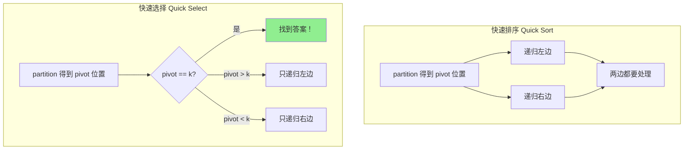
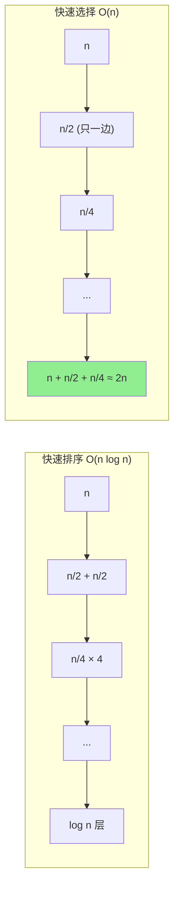
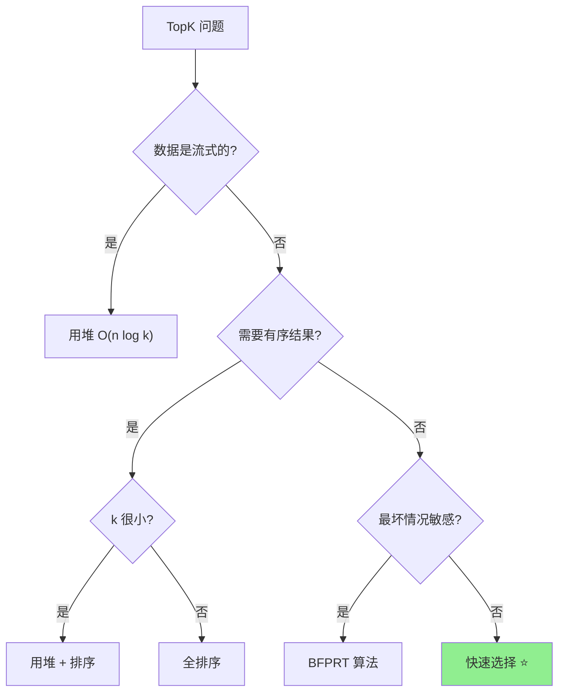

# 快速选择 (Quick Select)

## 📌 核心思想

基于快速排序的 **partition** 思想，但只递归处理包含目标位置的那一半，从而在 **O(n)** 平均时间内找到第 K 大/小的元素。

> 关键洞察：我们不需要完全排序，只需要让第 K 个位置的元素归位即可。

---

## 🎯 适用场景

### ✅ 推荐使用

| 场景 | 原因 |
|------|------|
| 找第 K 大/小元素 | O(n) 平均，比排序快 |
| TopK 问题（无需有序） | 一次 partition 确定边界 |
| 中位数查找 | K = n/2 |

### ❌ 不推荐使用

| 场景 | 原因 |
|------|------|
| 需要 TopK 有序结果 | 只能确定哪些是 TopK，不排序 |
| 在线/流式数据 | 堆更适合动态维护 |
| 最坏情况敏感 | O(n²) 最坏情况 |

---

## 📊 复杂度分析

| 指标 | 值 | 说明 |
|------|-----|------|
| **平均时间** | O(n) | n + n/2 + n/4 + ... ≈ 2n |
| **最坏时间** | O(n²) | 每次只排除 1 个元素 |
| **空间复杂度** | O(1) | 原地操作（迭代版） |

---

## 🔄 与快速排序的对比（Mermaid）



### 时间复杂度对比



---

## 💻 核心实现

### 基础版本

```typescript
/**
 * 快速选择：找到第 k 小的元素（k 从 0 开始）
 *
 * @param arr 输入数组（会被修改）
 * @param k 目标位置（0-indexed）
 * @param cmp 比较函数
 * @returns 第 k 小的元素
 */
export function quickSelect<T>(
  arr: T[],
  k: number,
  cmp: (a: T, b: T) => number
): T {
  if (k < 0 || k >= arr.length) {
    throw new Error(`k=${k} 超出范围 [0, ${arr.length - 1}]`);
  }

  let left = 0;
  let right = arr.length - 1;

  while (left < right) {
    const pivotIndex = partition(arr, left, right, cmp);

    if (pivotIndex === k) {
      return arr[k];
    } else if (pivotIndex < k) {
      left = pivotIndex + 1;  // 只看右边
    } else {
      right = pivotIndex - 1; // 只看左边
    }
  }

  return arr[k];
}

function partition<T>(
  arr: T[],
  left: number,
  right: number,
  cmp: (a: T, b: T) => number
): number {
  // 随机选择 pivot 避免最坏情况
  const randomIndex = left + Math.floor(Math.random() * (right - left + 1));
  [arr[randomIndex], arr[right]] = [arr[right], arr[randomIndex]];

  const pivot = arr[right];
  let i = left - 1;

  for (let j = left; j < right; j++) {
    if (cmp(arr[j], pivot) < 0) {
      i++;
      [arr[i], arr[j]] = [arr[j], arr[i]];
    }
  }

  [arr[i + 1], arr[right]] = [arr[right], arr[i + 1]];
  return i + 1;
}
```

### TopK 实现

```typescript
/**
 * 返回最小的 k 个元素（无序）
 */
export function topKSmallest<T>(
  arr: readonly T[],
  k: number,
  cmp: (a: T, b: T) => number
): T[] {
  if (k <= 0) return [];
  if (k >= arr.length) return [...arr];

  const result = [...arr];
  quickSelect(result, k - 1, cmp); // 确保前 k 个都小于等于第 k 个

  return result.slice(0, k);
}

/**
 * 返回最大的 k 个元素（无序）
 */
export function topKLargest<T>(
  arr: readonly T[],
  k: number,
  cmp: (a: T, b: T) => number
): T[] {
  // 反转比较器，找"最小"的 k 个（实际是最大）
  const reverseCmp = (a: T, b: T) => cmp(b, a);
  return topKSmallest(arr, k, reverseCmp);
}
```

---

## 🆚 TopK 问题的多种解法对比

| 解法 | 时间复杂度 | 空间复杂度 | 是否有序 | 适用场景 |
|------|-----------|-----------|---------|---------|
| **全排序** | O(n log n) | O(1)~O(n) | ✅ 有序 | 简单实现 |
| **堆（大小为 K）** | O(n log k) | O(k) | ✅ 可有序 | 在线/流式数据 |
| **快速选择** | O(n) 平均 | O(1) | ❌ 无序 | 离线批量、K 较大 |
| **BFPRT** | O(n) 最坏 | O(1) | ❌ 无序 | 需要保证最坏情况 |

### 选择决策



---

## ⚠️ 注意事项

### 1. k 的定义

```typescript
// 第 k 小 vs 第 k 大
// 注意 k 是 0-indexed 还是 1-indexed

// 0-indexed（本实现）：k=0 是最小，k=n-1 是最大
const kthSmallest = quickSelect(arr, k, numberAsc);

// 1-indexed（LeetCode 风格）：k=1 是最小
const kthSmallest = quickSelect(arr, k - 1, numberAsc);

// 第 k 大：用反向比较器，或用 n-k
const kthLargest = quickSelect(arr, arr.length - k, numberAsc);
```

### 2. 原数组会被修改

```typescript
// ⚠️ quickSelect 会修改原数组
const arr = [3, 1, 4, 1, 5];
quickSelect(arr, 2, (a, b) => a - b);
console.log(arr); // 顺序已改变！

// ✅ 如果需要保留原数组
const copy = [...arr];
const result = quickSelect(copy, 2, (a, b) => a - b);
```

### 3. 随机化避免最坏情况

```typescript
// ❌ 固定取最后一个元素，有序数组会退化到 O(n²)
const pivot = arr[right];

// ✅ 随机选择 pivot
const randomIndex = left + Math.floor(Math.random() * (right - left + 1));
[arr[randomIndex], arr[right]] = [arr[right], arr[randomIndex]];
```

---

## 🌐 前端业务场景

### 1. 搜索结果 TopK

```typescript
interface SearchResult {
  id: string;
  relevance: number;
}

// 找出相关度最高的 10 条结果（无需完全排序）
function getTopResults(results: SearchResult[], k: number): SearchResult[] {
  const copy = [...results];
  const cmp = (a: SearchResult, b: SearchResult) => b.relevance - a.relevance;

  // 快速选择确保前 k 个是最大的
  if (k < copy.length) {
    quickSelect(copy, k - 1, cmp);
  }

  // 如果需要有序，再对前 k 个排序
  return copy.slice(0, k).sort(cmp);
}
```

### 2. 中位数计算

```typescript
function median(arr: readonly number[]): number {
  const copy = [...arr];
  const n = copy.length;
  const cmp = (a: number, b: number) => a - b;

  if (n % 2 === 1) {
    // 奇数：中间那个
    return quickSelect(copy, n >> 1, cmp);
  } else {
    // 偶数：中间两个的平均
    const mid1 = quickSelect(copy, (n >> 1) - 1, cmp);
    const mid2 = quickSelect(copy, n >> 1, cmp);
    return (mid1 + mid2) / 2;
  }
}
```

### 3. 性能监控百分位数

```typescript
// 计算 P99 延迟
function p99Latency(latencies: number[]): number {
  const copy = [...latencies];
  const p99Index = Math.floor(copy.length * 0.99);
  return quickSelect(copy, p99Index, (a, b) => a - b);
}

// 计算多个百分位
function percentiles(
  values: number[],
  ps: number[]
): Map<number, number> {
  const copy = [...values];
  const result = new Map<number, number>();

  // 先排序最大的百分位，可以复用之前的结果
  const sortedPs = [...ps].sort((a, b) => b - a);

  for (const p of sortedPs) {
    const index = Math.floor(copy.length * p);
    result.set(p, quickSelect(copy, index, (a, b) => a - b));
  }

  return result;
}
```

---

## 📚 延伸阅读

1. **BFPRT 算法（Median of Medians）**：O(n) 最坏情况保证
2. **Introselect**：快速选择 + BFPRT 的混合
3. **双堆法求中位数**：在线维护中位数
4. **分布式 TopK**：MapReduce 场景下的 TopK

---

## ✅ 自检清单

- [ ] 能手写 quickSelect 基础实现
- [ ] 理解与快排的关系（只递归一边）
- [ ] 理解平均 O(n) 的数学原理
- [ ] 能实现 TopK（最大/最小 k 个元素）
- [ ] 知道何时用堆、何时用快选
- [ ] 能处理 k 的边界情况
- [ ] 知道随机化 pivot 的重要性

