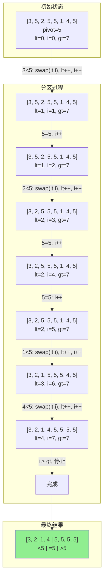
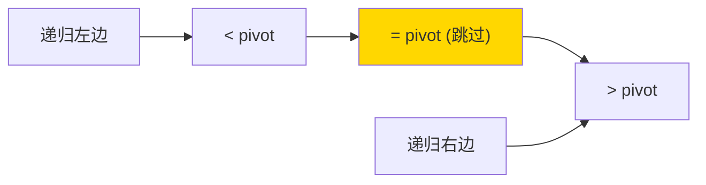

# 三路快速排序 (3-Way Quick Sort)

## 📌 核心思想

经典快排将数组分为「小于 pivot」和「大于等于 pivot」两部分。**三路快排**则分为三部分：
- `< pivot`
- `= pivot`
- `> pivot`

> 关键洞察：当数据包含大量重复元素时，`= pivot` 的部分可以直接跳过，不再参与后续递归。

---

## 🚨 场景识别信号

| 信号 | 推荐算法 |
|------|---------|
| **数据重复率高**（如状态码、等级、分类） | ✅ 三路快排 |
| 重复少的随机数据 | 标准快排即可 |
| 需要稳定排序 | 归并/TimSort |

---

## 🎯 适用场景

### ✅ 推荐使用

| 场景 | 原因 |
|------|------|
| 大量重复元素 | 相等元素一次性处理完 |
| 枚举值/分类数据排序 | 值域有限，重复多 |
| 多键排序的辅助 | 按某个字段有很多相同值 |

### ❌ 不推荐使用

| 场景 | 原因 |
|------|------|
| 几乎无重复的数据 | 额外开销无收益 |
| 需要稳定排序 | 不稳定 |

---

## 📊 复杂度分析

| 指标 | 标准快排 | 三路快排 |
|------|---------|---------|
| **最好时间** | O(n log n) | O(n log n) |
| **平均时间** | O(n log n) | O(n log n) |
| **最坏时间（全相同）** | O(n²) ⚠️ | **O(n)** ⭐ |
| **空间复杂度** | O(log n) | O(log n) |
| **稳定性** | ❌ | ❌ |

---

## 🔄 分区过程（Mermaid）

### Dijkstra 3-Way Partition



### 分区后的结构



---

## 💻 核心实现

### Dijkstra 三路分区

```typescript
/**
 * 三路快速排序
 *
 * 使用 Dijkstra 三路分区：
 * - [left, lt): < pivot
 * - [lt, gt]: = pivot（跳过）
 * - (gt, right]: > pivot
 */
export function sort<T>(arr: readonly T[], cmp: Comparator<T>): T[] {
  const result = [...arr];
  threeWayQuickSort(result, 0, result.length - 1, cmp);
  return result;
}

function threeWayQuickSort<T>(
  arr: T[],
  left: number,
  right: number,
  cmp: Comparator<T>
): void {
  if (left >= right) return;

  // 随机选择 pivot
  const randomIndex = left + Math.floor(Math.random() * (right - left + 1));
  [arr[randomIndex], arr[left]] = [arr[left], arr[randomIndex]];
  const pivot = arr[left];

  // 三路分区
  let lt = left;     // arr[left..lt-1] < pivot
  let gt = right;    // arr[gt+1..right] > pivot
  let i = left + 1;  // arr[lt..i-1] = pivot

  while (i <= gt) {
    const c = cmp(arr[i], pivot);
    if (c < 0) {
      [arr[lt], arr[i]] = [arr[i], arr[lt]];
      lt++;
      i++;
    } else if (c > 0) {
      [arr[i], arr[gt]] = [arr[gt], arr[i]];
      gt--;
      // 注意：i 不递增，因为交换来的元素还未检查
    } else {
      i++;
    }
  }

  // 递归处理 < pivot 和 > pivot 的部分
  // = pivot 的部分已经在正确位置，跳过
  threeWayQuickSort(arr, left, lt - 1, cmp);
  threeWayQuickSort(arr, gt + 1, right, cmp);
}
```

---

## ✅ 不变式与正确性

在每次循环迭代中，始终保持以下不变式：

1. `arr[left..lt-1]` 中所有元素 `< pivot`
2. `arr[lt..i-1]` 中所有元素 `= pivot`
3. `arr[gt+1..right]` 中所有元素 `> pivot`
4. `arr[i..gt]` 是尚未检查的区域

当 `i > gt` 时，未检查区域为空，分区完成。

---

## 🆚 与标准快排对比

### 全相同元素时的表现

```typescript
// 全相同元素 [5, 5, 5, 5, 5, 5, 5, 5]

// 标准快排：每次只排除 1 个元素 → O(n²)
// 第一次 partition 后：[5] [5, 5, 5, 5, 5, 5, 5]
// 第二次 partition 后：[5] [5] [5, 5, 5, 5, 5, 5]
// ...

// 三路快排：一次 partition 全部搞定 → O(n)
// 第一次 partition 后：[] [5, 5, 5, 5, 5, 5, 5, 5] []
// 完成！
```

### 少量重复时的表现

```typescript
// 少量重复 [3, 1, 4, 1, 5, 9, 2, 6]

// 两种方法性能接近
// 三路快排稍有额外开销（维护三个指针），但影响很小
```

---

## 🌐 前端业务场景

### 1. 状态码/枚举值排序

```typescript
type Status = 'pending' | 'processing' | 'completed' | 'failed';

interface Task {
  id: string;
  status: Status;
  priority: number;
}

// 任务状态字段重复率极高
const tasks: Task[] = [
  { id: '1', status: 'pending', priority: 1 },
  { id: '2', status: 'completed', priority: 2 },
  { id: '3', status: 'pending', priority: 3 },
  // ... 大量 pending/completed 重复
];

// 三路快排高效处理
const statusOrder: Record<Status, number> = {
  pending: 0,
  processing: 1,
  completed: 2,
  failed: 3,
};

const cmp = (a: Task, b: Task) => statusOrder[a.status] - statusOrder[b.status];
const sorted = threeWaySort(tasks, cmp);
```

### 2. 分数/等级排序

```typescript
// 学生成绩（等级制，重复多）
interface Student {
  name: string;
  grade: 'A' | 'B' | 'C' | 'D' | 'F';
}

// 只有 5 种等级，大量重复
const gradeOrder = { A: 0, B: 1, C: 2, D: 3, F: 4 };
const cmp = (a: Student, b: Student) => gradeOrder[a.grade] - gradeOrder[b.grade];
```

---

## 📚 延伸阅读

1. **Bentley-McIlroy 三路分区**：另一种三路分区实现
2. **Dual-Pivot Quicksort**：Java 7+ 默认排序，使用两个 pivot
3. **Pattern-Defeating Quicksort (PDQsort)**：更现代的变种

---

## ✅ 自检清单

- [ ] 能手写 Dijkstra 三路分区
- [ ] 理解三个指针 lt, i, gt 的含义
- [ ] 知道为什么 `i > gt` 时不递增 i
- [ ] 能解释为什么全相同元素时是 O(n)
- [ ] 知道何时选择三路快排而非标准快排
