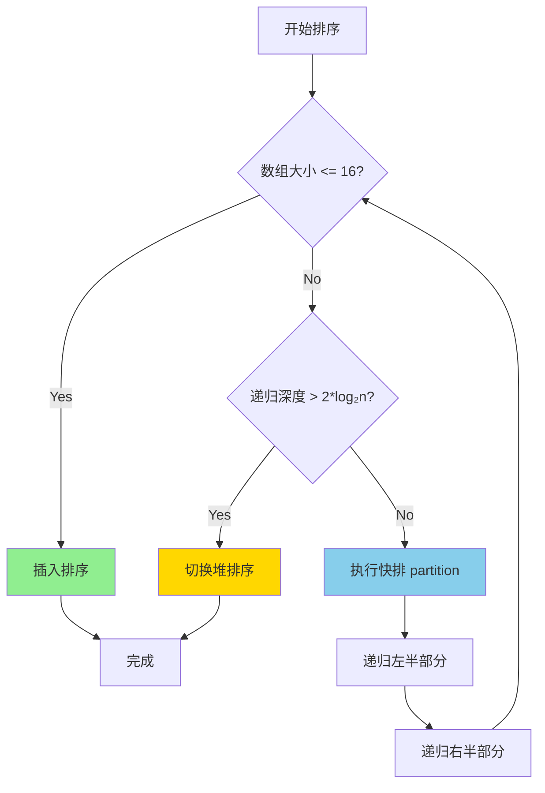
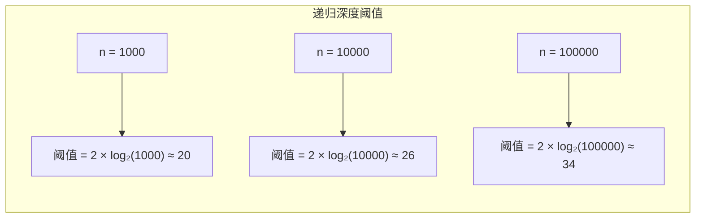

# Introsort (内省排序)

## 📌 核心思想

**混合排序策略**：结合快速排序、堆排序、插入排序的优点：

1. **默认使用快排**：平均情况最快
2. **递归深度过深时切换堆排**：避免 O(n²) 最坏情况
3. **小数组使用插入排序**：减少递归开销

> 关键洞察：快排的最坏情况可以通过监控递归深度来检测，一旦发现就切换到堆排序。

---

## 🚨 场景识别信号

| 信号 | 推荐算法 |
|------|---------|
| **担心对抗性输入/最坏情况** | ✅ Introsort |
| **通用排序，需要保证性能** | ✅ Introsort |
| 需要稳定排序 | TimSort |
| 数据近乎有序 | TimSort |

---

## 🎯 适用场景

### ✅ 推荐使用

| 场景 | 原因 |
|------|------|
| 通用排序库实现 | 综合性能最优 |
| 不可信输入数据 | 防止最坏情况攻击 |
| 性能敏感场景 | 快排的平均性能 + 堆排的最坏保证 |

### ❌ 不推荐使用

| 场景 | 原因 |
|------|------|
| 需要稳定排序 | 不稳定 |
| 数据已知近乎有序 | TimSort 更优 |

---

## 📊 复杂度分析

| 指标 | 值 | 说明 |
|------|-----|------|
| **最好时间** | O(n log n) | 快排表现 |
| **平均时间** | O(n log n) | 快排表现 |
| **最坏时间** | O(n log n) | ⭐ 堆排兜底 |
| **空间复杂度** | O(log n) | 递归栈 |
| **稳定性** | ❌ 不稳定 | |

---

## 🔄 决策流程（Mermaid）



### 阈值选择



---

## 💻 核心实现

```typescript
const INSERTION_THRESHOLD = 16;

/**
 * Introsort：快排 + 堆排 + 插入排序的混合
 */
export function sort<T>(arr: readonly T[], cmp: Comparator<T>): T[] {
  const result = [...arr];
  const maxDepth = 2 * Math.floor(Math.log2(result.length));
  introsortHelper(result, 0, result.length - 1, maxDepth, cmp);
  return result;
}

function introsortHelper<T>(
  arr: T[],
  left: number,
  right: number,
  depthLimit: number,
  cmp: Comparator<T>
): void {
  const size = right - left + 1;

  // 1. 小数组：插入排序
  if (size <= INSERTION_THRESHOLD) {
    insertionSortRange(arr, left, right, cmp);
    return;
  }

  // 2. 深度超限：堆排序
  if (depthLimit === 0) {
    heapSortRange(arr, left, right, cmp);
    return;
  }

  // 3. 正常情况：快排
  const pivotIndex = partition(arr, left, right, cmp);
  introsortHelper(arr, left, pivotIndex - 1, depthLimit - 1, cmp);
  introsortHelper(arr, pivotIndex + 1, right, depthLimit - 1, cmp);
}

// 插入排序（范围版）
function insertionSortRange<T>(
  arr: T[],
  left: number,
  right: number,
  cmp: Comparator<T>
): void {
  for (let i = left + 1; i <= right; i++) {
    const current = arr[i];
    let j = i - 1;
    while (j >= left && cmp(arr[j], current) > 0) {
      arr[j + 1] = arr[j];
      j--;
    }
    arr[j + 1] = current;
  }
}

// 堆排序（范围版）
function heapSortRange<T>(
  arr: T[],
  left: number,
  right: number,
  cmp: Comparator<T>
): void {
  const n = right - left + 1;

  // 建堆
  for (let i = Math.floor(n / 2) - 1; i >= 0; i--) {
    heapifyRange(arr, left, n, i, cmp);
  }

  // 排序
  for (let i = n - 1; i > 0; i--) {
    [arr[left], arr[left + i]] = [arr[left + i], arr[left]];
    heapifyRange(arr, left, i, 0, cmp);
  }
}

function heapifyRange<T>(
  arr: T[],
  offset: number,
  heapSize: number,
  i: number,
  cmp: Comparator<T>
): void {
  while (true) {
    let largest = i;
    const left = 2 * i + 1;
    const right = 2 * i + 2;

    if (left < heapSize && cmp(arr[offset + left], arr[offset + largest]) > 0) {
      largest = left;
    }
    if (right < heapSize && cmp(arr[offset + right], arr[offset + largest]) > 0) {
      largest = right;
    }

    if (largest === i) break;

    [arr[offset + i], arr[offset + largest]] = [arr[offset + largest], arr[offset + i]];
    i = largest;
  }
}

// 三数取中分区
function partition<T>(
  arr: T[],
  left: number,
  right: number,
  cmp: Comparator<T>
): number {
  // 三数取中选 pivot
  const mid = (left + right) >> 1;
  if (cmp(arr[left], arr[mid]) > 0) [arr[left], arr[mid]] = [arr[mid], arr[left]];
  if (cmp(arr[left], arr[right]) > 0) [arr[left], arr[right]] = [arr[right], arr[left]];
  if (cmp(arr[mid], arr[right]) > 0) [arr[mid], arr[right]] = [arr[right], arr[mid]];

  const pivot = arr[mid];
  [arr[mid], arr[right - 1]] = [arr[right - 1], arr[mid]];

  let i = left;
  let j = right - 1;

  while (true) {
    while (cmp(arr[++i], pivot) < 0) {}
    while (cmp(arr[--j], pivot) > 0) {}
    if (i >= j) break;
    [arr[i], arr[j]] = [arr[j], arr[i]];
  }

  [arr[i], arr[right - 1]] = [arr[right - 1], arr[i]];
  return i;
}
```

---

## ✅ 不变式与正确性

1. **递归深度限制**：`depthLimit = 2 * floor(log₂n)`
   - 正常快排的期望深度是 O(log n)
   - 超过 2 倍说明可能遇到最坏情况

2. **切换堆排保证**：堆排序最坏情况仍是 O(n log n)

3. **小数组优化**：插入排序在小数组上常数因子更小

---

## 🆚 与其他算法对比

| 算法 | 平均 | 最坏 | 稳定 | 特点 |
|------|------|------|------|------|
| 快速排序 | O(n log n) | O(n²) ⚠️ | ❌ | 平均最快 |
| 堆排序 | O(n log n) | O(n log n) | ❌ | 稳定但慢 |
| **Introsort** | O(n log n) | O(n log n) ⭐ | ❌ | 两者优点结合 |
| TimSort | O(n log n) | O(n log n) | ✅ | 近乎有序数据最优 |

---

## 🌐 前端业务场景

### 1. 不可信用户输入排序

```typescript
// 用户可能提交恶意数据试图触发 O(n²)
// Introsort 能防止这种攻击
function sortUserData(data: UserData[]): UserData[] {
  // 即使数据是精心构造的，也不会退化
  return introsort(data, compareUserData);
}
```

### 2. 性能敏感的实时排序

```typescript
// 游戏排行榜、实时数据表格
// 需要稳定的排序性能
function updateLeaderboard(scores: Score[]): Score[] {
  return introsort(scores, (a, b) => b.value - a.value);
}
```

---

## 📚 延伸阅读

1. **C++ std::sort**：使用 Introsort 实现
2. **.NET Array.Sort**：也使用 Introsort
3. **PDQsort**：更现代的变种，Rust 默认排序

---

## ✅ 自检清单

- [ ] 理解为什么需要混合多种排序算法
- [ ] 知道递归深度阈值 `2 * log₂n` 的含义
- [ ] 能手写 Introsort 的框架代码
- [ ] 知道小数组为什么用插入排序
- [ ] 理解 Introsort 如何避免快排最坏情况
