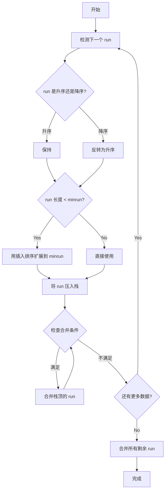
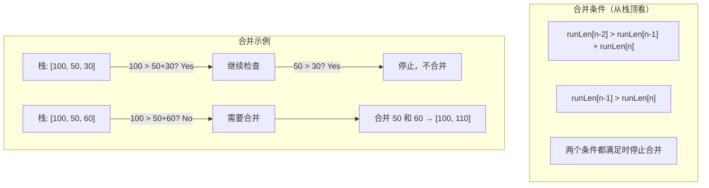

# TimSort

## 📌 核心思想

利用现实数据中常见的**有序片段（run）**，结合插入排序和归并排序的优点：

1. **检测自然有序的 run**
2. **短 run 用插入排序扩展到 minrun**
3. **按特定规则合并 run**（保证效率和稳定性）

> 关键洞察：现实数据往往部分有序（如时间序列、数据库记录），利用这一特性可以大幅提升性能。

---

## 🚨 场景识别信号

| 信号 | 推荐算法 |
|------|---------|
| **数据近乎有序/部分有序** | ✅ TimSort |
| **需要稳定排序** | ✅ TimSort |
| **表格多列排序** | ✅ TimSort |
| 完全随机数据 | Introsort/快排 |
| 大量重复元素 | 三路快排 |

---

## 🎯 适用场景

### ✅ 推荐使用

| 场景 | 原因 |
|------|------|
| 近乎有序数据 | 利用已有顺序，接近 O(n) |
| 业务表格多列排序 | 稳定性保证多次排序结果正确 |
| 时间序列数据 | 通常部分有序 |
| 数据库查询结果 | 可能按某列预排序 |

### ❌ 不推荐使用

| 场景 | 原因 |
|------|------|
| 完全随机数据 | 优势不明显，开销稍大 |
| 内存极度受限 | 需要 O(n) 辅助空间 |

---

## 📊 复杂度分析

| 指标 | 值 | 说明 |
|------|-----|------|
| **最好时间** | O(n) ⭐ | 完全有序时 |
| **平均时间** | O(n log n) | |
| **最坏时间** | O(n log n) | |
| **空间复杂度** | O(n) | 合并需要辅助空间 |
| **稳定性** | ✅ 稳定 | ⭐ 核心优势 |

---

## 🔄 算法流程（Mermaid）

### Run 检测与合并



### 合并栈规则



---

## 💻 核心实现（教学简化版）

```typescript
const MIN_MERGE = 32;

/**
 * TimSort（教学简化版）
 */
export function sort<T>(arr: readonly T[], cmp: Comparator<T>): T[] {
  const result = [...arr];
  const n = result.length;

  if (n < 2) return result;

  // 小数组直接用插入排序
  if (n < MIN_MERGE) {
    insertionSort(result, 0, n - 1, cmp);
    return result;
  }

  const minrun = computeMinrun(n);
  const runs: Array<{ start: number; length: number }> = [];

  let lo = 0;
  while (lo < n) {
    // 1. 检测 run
    let runLen = countRunAndMakeAscending(result, lo, n - 1, cmp);

    // 2. 如果 run 太短，用插入排序扩展
    if (runLen < minrun) {
      const force = Math.min(n - lo, minrun);
      insertionSort(result, lo, lo + force - 1, cmp);
      runLen = force;
    }

    // 3. 将 run 压入栈
    runs.push({ start: lo, length: runLen });

    // 4. 检查并执行合并
    mergeCollapse(result, runs, cmp);

    lo += runLen;
  }

  // 5. 合并所有剩余的 run
  mergeForceCollapse(result, runs, cmp);

  return result;
}

/**
 * 计算 minrun
 *
 * 保证 n/minrun 是 2 的幂或略小于 2 的幂
 * 这样合并时各层级大小接近，效率最高
 */
function computeMinrun(n: number): number {
  let r = 0;
  while (n >= MIN_MERGE) {
    r |= n & 1;
    n >>= 1;
  }
  return n + r;
}

/**
 * 检测 run 并确保升序
 *
 * 返回 run 的长度
 * 如果是降序 run，会反转为升序
 */
function countRunAndMakeAscending<T>(
  arr: T[],
  lo: number,
  hi: number,
  cmp: Comparator<T>
): number {
  let runHi = lo + 1;
  if (runHi > hi) return 1;

  // 检查是升序还是降序
  if (cmp(arr[runHi], arr[lo]) < 0) {
    // 降序 run
    while (runHi <= hi && cmp(arr[runHi], arr[runHi - 1]) < 0) {
      runHi++;
    }
    // 反转为升序
    reverseRange(arr, lo, runHi - 1);
  } else {
    // 升序 run
    while (runHi <= hi && cmp(arr[runHi], arr[runHi - 1]) >= 0) {
      runHi++;
    }
  }

  return runHi - lo;
}

function reverseRange<T>(arr: T[], lo: number, hi: number): void {
  while (lo < hi) {
    [arr[lo], arr[hi]] = [arr[hi], arr[lo]];
    lo++;
    hi--;
  }
}

/**
 * 检查并执行合并
 *
 * 维护不变式：
 * - runLen[n-2] > runLen[n-1] + runLen[n]
 * - runLen[n-1] > runLen[n]
 */
function mergeCollapse<T>(
  arr: T[],
  runs: Array<{ start: number; length: number }>,
  cmp: Comparator<T>
): void {
  while (runs.length > 1) {
    let n = runs.length - 2;

    if (n > 0 && runs[n - 1].length <= runs[n].length + runs[n + 1].length) {
      if (runs[n - 1].length < runs[n + 1].length) {
        n--;
      }
      mergeAt(arr, runs, n, cmp);
    } else if (runs[n].length <= runs[n + 1].length) {
      mergeAt(arr, runs, n, cmp);
    } else {
      break;
    }
  }
}

/**
 * 强制合并所有剩余的 run
 */
function mergeForceCollapse<T>(
  arr: T[],
  runs: Array<{ start: number; length: number }>,
  cmp: Comparator<T>
): void {
  while (runs.length > 1) {
    let n = runs.length - 2;
    if (n > 0 && runs[n - 1].length < runs[n + 1].length) {
      n--;
    }
    mergeAt(arr, runs, n, cmp);
  }
}

/**
 * 合并 runs[n] 和 runs[n+1]
 */
function mergeAt<T>(
  arr: T[],
  runs: Array<{ start: number; length: number }>,
  n: number,
  cmp: Comparator<T>
): void {
  const run1 = runs[n];
  const run2 = runs[n + 1];

  // 合并两个相邻的 run
  stableMerge(
    arr,
    run1.start,
    run1.start + run1.length - 1,
    run2.start + run2.length - 1,
    cmp
  );

  // 更新栈
  runs[n] = { start: run1.start, length: run1.length + run2.length };
  runs.splice(n + 1, 1);
}

/**
 * 稳定合并
 */
function stableMerge<T>(
  arr: T[],
  lo: number,
  mid: number,
  hi: number,
  cmp: Comparator<T>
): void {
  const leftLen = mid - lo + 1;
  const left = arr.slice(lo, mid + 1);

  let i = 0;
  let j = mid + 1;
  let k = lo;

  while (i < leftLen && j <= hi) {
    // <= 保证稳定性
    if (cmp(left[i], arr[j]) <= 0) {
      arr[k++] = left[i++];
    } else {
      arr[k++] = arr[j++];
    }
  }

  while (i < leftLen) {
    arr[k++] = left[i++];
  }
}

function insertionSort<T>(
  arr: T[],
  lo: number,
  hi: number,
  cmp: Comparator<T>
): void {
  for (let i = lo + 1; i <= hi; i++) {
    const current = arr[i];
    let j = i - 1;
    while (j >= lo && cmp(arr[j], current) > 0) {
      arr[j + 1] = arr[j];
      j--;
    }
    arr[j + 1] = current;
  }
}
```

---

## ✅ 不变式与正确性

1. **Run 检测**：每个 run 是升序的（降序 run 被反转）
2. **Minrun 扩展**：短 run 被扩展到 minrun，保证合并效率
3. **合并栈规则**：
   - `runLen[n-2] > runLen[n-1] + runLen[n]`
   - `runLen[n-1] > runLen[n]`
   - 保证合并次数是 O(n log n)
4. **稳定性**：合并时相等元素左边优先（`<=`）

---

## 🌐 前端业务场景

### 1. 表格多列稳定排序

```typescript
// 先按部门排序，再按入职时间排序
// 希望同入职时间的员工保持之前的部门顺序
interface Employee {
  name: string;
  department: string;
  joinDate: string;
}

// 第一次排序：按部门
let sorted = timsort(employees, (a, b) =>
  a.department.localeCompare(b.department)
);

// 第二次排序：按入职时间（稳定性保证同时间的保持部门顺序）
sorted = timsort(sorted, (a, b) =>
  a.joinDate.localeCompare(b.joinDate)
);
```

### 2. 近乎有序的时间序列

```typescript
// 日志数据通常按时间大致有序，偶尔有乱序
const logs: LogEntry[] = [
  { time: 1000, message: 'Start' },
  { time: 1002, message: 'Process' },
  { time: 1001, message: 'Retry' }, // 稍微乱序
  { time: 1003, message: 'Done' },
];

// TimSort 能高效处理这种近乎有序的数据
const sorted = timsort(logs, (a, b) => a.time - b.time);
```

---

## 📚 延伸阅读

1. **Python list.sort()**：使用 TimSort
2. **Java Arrays.sort() (对象)**：使用 TimSort
3. **Galloping Mode**：加速合并的优化技术
4. **Powersort**：TimSort 的改进版本

---

## ✅ 自检清单

- [ ] 理解 run 的概念和检测方法
- [ ] 知道 minrun 的作用
- [ ] 理解合并栈规则为什么能保证效率
- [ ] 能解释 TimSort 为什么对近乎有序数据快
- [ ] 知道稳定性是如何在合并中保证的
- [ ] 能说出 TimSort 适用的业务场景

