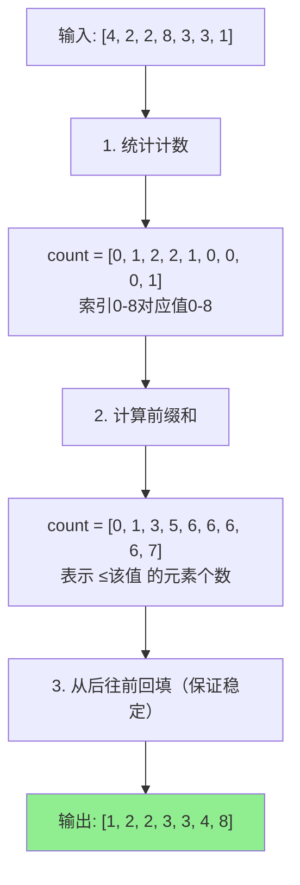
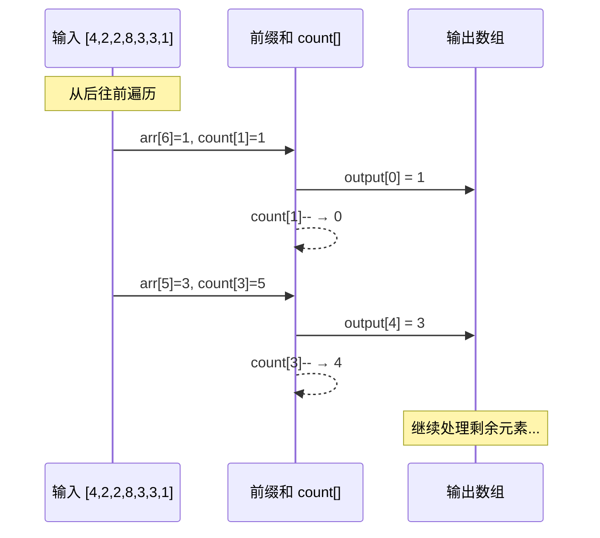

# 计数排序 (Counting Sort)

## 📌 核心思想

**不比较元素大小**，而是统计每个元素出现的次数，然后根据次数还原有序序列。

> 关键洞察：如果知道有多少个元素比当前元素小，就知道它应该在哪个位置。

---

## 🚨 适用边界（必须满足）

| 条件 | 要求 | 原因 |
|------|------|------|
| **数据类型** | 整数（可离散化） | 需要作为数组索引 |
| **值域范围** | 较小（k 不远大于 n） | 空间 O(k)，太大浪费 |
| **非负** | 最好非负或做偏移 | 负数需要偏移处理 |

### ⚠️ 什么时候别用

- 浮点数、字符串（除非离散化）
- 值域极大（如 0~10^9）
- 只有几个元素但值域很大

---

## 🎯 场景识别信号

| 信号 | 推荐度 |
|------|-------|
| 小范围整数（如年龄 0-150、分数 0-100） | ⭐⭐⭐⭐⭐ |
| 枚举值/状态码排序 | ⭐⭐⭐⭐ |
| 需要稳定排序的整数数据 | ⭐⭐⭐⭐ |
| 值域远大于数据量 | ❌ 不推荐 |

---

## 📊 复杂度分析

| 指标 | 值 | 说明 |
|------|-----|------|
| **时间复杂度** | O(n + k) | n 是元素数，k 是值域 |
| **空间复杂度** | O(n + k) | 计数数组 + 输出数组 |
| **稳定性** | ✅ 稳定 | 从后往前回填 |

---

## 🔄 算法流程（Mermaid）



### 回填过程详解



---

## 💻 核心实现

```typescript
/**
 * 计数排序（稳定版）
 *
 * @param arr 待排序数组
 * @param min 值域最小值
 * @param max 值域最大值
 * @returns 排序后的新数组
 */
export function countingSort(
  arr: readonly number[],
  min: number,
  max: number
): number[] {
  // 输入校验
  if (min > max) throw new Error('min > max');

  const n = arr.length;
  if (n === 0) return [];

  const range = max - min + 1;
  const count = new Array(range).fill(0);
  const output = new Array(n);

  // 1. 统计计数
  for (const num of arr) {
    if (num < min || num > max) {
      throw new Error(`值 ${num} 超出范围 [${min}, ${max}]`);
    }
    count[num - min]++;
  }

  // 2. 计算前缀和（累积计数）
  for (let i = 1; i < range; i++) {
    count[i] += count[i - 1];
  }

  // 3. 从后往前回填（保证稳定性）
  for (let i = n - 1; i >= 0; i--) {
    const idx = arr[i] - min;
    output[count[idx] - 1] = arr[i];
    count[idx]--;
  }

  return output;
}
```

---

## ✅ 稳定性保证

**从后往前回填**是稳定性的关键：

```typescript
// ✅ 稳定：从后往前
for (let i = n - 1; i >= 0; i--) {
  output[--count[arr[i] - min]] = arr[i];
}

// ❌ 不稳定：从前往后
for (let i = 0; i < n; i++) {
  output[--count[arr[i] - min]] = arr[i];
}
```

原理：相同值的元素，后出现的放在后面的位置，保持原顺序。

---

## 🔧 变种与优化

### 1. 自动检测范围

```typescript
export function countingSortAuto(arr: readonly number[]): number[] {
  if (arr.length === 0) return [];

  let min = arr[0], max = arr[0];
  for (const num of arr) {
    if (num < min) min = num;
    if (num > max) max = num;
  }

  return countingSort(arr, min, max);
}
```

### 2. 对象排序（按整数字段）

```typescript
export function countingSortBy<T>(
  arr: readonly T[],
  keyFn: (item: T) => number,
  min: number,
  max: number
): T[] {
  const n = arr.length;
  if (n === 0) return [];

  const range = max - min + 1;
  const count = new Array(range).fill(0);
  const output = new Array(n);

  // 按 key 计数
  for (const item of arr) {
    count[keyFn(item) - min]++;
  }

  // 前缀和
  for (let i = 1; i < range; i++) {
    count[i] += count[i - 1];
  }

  // 回填
  for (let i = n - 1; i >= 0; i--) {
    const idx = keyFn(arr[i]) - min;
    output[count[idx] - 1] = arr[i];
    count[idx]--;
  }

  return output;
}
```

---

## 🌐 前端业务场景

### 1. 分数/年龄排序

```typescript
interface Student {
  name: string;
  score: number; // 0-100
}

const students: Student[] = [
  { name: 'Alice', score: 85 },
  { name: 'Bob', score: 92 },
  { name: 'Charlie', score: 85 },
];

// 按分数排序（稳定，同分保持原顺序）
const sorted = countingSortBy(
  students,
  s => s.score,
  0, 100
);
```

### 2. 状态码排序

```typescript
type Status = 0 | 1 | 2 | 3; // pending, processing, completed, failed

interface Task {
  id: string;
  status: Status;
}

// 只有 4 种状态，计数排序最优
const sorted = countingSortBy(tasks, t => t.status, 0, 3);
```

---

## 🆚 与其他排序对比

| 算法 | 时间 | 空间 | 稳定 | 适用条件 |
|------|------|------|------|---------|
| **计数排序** | O(n+k) | O(n+k) | ✅ | 小范围整数 |
| 基数排序 | O(d·n) | O(n+k) | ✅ | 整数/定长字符串 |
| 归并排序 | O(n log n) | O(n) | ✅ | 通用 |
| 快速排序 | O(n log n) | O(log n) | ❌ | 通用 |

---

## ✅ 自检清单

- [ ] 理解计数、前缀和、回填三个步骤
- [ ] 知道为什么从后往前回填能保证稳定性
- [ ] 能分析时间和空间复杂度 O(n+k)
- [ ] 知道值域 k 过大时不适合用计数排序
- [ ] 能实现对象按整数字段排序的版本

