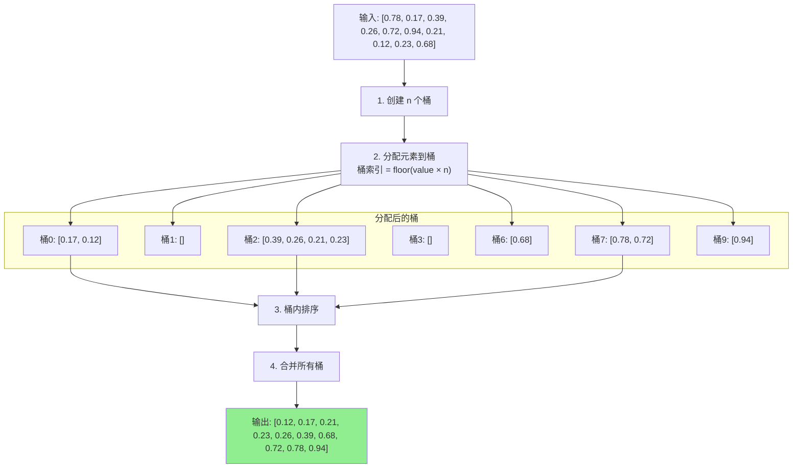

# 桶排序 (Bucket Sort)

## 📌 核心思想

将元素**分散到多个桶**中，每个桶内部排序，最后按顺序合并所有桶。

> 关键洞察：如果数据分布均匀，每个桶的元素很少，桶内排序很快。

---

## 🚨 适用边界（必须满足）

| 条件 | 要求 | 原因 |
|------|------|------|
| **数据分布** | 尽量均匀 | 不均匀会导致某桶过大 |
| **可映射** | 能映射到桶索引 | 需要确定元素归属 |
| **桶数量** | 合理（通常 n 个桶） | 太少退化，太多浪费 |

### ⚠️ 什么时候别用

- 数据分布极不均匀
- 无法确定合理的映射函数
- 数据量很小（直接用比较排序）

---

## 🎯 场景识别信号

| 信号 | 推荐度 |
|------|-------|
| 均匀分布的浮点数（如 0-1 范围） | ⭐⭐⭐⭐⭐ |
| 可预知分布的数据 | ⭐⭐⭐⭐ |
| 大量数据需要分布式排序 | ⭐⭐⭐⭐ |
| 分布未知/极不均匀 | ❌ 不推荐 |

---

## 📊 复杂度分析

| 指标 | 最好情况 | 平均情况 | 最坏情况 |
|------|---------|---------|---------|
| **时间** | O(n) | O(n + k + n²/k) | O(n²) |
| **空间** | O(n + k) | O(n + k) | O(n + k) |

> 当 k ≈ n 且分布均匀时，平均 O(n)。

---

## 🔄 算法流程（Mermaid）



---

## 💻 核心实现

```typescript
/**
 * 桶排序（0-1 范围的浮点数）
 */
export function bucketSort(arr: readonly number[]): number[] {
  const n = arr.length;
  if (n <= 1) return [...arr];

  // 创建 n 个桶
  const buckets: number[][] = Array.from({ length: n }, () => []);

  // 分配到桶
  for (const num of arr) {
    if (num < 0 || num >= 1) {
      throw new Error(`值 ${num} 不在 [0, 1) 范围内`);
    }
    const bucketIdx = Math.floor(num * n);
    buckets[bucketIdx].push(num);
  }

  // 桶内排序（使用插入排序，因为桶内元素少）
  for (const bucket of buckets) {
    insertionSort(bucket);
  }

  // 合并
  const result: number[] = [];
  for (const bucket of buckets) {
    result.push(...bucket);
  }

  return result;
}

function insertionSort(arr: number[]): void {
  for (let i = 1; i < arr.length; i++) {
    const current = arr[i];
    let j = i - 1;
    while (j >= 0 && arr[j] > current) {
      arr[j + 1] = arr[j];
      j--;
    }
    arr[j + 1] = current;
  }
}
```

---

## 🔧 通用版本（自定义映射函数）

```typescript
/**
 * 通用桶排序
 *
 * @param arr 待排序数组
 * @param bucketCount 桶数量
 * @param getBucketIndex 元素到桶索引的映射函数
 * @param cmp 比较函数
 */
export function bucketSortGeneric<T>(
  arr: readonly T[],
  bucketCount: number,
  getBucketIndex: (item: T) => number,
  cmp: (a: T, b: T) => number
): T[] {
  const n = arr.length;
  if (n <= 1) return [...arr];

  // 创建桶
  const buckets: T[][] = Array.from({ length: bucketCount }, () => []);

  // 分配
  for (const item of arr) {
    const idx = getBucketIndex(item);
    if (idx < 0 || idx >= bucketCount) {
      throw new Error(`桶索引 ${idx} 超出范围 [0, ${bucketCount})`);
    }
    buckets[idx].push(item);
  }

  // 桶内排序
  for (const bucket of buckets) {
    bucket.sort(cmp);
  }

  // 合并
  const result: T[] = [];
  for (const bucket of buckets) {
    result.push(...bucket);
  }

  return result;
}
```

---

## ✅ 稳定性保证

桶排序的稳定性取决于：
1. **分配过程**：按原顺序分配是稳定的
2. **桶内排序**：使用稳定算法（如插入排序、TimSort）

```typescript
// ✅ 稳定版本：桶内使用稳定排序
for (const bucket of buckets) {
  stableSort(bucket, cmp); // 如 TimSort
}

// ⚠️ 可能不稳定：使用快排
for (const bucket of buckets) {
  quickSort(bucket, cmp);
}
```

---

## 🌐 前端业务场景

### 1. 按分数区间分组

```typescript
interface Student {
  name: string;
  score: number; // 0-100
}

// 按分数分成 10 个区间（0-9, 10-19, ...）
const bucketCount = 10;
const getBucket = (s: Student) => Math.min(9, Math.floor(s.score / 10));
const cmp = (a: Student, b: Student) => a.score - b.score;

const sorted = bucketSortGeneric(students, bucketCount, getBucket, cmp);
```

### 2. 按价格区间排序

```typescript
interface Product {
  name: string;
  price: number; // 0-1000
}

const bucketCount = 20; // 每 50 元一个桶
const getBucket = (p: Product) => Math.min(19, Math.floor(p.price / 50));
const cmp = (a: Product, b: Product) => a.price - b.price;

const sorted = bucketSortGeneric(products, bucketCount, getBucket, cmp);
```

### 3. 均匀分布的哈希值排序

```typescript
// 哈希值在 [0, 1) 范围内均匀分布
const hashes = items.map(item => ({
  item,
  hash: hashFunction(item) / MAX_HASH, // 归一化到 [0, 1)
}));

const sorted = bucketSort(hashes.map(h => h.hash));
```

---

## 🆚 与其他非比较排序对比

| 算法 | 适用数据 | 时间 | 稳定 | 特点 |
|------|---------|------|------|------|
| **桶排序** | 均匀分布 | O(n)~O(n²) | 可选 | 需要好的映射函数 |
| 计数排序 | 小范围整数 | O(n+k) | ✅ | 简单直接 |
| 基数排序 | 整数/定长串 | O(d·n) | ✅ | 多轮稳定排序 |

---

## ✅ 自检清单

- [ ] 理解桶排序的分配-排序-合并三步
- [ ] 知道分布均匀时能达到 O(n)
- [ ] 能设计合适的映射函数（getBucketIndex）
- [ ] 理解稳定性取决于桶内排序算法
- [ ] 知道数据倾斜时性能下降的原因

