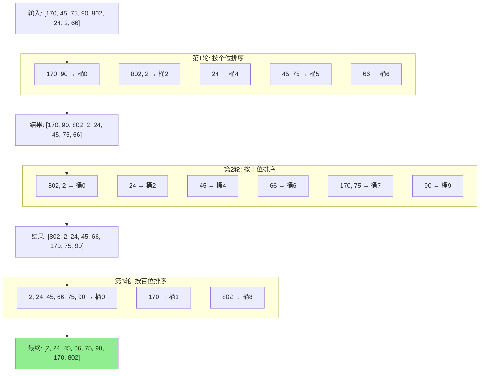
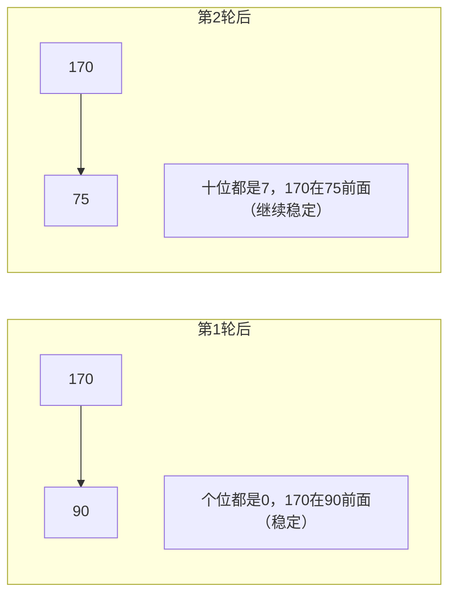

# 基数排序 (Radix Sort)

## 📌 核心思想

按照**每一位**（从低位到高位或从高位到低位）进行稳定排序，多轮排序后得到有序结果。

> 关键洞察：利用稳定排序的性质，低位排序后高位再排，不会打乱低位的相对顺序。

---

## 🚨 适用边界（必须满足）

| 条件 | 要求 | 原因 |
|------|------|------|
| **数据类型** | 整数或定长字符串 | 需要按位处理 |
| **位数有限** | d 不太大 | 时间 O(d·n) |
| **非负** | 默认非负（负数需特殊处理） | 按位比较 |

### ⚠️ 什么时候别用

- 浮点数（位表示复杂）
- 位数极多（如 64 位整数）
- 混合正负数（需要额外处理）

---

## 🎯 场景识别信号

| 信号 | 推荐度 |
|------|-------|
| 固定位数的整数（如手机号、ID） | ⭐⭐⭐⭐⭐ |
| 需要稳定排序的整数数据 | ⭐⭐⭐⭐ |
| 定长字符串排序 | ⭐⭐⭐⭐ |
| 位数变化极大的数据 | ⚠️ 需要填充 |

---

## 📊 复杂度分析

| 指标 | 值 | 说明 |
|------|-----|------|
| **时间复杂度** | O(d · (n + k)) | d 是位数，k 是基数（通常 10） |
| **空间复杂度** | O(n + k) | 计数排序辅助空间 |
| **稳定性** | ✅ 稳定 | 每轮使用稳定子排序 |

---

## 🔄 LSD vs MSD

| 类型 | 方向 | 特点 |
|------|------|------|
| **LSD** (Least Significant Digit) | 低位 → 高位 | 简单，适合等长数据 |
| **MSD** (Most Significant Digit) | 高位 → 低位 | 可提前终止，适合变长 |

本实现使用 **LSD**（更常用）。

---

## 🔄 算法流程（Mermaid）



### 稳定性保证示意



---

## 💻 核心实现

```typescript
/**
 * 基数排序（LSD，非负整数）
 */
export function radixSort(arr: readonly number[]): number[] {
  const n = arr.length;
  if (n <= 1) return [...arr];

  // 找最大值确定位数
  let max = 0;
  for (const num of arr) {
    if (num < 0) throw new Error('基数排序不支持负数');
    if (num > max) max = num;
  }

  let result = [...arr];
  const RADIX = 10;

  // 按每一位进行计数排序
  for (let exp = 1; max / exp >= 1; exp *= RADIX) {
    result = countingSortByDigit(result, exp, RADIX);
  }

  return result;
}

/**
 * 按某一位进行计数排序
 */
function countingSortByDigit(
  arr: number[],
  exp: number,
  radix: number
): number[] {
  const n = arr.length;
  const output = new Array(n);
  const count = new Array(radix).fill(0);

  // 计数
  for (const num of arr) {
    const digit = Math.floor(num / exp) % radix;
    count[digit]++;
  }

  // 前缀和
  for (let i = 1; i < radix; i++) {
    count[i] += count[i - 1];
  }

  // 从后往前回填（稳定）
  for (let i = n - 1; i >= 0; i--) {
    const digit = Math.floor(arr[i] / exp) % radix;
    output[count[digit] - 1] = arr[i];
    count[digit]--;
  }

  return output;
}
```

---

## 🔧 对象排序版本

```typescript
/**
 * 按整数字段进行基数排序
 */
export function radixSortBy<T>(
  arr: readonly T[],
  keyFn: (item: T) => number
): T[] {
  const n = arr.length;
  if (n <= 1) return [...arr];

  // 找最大 key
  let max = 0;
  for (const item of arr) {
    const key = keyFn(item);
    if (key < 0) throw new Error('key 不能为负');
    if (key > max) max = key;
  }

  let result = [...arr];
  const RADIX = 10;

  for (let exp = 1; max / exp >= 1; exp *= RADIX) {
    result = countingSortByDigitGeneric(result, keyFn, exp, RADIX);
  }

  return result;
}

function countingSortByDigitGeneric<T>(
  arr: T[],
  keyFn: (item: T) => number,
  exp: number,
  radix: number
): T[] {
  const n = arr.length;
  const output = new Array(n);
  const count = new Array(radix).fill(0);

  for (const item of arr) {
    const digit = Math.floor(keyFn(item) / exp) % radix;
    count[digit]++;
  }

  for (let i = 1; i < radix; i++) {
    count[i] += count[i - 1];
  }

  for (let i = n - 1; i >= 0; i--) {
    const digit = Math.floor(keyFn(arr[i]) / exp) % radix;
    output[count[digit] - 1] = arr[i];
    count[digit]--;
  }

  return output;
}
```

---

## 🔧 支持负数

```typescript
/**
 * 基数排序（支持负数）
 */
export function radixSortWithNegative(arr: readonly number[]): number[] {
  // 分离正负数
  const negative: number[] = [];
  const nonNegative: number[] = [];

  for (const num of arr) {
    if (num < 0) {
      negative.push(-num); // 取绝对值
    } else {
      nonNegative.push(num);
    }
  }

  // 分别排序
  const sortedNegative = radixSort(negative).reverse().map(x => -x);
  const sortedNonNegative = radixSort(nonNegative);

  // 合并：负数在前（已反转），非负数在后
  return [...sortedNegative, ...sortedNonNegative];
}
```

---

## 🌐 前端业务场景

### 1. 手机号排序

```typescript
// 手机号都是 11 位数字
const phoneNumbers = ['13812345678', '15987654321', '13698765432'];

// 转为数字后基数排序
const sorted = radixSort(phoneNumbers.map(Number));
```

### 2. 订单号排序

```typescript
interface Order {
  id: number; // 8位订单号
  amount: number;
}

// 按订单号排序
const sorted = radixSortBy(orders, o => o.id);
```

### 3. 时间戳排序

```typescript
interface Event {
  name: string;
  timestamp: number; // Unix 时间戳
}

// 按时间戳排序（稳定）
const sorted = radixSortBy(events, e => e.timestamp);
```

---

## 🆚 与计数排序对比

| 特性 | 计数排序 | 基数排序 |
|------|---------|---------|
| 适用范围 | 小范围整数 | 任意位数整数 |
| 时间 | O(n + k) | O(d · (n + k)) |
| 空间 | O(k) | O(n + k) |
| 稳定性 | ✅ | ✅ |
| 值域限制 | 严格 | 较宽松 |

---

## ✅ 自检清单

- [ ] 理解 LSD 从低位到高位的排序过程
- [ ] 知道每轮必须使用稳定排序
- [ ] 能分析时间复杂度 O(d·(n+k))
- [ ] 能处理负数（分离或偏移）
- [ ] 知道基数选择对性能的影响（通常用 10 或 256）

